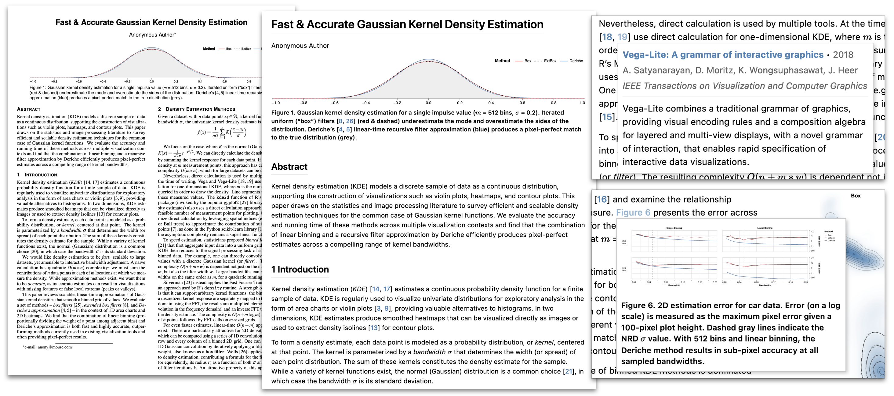
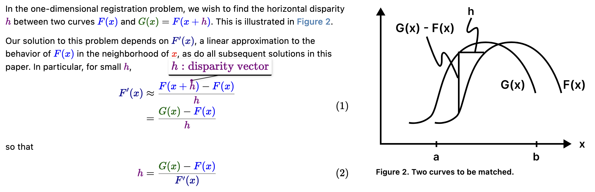
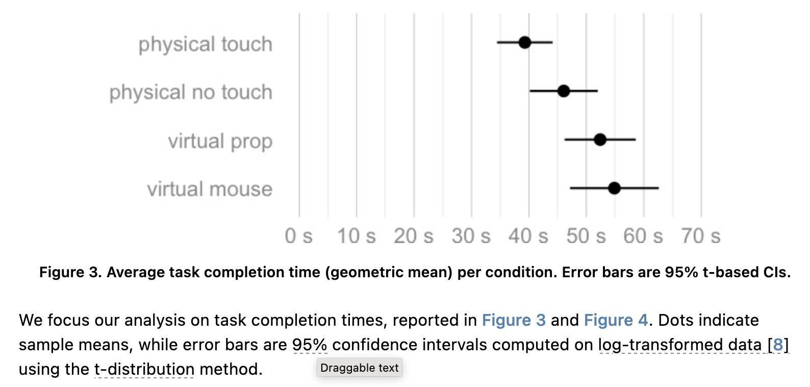
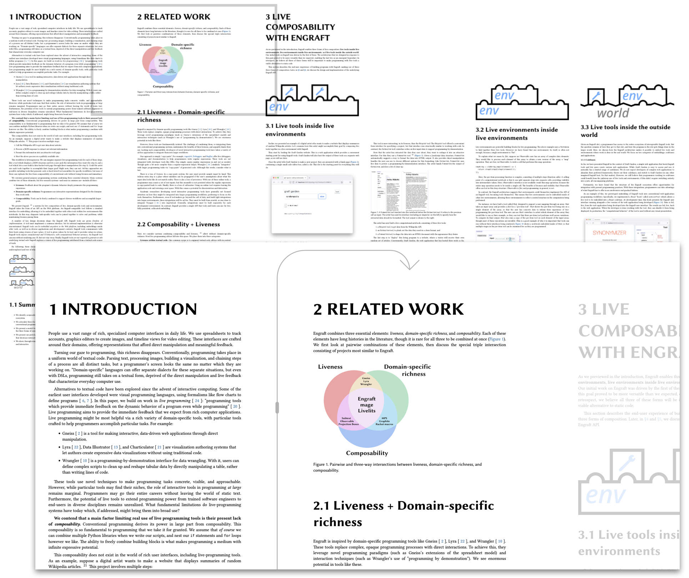
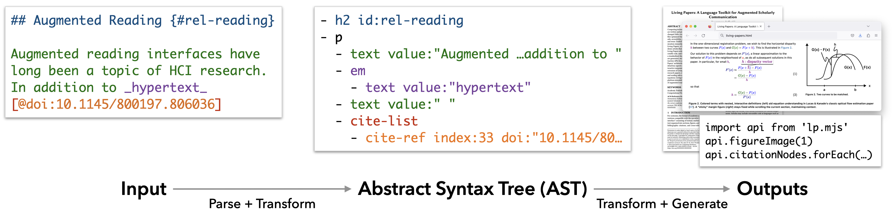
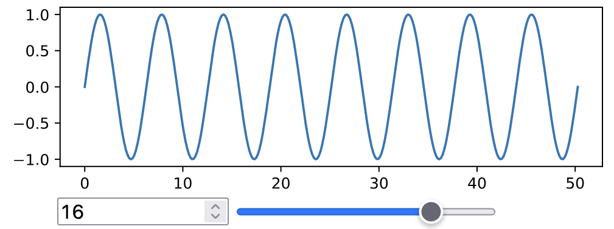
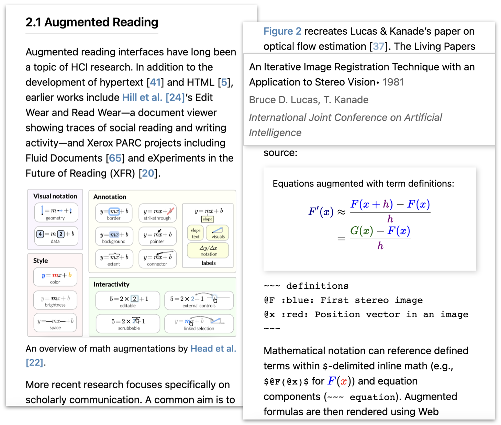

~~~ latex:preamble
\copyrightyear{2023}
\acmYear{2023}
\setcopyright{rightsretained}
\acmConference[UIST '23]{The 36th Annual ACM Symposium on User Interface Software and Technology}{October 29-November 1, 2023}{San Francisco, CA, USA}
\acmBooktitle{The 36th Annual ACM Symposium on User Interface Software and Technology (UIST '23), October 29-November 1, 2023, San Francisco, CA, USA}
\acmDOI{10.1145/3586183.3606791}
\acmISBN{979-8-4007-0132-0/23/10}

\begin{CCSXML}
<ccs2012>
    <concept>
        <concept_id>10003120.10003121.10003129</concept_id>
        <concept_desc>Human-centered computing~Interactive systems and tools</concept_desc>
        <concept_significance>500</concept_significance>
        </concept>
  </ccs2012>
\end{CCSXML}
\ccsdesc[500]{Human-centered computing~Interactive systems \& tools}
~~~

::: abstract
Computing technology has deeply shaped how academic articles are written and produced, yet article formats and affordances have changed little over centuries.
The status quo consists of digital files optimized for printed paper---ill-suited to interactive reading aids, accessibility, dynamic figures, or easy information extraction and reuse.
Guided by formative discussions with scholarly communication researchers and publishing tool developers, we present Living Papers, a language toolkit for producing augmented academic articles that span print, interactive, and computational media.
Living Papers articles may include formatted text, references, executable code, and interactive components.
Articles are parsed into a standardized document format from which a variety of outputs are generated, including static PDFs, dynamic web pages, and extraction APIs for paper content and metadata.
We describe Living Papers' architecture, document model, and reactive runtime, and detail key aspects such as citation processing and conversion of interactive components to static content.
We demonstrate the use and extension of Living Papers through examples spanning traditional research papers, explorable explanations, information extraction, and reading aids such as enhanced citations, cross-references, and equations.
Living Papers is available as an extensible, open source platform intended to support both article authors and researchers of augmented reading and writing experiences.
:::

\place{kde}

# Introduction

::: aside {.html:only style="max-width: 360px;"}
::: blockquote
{.interactive width=300}
:::

A page from _Philosophical Transactions of the Royal Society_ (1665), one of the first scientific journals.
:::

For centuries, the format of academic articles has adhered to conventions compatible with the movable type printing press: a "user interface" consisting of textual, mathematical, and graphical content organized into sections, figures, and linkages such as footnotes, bibliographic citations, and cross-references.
In recent decades, computational technologies such as word processing, digital typesetting, and the Internet have had a tremendous impact on how research articles are written, produced, archived, and accessed, yet had relatively little impact on the structure of articles themselves.
Physical paper has multiple virtues as a format---it is tangible and archival, with no batteries required.
But academic articles are now often read on a screen [@ritchie2022big], using a proprietary format optimized for print (PDF) that suffers from accessibility concerns [@doi:10.1145/2851581.2892588] and complicates computational extraction and analysis [@doi:10.48550/arXiv.2301.10140].

In contrast, visions of alternative publishing formats have been a staple of Human-Computer Interaction since the inception of the field, from initial hypertext designs [@doi:10.1145/800197.806036], to the World Wide Web [@doi:10.1145/179606.179671], to interactive documents now published regularly by data-driven journalists [@doi:10.1145/3242587.3242600].
Despite exciting innovations in augmented reading aids [@doi:10.1145/3411764.3445648;@doi:10.1145/3491102.3501932;@doi:10.1145/3490099.3511162;@doi:10.1145/3290605.3300295] and experiments with online-first research venues [@doi:10.23915/distill.00031;@visxai], academic publishing remains resistant to change.

Meanwhile, both corporations [@gscholar] and non-profits [@doi:10.18653/v1/N18-3011] have indexed large swathes of the literature, often applying vision and NLP methods for not-always-accurate extraction of paper content and metadata [@doi:10.1162/tacl_a_00466].
These efforts enable large-scale search and scientometric analysis [@doi:10.1126/science.aao0185];
however, robust and flexible tools for content extraction and reuse remain out of reach for many researchers.

We seek to bridge present and future publishing through novel authoring tools.
We contribute Living Papers, a framework for writing enhanced articles that encompass multiple output types:
_interactive web pages_ to enable augmented reading experiences, accessibility, and self-publishing;
_static PDFs_ to align incentives and participate in existing publishing workflows;
and _application programming interfaces (APIs)_ to enable easy extraction and reuse of both article content and executable code.
In sum, Living Papers is a "language toolkit" consisting of a standardized document model and a set of extensible parsers, transforms, and output generators.

::: aside {.interactive .margin .html:only}
This web-based article includes interactive content!
Here is a trivial, but fun, explorable:

``` js
import { Scrubber } from "@jheer/scrubber"
---
viewof rot = Scrubber([0, 10], {
  step: 0.05,
  value: 5,
  alternate: true,
  label: 'Rotation',
  format: x => x.toFixed(2)
})
```

``` js
viewof sep = Scrubber([1, 100], {
  value: 4,
  alternate: true,
  label: 'Separation'
})
```

<!--
We can define multiple code cells using the --- delimiter.
Only output from the last cell is shown.
-->

``` js
size = 25
---
n = Math.ceil((600 + 4*size) / sep)
---
pad = 30
---
color = d3.scaleSequential(d3.interpolateRainbow).domain([360, 0])
---
svg`<svg width="${600}" height="${2*size+pad}" viewBox="0 0 600 ${2*size+pad}">
  ${d3.range(0, n).map(i => {
    const a = (i * rot) % 360;
    return svg`<rect
      transform="translate(${i*sep-2*size-1}, ${pad/2}) rotate(${-a}, ${size}, ${size})"
      width="${2*size}" height="${2*size}"
      fill="none" stroke="${color(a)}"></rect>`;
  })}
  </svg>`
```
:::

To support dynamic reading aids and explorable explanations [@expexp], Living Papers produces web-based articles with a reactive runtime and extensible component system.
We use Markdown [@markdown] as a default input format, with syntax extensions for custom components.
Articles may include executable code in languages such as JavaScript, R, and Python to generate static or interactive content.
To support "backwards compatibility" with current publishing practices, the Living Papers compiler automatically converts interactive and web-based material to static content, and generates LaTeX [@latex] projects or compiled PDFs using extensible journal and conference templates.
To assist not only people but also computers to more easily interpret papers, Living Papers can compile article content into accessible data structures, APIs, and software modules.

We present our design objectives for Living Papers, honed in conversations with publishing tool developers and researchers of both augmented reading aids and information extraction from academic articles.
We seek to balance tensions among dynamic content, accessible authoring, participation in existing publishing workflows, and research into novel techniques.
We evaluate the system by demonstration, sharing articles by ourselves and others that span formal research papers (including this one!), explorable explanations, and enhanced content extraction and reuse.
These examples highlight augmentations such as enhanced previews for citations and cross-referenced material, equations with interactive term definitions, and articles with dynamic content such as explorable multiverse analyses [@doi:10.1145/3290605.3300295].
Living Papers is available as open source software, and intended to support both article authors and researchers exploring augmented forms of scholarly communication.

::: {.interactive .html:only}
Other resources:

- [LaTeX PDF version of this paper](index.pdf)
- [Supplemental material: articles and extraction APIs](../)
:::

# Related Work {#rel}

Living Papers connects prior research on augmented reading, article authoring tools, and information extraction from academic papers.

## Augmented Reading {#rel-reading}

Augmented reading interfaces have long been a topic of HCI research.
In addition to the development of hypertext [@doi:10.1145/800197.806036] and HTML [@doi:10.1145/179606.179671], earlier works include @doi:10.1145/142750.142751's Edit Wear and Read Wear---a document viewer showing traces of social reading and writing activity---and Xerox PARC projects including Fluid Documents [@doi:10.1145/332040.332440] and eXperiments in the Future of Reading (XFR) [@doi:10.1145/369825.369829].

::: aside {.html:only}

An overview of math augmentations by @doi:10.1145/3491102.3501932.
:::

More recent research focuses specifically on scholarly communication.
A common aim is to provide contextual information about references, technical terms, and mathematical symbols where they are used, without having to break one's flow by jumping to another part of the document.
ScholarPhi [@doi:10.1145/3411764.3445648] annotates papers with definitions of terms and symbols.
Other projects study math augmentations to improve the readability of formulas [@doi:10.1145/3491102.3501932],
perform rich linking of text and tables [@doi:10.1109/TVCG.2018.2865119;@doi:10.1145/3242587.3242617],
provide context by surfacing citation text from later papers [@doi:10.1145/3490099.3511162],
support skimming via automatic highlights [@doi:10.48550/arXiv.2205.04561],
and produce plain language summaries for broader audiences [@doi:10.48550/arXiv.2203.00130].
Some of these techniques are now available in the online Semantic Reader application [@semreader].
@doi:10.1145/3290605.3300295 prototype "multiverse" analyses of varied data analysis choices by interacting with the paper itself.
Living Papers provides a platform for the development and deployment of such techniques.

Elsewhere, interactive articles with dynamic figures, annotations, and embedded simulations have gained prominence, particularly in data-driven journalism [@doi:10.1145/3242587.3242600].
Distill.pub [@doi:10.23915/distill.00031], a journal for explaining machine learning, and the IEEE VISxAI workshop [@visxai], provide academic venues for online-first, interactive web content.
However, Distill is now on indefinite hiatus [@doi:10.23915/distill.00031], in part due to the editing and mentoring costs of high-quality interactive articles.
Living Papers seeks to make it easier to write and self-publish such articles, but also align incentives by simultaneously producing static outputs for submission to traditional research venues.

## Authoring Tools {#rel-authoring}

Academic articles are typically written using word processors or digital typesetting tools, notably TeX [@tex] and LaTeX [@latex].
TeX's mathematical notation has become a _de facto_ standard for writing formulae, also applicable on the Web via packages such as KaTeX [@katex].
Collaborative authoring is supported via web applications, including Overleaf [@overleaf].
Typst [@typst] is a more recent alternative to TeX with its own markup language and integrated scripting language, runnable online via WebAssembly.
For formatted text, Markdown [@markdown] is a popular alternative to both HTML and LaTeX.

Pandoc [@pandoc] is a document converter with many-to-many (though sometimes lossy) transformations among formats.
Pandoc parses input documents into an internal abstract syntax tree (AST) representation, from which it then produces converted outputs.
Living Papers follows a similar approach, and even uses Pandoc to parse input Markdown files, but differs by providing built-in reading augmentations, an integrated reactive runtime, an extensible component system, and API outputs for information extraction.

Authoring tools may include executable code to enable interactivity or to support computational generation of content such as figures, tables, and statistical models.
Knuth's Literate Programming [@doi:10.1093/comjnl/27.2.97] popularized the interleaving of code and narrative within a single document and has had a strong influence on computational notebooks and related formats [@doi:10.1145/3173574.3173606].
Computational notebooks including Jupyter [@jupyter] and Observable [@observable] structure a document into "cells" that may contain text (with Markdown syntax) or runnable code.
CurveNote [@curvenote] builds on Jupyter notebooks to produce online articles, while JupyterBook [@jupyterbook] uses a Markdown-based format (MyST [@myst]) with references to external notebook content.

RMarkdown [@rmarkdown] and its successor Quarto [@quarto] interleave executable code blocks into Markdown syntax. Code is extracted, evaluated, and results are stitched back into the document. Code is typically evaluated at compile time (e.g., running an R script), though Quarto also supports "live" JavaScript in the browser.
Living Papers similarly supports interleaved text and code, and can execute code either at compile time or within an integrated reactive runtime and component system.
Both Living Papers and Quarto independently chose to incorporate the JavaScript dialect of Observable notebooks [@observable] for interactive content.
Quarto does not provide a component library and relies primarily on Pandoc for its implementation (Living Papers uses Pandoc only for parsing).

Manubot [@doi:10.1371/journal.pcbi.1007128] provides a toolchain for scholarly publishing that takes Markdown files as input, supports automatic resolution of Digital Object Identifiers (DOIs), and generates static Web and PDF output using Pandoc and GitHub actions.
Living Papers similarly supports retrieval of bibliographic metadata given DOIs or other paper identifiers.
Nota [@nota] is a tool for writing web documents with augmented reading aids and interactive figures implemented within the React [@react] framework.
Nota uses a variant of Markdown syntax extended with constructs for defining terms and inline scripting.

Idyll [@doi:10.1145/3242587.3242600] is a language for interactive articles, including explorable explanations [@expexp].
Idyll uses Markdown syntax, extended to include arbitrary components, and produces web applications implemented using React.
Living Papers similarly supports an extensible component model, though using W3C-standard custom HTML elements rather than React.
Living Papers uses a modified version of Idyll's abstract syntax tree (AST) format, and provides an extended tool chain to support academic articles, including citation processing, multiple output formats, and conversion of interactive content to static output.
In addition, Living Papers uses Observable's reactive runtime for linked interactive content.
In contrast to Idyll, Living Papers authors can write code directly in their articles and import content from existing Observable notebooks, enabling custom interactives with much less software engineering.
Fidyll [@doi:10.48550/arXiv.2205.09858] provides a higher-level syntax for Idyll focused squarely on narrative visualization, and also targets slideshow, video, and PDF output.

Living Papers and the projects above share significant overlaps.
Markdown syntax is prevalent across projects and multiple tools use identifiers such as DOIs to automatically resolve bibliographic data.
Living Papers differs from the other projects by combining both support for academic papers (including "built-in" reading augmentations) and an integrated reactive runtime and component system.
To the best of our knowledge, Living Papers is also unique in generating APIs for context extraction and reuse.

Meanwhile, other tools for interactive documents use graphical interfaces rather than textual markup and code.
Idyll Studio [@doi:10.1145/3472749.3474731] provides a WYSIWYG editor for Idyll articles (though not custom components).
Webstrates [@doi:10.1145/2807442.2807446] support collaborative editing to a shared, network-accessible document model.
VisFlow [@doi:10.1145/3411764.3445354] uses text-chart links to support dynamic layouts for narrative visualization.
Scalar [@scalar] is a web-first tool that provides authoring interfaces and content reuse, primarily serving the digital humanities community.
Here we focus on the language toolkit provided by Living Papers, upon which future graphical and collaborative editors might build.

## Information Extraction & Reuse {#rel-extraction}

Other projects focus on analyzing and extracting content from papers, sometimes available only in PDF form.
Augmented reading techniques (@sec:rel-reading) and literature review tools [@doi:10.48550/arXiv.2205.02007] depend upon accurate identification or synthesis of term definitions [@doi:10.48550/arXiv.2010.05129], citation sentences [@doi:10.1145/3490099.3511162], summary text [@doi:10.48550/arXiv.2203.00130], and more.
Extraction tools include GROBID [@doi:10.1007/978-3-642-04346-8_62] and the infrastructure behind the open Semantic Scholar graph [@doi:10.18653/v1/N18-3011].
Extraction tools can "unlock" content to convert PDF documents to more screen reader accessible HTML [@doi:10.1145/3441852.3476545] or interpret bitmap images of charts [@doi:10.1145/2047196.2047247].
However, automatic extraction from PDFs is a difficult, error-prone task [@doi:10.1162/tacl_a_00466].

Living Papers instead supports extraction and reuse directly from published results.
In addition to articles intended for people to read, Living Papers produces outputs for computational use.
Living Papers generates a structured AST format in JavaScript Object Notation (JSON) and an application programming interface (API) that provides convenient access to paper metadata (title, authors, etc.) and content (section text, figures, captions, references, _in situ_ citations).
Moreover, the interactive content of a Living Papers article compiles to a separate, importable JavaScript module, enabling reuse of computational content in other articles or web pages.

# Design Goals & Process {#goals}

Living Papers seeks to balance sometimes competing goals, such as supporting both interactive web articles and standard print workflows.
Through our iterative development we have discussed our goals and progress with multiple stakeholder groups.
Over the period of a year we spoke with augmented reading and accessibility researchers from the CHI, UIST, VIS, and ASSETS communities; information extraction and knowledge base researchers (many associated with the Semantic Scholar team [@doi:10.18653/v1/N18-3011]); and publishing tool developers, including contributors to Quarto [@quarto], Distill.pub [@doi:10.23915/distill.00031], Nota [@nota], Jupyter [@jupyter], Observable [@observable], and the New York Times.
We use Living Papers to write our own research articles and observed its use by graduate students in a Fall 2022 course on the Future of Scholarly Communication.
Through this process we arrived at the following design considerations.

_**Augmented** reading experiences._
We seek to aid contextual understanding of references, formulas, and other content without “bouncing” between paper sections (@sec:rel-reading).
By default, output web articles include contextual previews for both citations and cross-references.
We also demonstrate extensions for augmented equations, term definitions, and alternative reading interfaces.

_**Computational** media._
We seek to recast scholarly publications from static articles to computational artifacts more amenable to both people and machines.
Authors should be able to incorporate reproducible results such as models and data visualizations, which can then be reused as-is in other media.
Living Papers supports interaction via a reactive runtime that integrates executable code blocks and an extensible component library that includes augmented citations, cross-references, equations, and interactive text.
While tools like Semantic Scholar rely on accurate information extraction to provide reading aids, Living Papers side-steps this issue via language design and enables downstream extraction by producing APIs to query paper content and reuse reactive web content.

_**Approachable** writing and content generation._
We sought a familiar yet sufficiently expressive markup language, leading us to use Markdown as our default input format.
We follow Pandoc's [@pandoc] Markdown syntax, which is familiar to users of RMarkdown [@rmarkdown] and includes constructs for tables, math blocks, and citations.
In addition, syntax highlighting (e.g., in VSCode) is already supported.
We want to simplify inclusion of computer-generated models and figures, for example using executable code blocks.
In addition, Living Papers' citation processor performs automatic lookup of bibliographic metadata from DOIs and other identifiers (e.g., PubMed and Semantic Scholar ids) to help ease reference management, while still supporting standard citation formats such as BibTeX.

_**Compatible** with existing publishing norms._
We hypothesize that the print-focused needs of current publication workflows is a major impediment to the adoption of augmented formats.
Distill.pub editors, for instance, emphasized the issue of aligning to existing incentives.
Living Papers supports both interactive web-based content and traditional print-based media.
Authors should be able to write their content once and generate both augmented web pages and submission-worthy PDFs.
To accommodate these needs, Living Papers automatically converts interactive material to static text or images for print output, while also supporting output-specific blocks when authors wish to specialize content for different media.

_**Accessible** and **archivable** content and interactions._
Accessibility researchers expressed a strong preference for HTML over PDF, as HTML output with semantic tags better supports screen readers than standard PDF output.
Living Papers' default web page template uses a responsive layout that adjusts for desktop or mobile viewing.
By publishing to the Web, Living Papers is also applicable to more informal genres such as blog posts.
Meanwhile, static output enables printing to paper for both reading and archival purposes.

_**Collaborative** authoring and review._
Much academic work is collaborative in nature.
Living Papers uses plain text formats that operate well with revision control and diff'ing tools such as Git, supporting awareness and integration of collaborators' work.
We also support anchored annotations [@doi:10.1016/S1389-1286%2800%2900043-8] to a Living Papers AST, providing infrastructure for collaborative commentary or annotations of terms or named entities of interest.
Though beyond the scope of this paper, we plan to build on these features to support collaborative authoring and reviewing interfaces in future work.

_**Extensible** platform for research._
While Living Papers is intended to be useful as-is, our collective understanding of the design space of augmented reading aids and effective use of interactivity is still developing.
For example, augmented reading researchers desired an extensible research platform for better dissemination and testing of techniques.
To support continued research and evaluation, Living Papers provides an open architecture with flexible parsing, transforms, and output formats.
Living Papers can support exploration of new input markup languages, AST transforms, reading aids, custom interactive components, output types, and more.

\place{maugs}

In terms of _non-goals_, web application frameworks, static site generators, and narrative visualization tools (e.g., for rich "scrollytelling" [@doi:10.1145/3242587.3242600]) overlap with Living Papers.
We do not attempt to cover this space, but instead focus squarely on academic articles.
We prioritize familiarity and practicality (including use of Markdown, the Observable runtime, BibTeX, and leaky abstractions over LaTeX) over formal elegance---"evolution, not revolution."
This focus was honed by discussions with notebook and publishing tool creators, and by the accretive history of the Web versus other document systems, all the way back to Nelson and the "curse of Xanadu" [@xanadu].
Living Papers intentionally embraces a "polyglot" syntax.


# Example Articles {#examples}

Before detailing Living Papers' technical building blocks, we present a set of example articles that span---and blur the distinction between---traditional research papers and explorable explanations.
All article sources and outputs are included as supplemental material.
Beyond the examples presented here, both ourselves and others have used Living Papers to write research papers for course projects and for venues such as IEEE VIS, ACM CHI, and UIST---including this paper.

## Fast & Accurate Kernel Density Estimation {#example-kde}

::: figure {#kde .page position="t"}
{width=98%}
| Living Papers version of an IEEE VIS 2021 paper, with PDF (_left_) and HTML (_center_) output generated from the same source document. Web output includes reading aids for citations (_top right_) and cross-references (_bottom right_).
:::

@fig:kde shows an IEEE VIS 2021 paper on kernel density estimation [@doi:10.1109/VIS49827.2021.9623323].
The original LaTeX manuscript includes text, equations, and figures created with the Vega visualization grammar [@doi:10.1109/TVCG.2015.2467091], which were manually converted from SVG to PDF format.
The Living Papers version is written in a more _approachable_ Markdown syntax, produces _compatible_, _archivable_ PDF output, and converts source SVG images to PDF output for inclusion in LaTeX.
Living Papers uses extended Markdown syntax to define a `figure` component:

```
::: figure {#id .class property=value}

| Caption text
:::
```

References in BibTeX format can be included in-document, in a separate file, or retrieved using an inline identifier (e.g., using DOIs, `@doi:10.1109/VIS49827.2021.9623323`).
Living Papers' more _accessible_ `html` output includes _augmented_ reading aids that provide previews for citations and cross-references (@fig:kde, _right_).

Living Papers also helps manage figure layout across media types.
The Web-based version includes margin figures (indicated by a `.margin` class on figure components), which, for the `latex` output, are instead placed within a two-column layout.
LaTeX is notoriously finicky with figure layout: to ensure desired placement, authors may need to move figure source definitions far from the content they reference.
Living Papers provides a `\place{id}` directive that indicates where to place a referenced figure or table within the output `latex` source.
This allows `html` output to place the figure where it is defined in the original Living Papers source, while repositioning the figure as desired within generated LaTeX.
To adjust layout and prevent undesirable gaps or overflows, the `latex` output module also accepts a `vspace` option that systematically inserts vertical offset instructions for figures, captions, or other named node types.
We have found these extensions valuable for expediting article production, including for this current paper.

## An Iterative Image Registration Technique {#example-lucas}

::: figure {#maugs .page}

\vspace{-20pt}
| Colored terms with nested, interactive definitions (_left_) aid equation understanding in Lucas & Kanade's classic optical flow estimation paper [@LucasKanade81]. A "sticky" margin figure (_right_) stays fixed while scrolling the current section, maintaining context.
\vspace{-5pt}
:::

@fig:maugs recreates Lucas & Kanade's paper on optical flow estimation [@LucasKanade81].
The Living Papers version provides math augmentations [@doi:10.1145/3491102.3501932] to help readers make sense of the paper's formulas, demonstrating Living Papers' _extensibility_.
Equations include colored terms; in-situ definitions are revealed on mouse click.
A custom AST transform first parses `definitions` components in the document source:

::: aside {.interactive .html:only}
Equations augmented with term definitions:

~~~ definitions
@x         :red: Position vector in an image
@h         :purple: Disparity vector
@F         :blue: First stereo image
@F(x)      :blue: First stereo image
@G(x)      :darkgreen: Second stereo image
@F(x + @h) :blue: Best translated $@F(x)$ to approximate $@G(x)$
@F'(x)     :darkblue: Linear approximation of $@F(x)$ in the neighborhood of $@x$
~~~

~~~ math
\begin{split}
  @F'(x) &\approx \frac{@F(x + @h) - @F(x)}{@h} \\
  &= \frac{@G(x) - @F(x)}{@h}
\end{split}
~~~
:::

```
~~~ definitions
@F :blue: First stereo image
@x :red: Position vector in an image
~~~
```

Mathematical notation can reference defined terms within `$`-delimited inline math (e.g., `$@F(@x)$` [ for $@F(@x)$]{.html:only}) and equation components (`~~~ equation`).
Augmented formulas are then rendered using Web components that inject color annotations into KaTeX [@katex] source and bind event listeners to the rendered terms.
_Compatible_ `latex` output shows normal, unaugmented math.

The article includes _augmented_ "sticky" figures that persist to maintain context while reading.
For `html` output, adding the attribute `sticky-until="#sec4_2"` to a figure component causes that figure to stay on-screen until the section with id `sec4_2` is reached.
The `latex` output ignores these web-specific annotations.

## Explorable Multiverse Analysis {#example-multiverse}

::: figure {#multiverse position="t"}

\vspace{-15pt}
| Interactive text enables explorable multiverse analysis of data analysis choices [@doi:10.1145/3290605.3300295]. Dragging or clicking the text cycles through statistical procedures and resulting plots.
\vspace{-10pt}
:::

~~~ js { hide=true }
logTransform = false
---
bootstrap = true
---
confidenceLevel = 95
---
fileSuffix = `${Math.round(confidenceLevel * 10) / 1000}${bootstrap ? "-bootstrapped" : ""}${logTransform ? "-log-transformed" : ""}-bonferroni-adjusted.jpg`;
---
multiverseImage = `assets/multiverse/fig1-${fileSuffix}`;
~~~

::: aside {.interactive .html:only}
Multiverse analysis of experimental results:


- Transform: [:toggle-text:
    [Log-transformed data]{}
    [Untransformed data]{}
  ]{bind=logTransform}
- Procedure: [:toggle-text:
    [BCa bootstrap]{}
    [Parametric (t-distribution)]{}
  ]{bind=bootstrap}
- Confidence level: [:option-text:]{
    options=[50,68,80,90,95,99,99.9]
    suffix="%"
    span=20
    bind=confidenceLevel
  }
:::

\place{barnes-hut}

Living Papers articles can include interactive _computational_ content.
Here we recreate @doi:10.1145/3290605.3300295's explorable multiverse analyses for assessing the sensitivity of different statistical analysis decisions.
Readers can explore a range of data analysis choices by interacting with built-in components for draggable and toggleable text (@fig:multiverse).
For example, the following inline component syntax adds draggable text for a choice of confidence interval levels:

```
[:option-text:]{
  options=[50,68,80,90,95,99,99.9]
  suffix="%"
  bind=confidenceLevel
}
```

The reactive runtime binds the component value to the runtime's `confidenceLevel` variable, causing all dependent components to update.
The inline JavaScript code `` `js confidenceLevel` ``, for example, dynamically displays the current value as output text.
Other bound components similarly update via two-way bindings.

The article uses pre-computed images for all confidence level and analysis procedure combinations (e.g., bootstrapped vs. parametric intervals).
The image syntax ```` binds code output---here, the variable `figA`---to the image source URL.
Alternatively, result images could be generated during article compilation by using the `knitr` transform to evaluate R code blocks (@sec:transforms-optin).

This article also compiles to _compatible_ LaTeX.
An output-specific AST transform (@sec:transforms-output) evaluates the reactive runtime in a headless web browser, generates static content, and rewrites the article AST by replacing all dynamic elements.
The resulting PDF is a coherent article describing just the default set of analysis choices.

## The Barnes-Hut Approximation {#example-barnes-hut}

::: figure {#barnes-hut .page}

\vspace{-20pt}
| An explorable explanation of the Barnes-Hut approximation for N-body forces. Linked text and chart elements update the $\Theta$ variable in the Living Papers reactive runtime, driving highlighting and simulation parameters.
\vspace{-5pt}
:::

~~~ js { hide=true }
theta = 1
~~~

::: aside {.interactive .barnes-hut .html:only}
Explore n-body force estimation:

[:barnes-hut:]{
  width=350
  height=350
  theta=`theta`
  layout=false
  estimate=true
}

~~~ js {bind=theta}
Inputs.range([0, 2], { step: 0.1, label: 'Barnes-Hut Θ'})
~~~
:::

@fig:barnes-hut shows an explorable explanation of the Barnes-Hut approximation for N-body forces, originally written using Idyll [@doi:10.1145/3242587.3242600], which demonstrates _augmented_ reading, _computational_ media, and _extensibility_.
A custom simulation component---showcasing force-directed layout and interactive visualizations of quadtree structures and force calculations---is included as a margin figure that persists throughout the article.
The simulation and linked plots update in response to interactions with the article, including input from _action links_ (e.g., ``[Θ = 0.5](`theta=0.5`)``) and bound sliders (created with the Observable standard library's `Inputs.range` method):

```
~~~ js {bind=theta}
Inputs.range([0, 2], { step: 0.1, label: 'Theta' })
~~~
```

Similar to the Idyll version, the force simulation and Vega-based plots are implemented as custom components.
Converting the original React components to W3C custom HTML elements was straightforward, involving changes only to "wrapper" code.
However, the Idyll version also involves custom components for sliders and action links (implemented in separate JavaScript files) and integration logic that requires knowledge of Idyll internals.
Living Papers supports these features, including reuse of common Observable components, directly within the primary article source.

The article compiles to LaTeX, but, if done naïvely, can produce an illegible article due to the lack of interaction.
Using _output-specific_ blocks, Living Papers authors can designate content that should be included only for target output types.
Here, we can annotate the persistent interactive simulation as `html:only`.
We can then use `latex:only` blocks to include _compatible_ simulation snapshots with desired keyframe parameters in the static output.

::: figure {#zoomable .margin}

\vspace{-15pt}
| A zoomable paper reading interface created by post-processing Living Papers `html` output.
\vspace{-10pt}
:::

## Zoomable Paper Reader {#example-zoomable}

@fig:zoomable shows an _augmented_ reading interface created by a student, demonstrating _extensible_ output.
JavaScript code post-processes Living Papers `html` output into a zoomable, column-oriented layout.
The initial view provides an overview of the full paper.
A reader can freely pan and zoom the canvas.
For a linear reading experience, the reader can click a region of the article (Fig. [-@fig:zoomable] _top-left_) and zoom in to a tracked, scrollable navigation mode (Fig. [-@fig:zoomable] _bottom-center_).
When the reader reaches the end of a column, they can continue scrolling to trigger automatic panning along a "track" to the top of the next column.
The content in each column is standard Living Papers output, with the same reading aids and reactive content options previously discussed.
We are now refactoring this layout and navigation code into a reusable `html` output template.

\place{overview}

\place{pipeline}

# Living Papers Architecture

::: figure {#overview .page}

\vspace{-20pt}
| Overview of Living Papers compilation. Input files (e.g., using extended Markdown syntax) are parsed to produce an Abstract Syntax Tree (AST) that is further updated by AST transforms for citations, executable code, and more. Modules for `web`, `latex`, and `api` output apply output-specific AST transforms and then generate output files.
\vspace{-13pt}
:::

::: figure {#pipeline .page}

\vspace{-20pt}
| Pipeline to parse a Markdown file (@sec:parse), perform AST transforms (@sec:transforms), and generate HTML, LaTeX, and API outputs (@sec:output).
\vspace{-5pt}
:::

Living Papers uses the compilation pipeline illustrated in Figures [-@fig:overview] & [-@fig:pipeline].
Input files are _parsed_ into an abstract syntax tree (AST).
AST _transforms_ then analyze and update the AST, including citation processing and analysis of executable code, to form a _canonical AST_ that represents the article in standalone fashion.
One or more _output modules_ take the canonical AST as input, apply _output-specific transforms_, and then generate output files.
Living Papers is implemented in JavaScript and provides a command line utility (`lpub`) for article compilation.
Here we describe the core abstractions of the document model, reactive runtime, and extensibility mechanisms.
Later sections further detail the compilation steps of parsing (@sec:parse), AST transformation (@sec:transforms), and output generation (@sec:output).

## Document Model

Living Papers uses an AST format adapted from Idyll [@doi:10.1145/3242587.3242600], analagous to the Document Object Model (DOM) used by web browsers.
An AST is representable in JSON format, facilitating both processing and serialization.
At the top-level, an AST consists of three properties: _metadata_, _data_, and the _article_ tree.
Article _metadata_ includes information such as title, authors, and keywords, as well as processing options for outputs, transforms, and components.
Article _data_, such as resolved citations or term definitions, can be accessed by downstream components and generated APIs.
Extensions can add their own data properties as needed.
Living Papers includes a stand-alone library for AST creation, modification, and traversal.

The document tree is rooted at the AST _article_ property.
A document node may contain a _type_, _name_, _properties_, and either a _value_ or _children_.
Currently, we only use the types _textnode_ and _component_.
A text node contains verbatim text as a string _value_.
Component nodes include a _name_ (e.g., `p` for paragraph or `em` for emphasis) and may include _children_ as an array of child AST nodes.
@fig:overview (_middle_) illustrates this AST structure.
All Living Papers start with a root node with the component name `article`.

Node properties consist of key-value pairs where the _values_ take one of three types.
_Value_-typed properties simply contain a static value.
_Expression_-typed properties contain a reactive JavaScript expression, which can be used to dynamically set component properties.
_Event_-typed properties contain JavaScript event handler code.
Unlike expression properties, event handlers can update variable assignments in the reactive runtime (@sec:runtime).
The special `class` property may contain one or more named classes used to style content.
Living Papers includes a standard set of classes for layout and sizing shared by `html` and `latex` output.

Our design prioritizes Web output, while maintaining flexibility for other outputs.
Basic AST component nodes adhere to matching HTML elements.
Living Papers' `p`, `link`, and `image` nodes map to `p`, `a`, and `img` HTML tags, with properties that align to corresponding HTML attributes.
Similarly, formatting (`em`, `strong`, `blockquote`, …) and list (`ul`, `ol`, `li`) nodes mirror their HTML equivalents.

Other nodes are specific to Living Papers.
The `cite-list` and `cite-ref` nodes represent citations.
A `cross-ref` node represents a reference to a section, `figure`, `table`, or `equation` elsewhere in the article.
The `code` and `codeblock` components represent source code, often with syntax highlighting.
Meanwhile, `math` and `equation` nodes represent expressions in TeX math notation.

::: aside {.interactive .html:only}
~~~ js { hide=true }
texcode = '\\phi = \\frac{1+\\sqrt{5}}{2}'
~~~

Typeset math for `js Inputs.text()`{.math-input bind=texcode}

~~~ math {code=`texcode`}
~~~
:::

Component nodes for executable code, math formulas, or other specialized syntax may include content in a `code` property or child text node.
For example, a `math` node with the formula for the golden ratio $\phi$ could contain a single child text node with the string `\phi=\frac{1+\sqrt{5}}{2}`.
Downstream transforms or output modules then process this content as needed.
With `html` output, each of these is ultimately displayed using a custom HTML element.

## Reactive Runtime {#runtime}

To support interaction, Living Papers includes a _reactive runtime_ in which changes to variables or code outputs automatically propagate to dependent elements.
Though the runtime is browser-based, it is tied to features of Living Papers' core document model, including _expression_- and _event_-typed properties.

Unlike Idyll, which uses its own basic reactive variable store within a React [@react] context, Living Papers uses the same reactive runtime as Observable notebooks [@obsruntime].
In addition to providing a robust and performant reactive engine, we chose this approach to leverage Observable's standard library (with built-in access to libraries including D3 [@doi:10.1109/TVCG.2011.185] and Vega-Lite [@doi:10.1109/TVCG.2016.2599030]) and import content from existing Observable notebooks.
Authors can create content such as dynamic figures within an external notebook and then reuse that work, importing it directly in a Living Papers article.

After initial parsing, an AST transform identifies executable code blocks using Observable's JavaScript dialect and converts them to `cell-view` component nodes.
Multiple named cells (reactive units) can be defined within one code block by using a single-line `---` delimiter. Only the last cell in a block is mapped to visible output.

Other components can also participate.
_Expression_-valued properties map to reactive variables in the runtime, updating their corresponding components upon change.
_Event_-valued properties are evaluated upon component input events (such as click), and can assign new values to named reactive variables, triggering article updates.
Both custom components and JavaScript-defined elements (e.g., Observable Inputs [@obsinputs]) can serve as input widgets, so long as the resulting Web element exposes a gettable and settable _value_ property.
Living Papers AST nodes also support a `bind` property that instructs the runtime to instantiate a two-way binding between a named reactive variable and the input component _value_.

::: aside {.interactive .html:only}
A slider-bound variable and interpolated math:

~~~ js {bind=v}
v = 128
---
Inputs.range([0, 255], {step: 1, label: md`The variable _v_:`})
~~~
$$x^2 = ${v}^2 = ${v*v}$$
:::

Depending on the input format, Living Papers provides syntactic sugar for runtime integration.
In Living Papers Markdown, the span `$$x^2 = ${v}^2 = ${v*v}$$` specifies a dynamic equation: JavaScript string interpolation is performed for the templated code `${v}` and `${v*v}`, the resulting TeX formula is then typeset.
We use a double `$$` delimiter here to enable these internal template variables.
Instead of a normal hyperlink, the link syntax ``[click me](`v+=1`)`` specifies an _action link_
with an _event_-typed `onclick` property invoked upon click.
Similarly, the image syntax ```` creates an _expression_-valued `src` property that dynamically sets the source URL to the `image_src` variable.

## Extensibility {#extensibility}

The Living Papers compiler marshals a number of extensible modules.
Articles may specify AST _transforms_ to apply.
Web output may include _components_ implemented as custom HTML elements.
Both `html` and `latex` output are generated using _templates_.

The compiler maintains a _context_ object across parsing, transforms, and output generation to provide access to needed resources and services.
The context provides access to the source file paths, directories, and external options (to complement or override options provided as article metadata) as well as caching, logging, and a resolution method for extension lookup.

Living Papers supports third-party extensions using a resolution scheme to lookup external transforms, components, templates, parsers, or output modules.
If an extension is specified as a file path, it is looked up directly, typically within the same article project.
Otherwise, the extension specification is treated as an npm (Node Package Manager) package name and looked up using Node.js' built-in resolution algorithm.
Third-party packages can include a special `living-papers` entry in their `package.json` file, providing a manifest for any extensions (transforms, components, etc.) provided; these are then added to the compiler's internal registry.


# Input Parsing {#parse}

::: figure {#md-components .margin}
```` {style="margin-bottom: 1em;"}
::: figure {#overview .page position="t"}

| Figure caption text.
:::

~~~ equation {#kde}
f(x) = \frac{1}{n\sigma} \sum_{i=1}^{n}
  K{\Big (}\frac{x - x_i}{\sigma}{\Big )}
~~~

[:range-text:]{min=1 max=10 bind=var}
````
\vspace{-10pt}
| Living Papers Markdown syntax for block and inline component elements. Fenced blocks (`:::`) contain Markdown content to be parsed. Verbatim blocks (`~~~`) pass child content as-is. Inline elements may include parsed child content in the span after the `:component-name:`.
\vspace{-10pt}
:::

Parsing is the first phase of article compilation.
The Living Papers architecture supports arbitrary parsers dispatched by file extension or a specified input type, including the "non-parser" of reading in an existing canonical AST JSON file.
That said, our current implementation focuses on an extended Markdown format.

Given its familiarity and support for citations, references, tables, and more, we use Pandoc's Markdown variant.
The parser module calls the Pandoc binary to parse inputs and produce a Pandoc AST in JSON format, then transforms the Pandoc AST to a Living Papers AST.
Prior to invoking Pandoc, a pre-processor is used to handle our customized component syntax, including block and inline components (@fig:md-components), and to properly escape backtick-quoted code in component attributes, action links, and images.
The pre-processor emits Pandoc-compatible Markdown.^[We adopted Pandoc to expedite development. However, the parser does not track input token positions, which are valuable for linking input and output. Pandoc and the pre-processor may later be replaced by a JavaScript implementation. That said, parsing Pandoc ASTs provides an avenue for conversion from other formats (see @sec:discussion).]

The parser performs additional interpretation tasks when mapping the Pandoc AST to a Living Papers AST.
Notably, it classifies different references by type.
While `@Knuth:84` cites a reference by id (e.g., in BibTeX), `@doi:10.1093/comjnl/27.2.97` instead cites the work by its DOI.
Meanwhile, references such as `@fig:overview` or `@eqn:kde` are cross-references to article content.
The parser distinguishes among these based on the prefix.

Though the Markdown parser is not internally extensible at present, Living Papers can also accept entirely new parsers.
In any case, novel components are supported via AST transforms.
For example, a transform can extract and process code blocks with custom component names (e.g., the math term definitions in @sec:example-lucas).
As such transforms of verbatim content are applied downstream of the initial parse, they can be reused with any future parsers as long as those parsers produce compatible ASTs.

# AST Transforms {#transforms}

After an initial parse, the compiler applies AST transforms to map the parser output to a canonical AST representation of the article.
Different output modules may also apply subsequent AST transforms.
An AST transform is created by calling a constructor method that passes in options, resulting in a function that takes an AST and context (@sec:extensibility) as input and returns a modified AST as output.

## Post-Parse Transforms {#transforms-postparse}

The first transform applied after parsing handles _inclusion_ of additional content.
Depending on the specified options, additional source files are loaded, either parsed or left verbatim, and then added to the AST.
As in many other document processors, this allows article content to be spread over multiple files.

The next transform performs _runtime code extraction_, identifying executable code (e.g., `` `js value.toFixed(2)` ``) and mapping it to `cell-view` components for inclusion in the reactive runtime.
Subsequent parsing and generation of runtime code occurs later during `html` output generation (@sec:output-web).

The _citations_ transform provides citation processing.
Any external bibliography (BibTeX) files referenced in the article metadata are first loaded and parsed.
Next, the transform finds `bibliography` component nodes in the AST and parses their verbatim content.
Bibliographic data is parsed using the citation.js library [@citejs], with CSL-JSON [@csl] as our canonical format.
The transform then traverses the AST to visit all `cite-ref` nodes.
If a citation refers to a work by an internal id, the transform attempts to look up that id among the parsed entries.
If the citation instead uses an external id such as a DOI, the transform attempts to retrieve a CSL-JSON entry from the Web.
For DOI lookup we use the REST API of [doi.org](https://doi.org).
Given a resolved external id, the transform also queries the Semantic Scholar API [@doi:10.18653/v1/N18-3011] for additional information, including abstracts and summary ("tldr") snippets.
Network request results are cached across iterative compilations for improved performance.

The _citations_ transform produces multiple results.
Bibliographic entries for all cited works are included in a formatted bibliography at the end of the article.
All `cite-ref` nodes are updated to include an integer index into the sorted bibliography and a resolved id.^[If a DOI and internal id refer to the same article, they are resolved to a single id.]
To support in-context reading aids and information extraction, bibliographic data (CSL-JSON, BibTeX, and Semantic Scholar data) are added to the article AST's top-level `data` property under the `citations` key.
Citation lookup failures are also recognized, resulting in informative error messages.

## Opt-In Transforms {#transforms-optin}

Opt-in AST transforms specified in an article's metadata run after the standard transforms.
Either custom third-party transforms or the following built-in transforms may be invoked.

::: figure {#knitr .margin}

\vspace{-5pt}
| The _knitr_ transform evaluates R code blocks at compile time and rewrites the AST. Fitted parameters bind to the runtime for inclusion in formula text.
\vspace{-5pt}
:::

\place{pyodide}

The _knitr_ transform extracts executable code written in the R programming language, synthesizes and evaluates an R script, and weaves the results back into the Living Papers AST.
The transform writes extracted R code to blocks in an external Markdown file, invokes the knitr program (also used by RMarkdown and Quarto) to evaluate the code, and parses the resulting output Markdown to extract generated content.
Adding a `bind` property to an R code block causes JSON-serialized output to be bound to a named variable in the reactive runtime.
As in @fig:knitr, one can fit a statistical model in R and pass the fitted parameters and other data for processing by JavaScript.
In the future, we hope to provide analagous functionality for compile-time evaluation of Python code blocks.

::: figure {#pyodide .interactive .margin}
{.latex:only}
\vspace{-20pt}

::: {.html:only}
``` py { hide=true }
import numpy as np
~~~
from matplotlib import pyplot as plt
import types
import io
import base64
from js import document

def png(self):
  buf = io.BytesIO()
  self.savefig(buf, format='png')
  buf.seek(0)
  img_str = 'data:image/png;base64,' + base64.b64encode(buf.read()).decode('UTF-8')
  el = document.createElement('img')
  el.src = img_str
  return el

def svg(self):
  buf = io.BytesIO()
  self.savefig(buf, format='svg')
  buf.seek(0)
  div = document.createElement('div')
  div.innerHTML = buf.getvalue().decode('UTF-8')
  return div.querySelector('svg')

plt._show = types.MethodType(plt.show, plt)
plt.show = types.MethodType(png, plt)
plt.png = types.MethodType(png, plt)
plt.svg = types.MethodType(svg, plt)
plt
```

``` js
x = np.linspace(0, sx * np.pi, 300)
---
{
  const fig = plt.figure();
  fig.set_figwidth(5);
  fig.set_figheight(1.9);
  plt.plot(x, np.sin(x));
  const svg = plt.svg();
  return (plt.close(), svg);
}
```
``` js
viewof sx = Inputs.range([2, 20], { step: 0.1, value: 10 })
```
:::

| Using the _pyodide_ transform: a dynamic Python Matplotlib chart is parameterized by a JavaScript slider.
\vspace{-5pt}
:::

The _pyodide_ transform extracts Python code to run directly within the reactive runtime.
We use Pyodide, a WebAssembly port of Python and libraries including Pandas, Matplotlib, and Scikit-Learn.
Pyodide evaluates Python code in the browser, including an object model with direct JavaScript bindings.
The transform leverages Pyodide to create Python cells that run just like standard Observable JavaScript cells.
@fig:pyodide shows a Python Matplotlib figure interactively driven by an Observable Inputs slider.
However, Pyodide and associated libraries take a few seconds to initialize, delaying page loading time.
Languages such as R might be similarly integrated if they are compiled to WebAssembly.

## Output-Specific Transforms {#transforms-output}

Ouput modules apply transforms to prepare an AST for a specific output type.
For example, `html` output applies multiple transforms to aid layout, section numbering, and other aspects (@sec:output-web).
Here we focus on a particularly important transform shared by multiple output types: conversion of interactive and web-specific content to static assets such as text and images.

The _convert_ transform first analyzes an input AST to form a _conversion plan_, consisting of nodes and properties that need to be converted to produce static output.
For example, SVG images are supported in the browser but not by LaTeX; we want to convert those to PDF format prior to `latex` output generation.
Other content is generated or parameterized by the reactive runtime (e.g., _expression_-typed properties).
We must instantiate a runtime, evaluate the content, then extract and convert it.

To perform conversion we use Puppeteer [@puppeteer], an instrumented, headless browser commonly used for automated web page testing.
In order to associate AST nodes with resulting HTML DOM elements, the transform first annotates the AST nodes we wish to convert with a unique id attribute.
This attribute passes through the `html` output module to the resulting web page, enabling dynamic lookup via CSS selectors.
The transform then loads the compiled article in Puppeteer, extracts the rendered content, and rewrites the corresponding AST nodes.
For expression-typed AST node properties and text content, generated values are simply transferred as-is.
For all other content, the transform takes an image screenshot in either PNG, JPG, or PDF format.

Puppeteer provides a convenient API for extracting bitmap images of an identified DOM element.
However, for PDF output, only full page printing is supported.
To work around this limitation, the transform dynamically injects a new stylesheet into the Puppeteer page that hides all content but the desired target element.
It also applies absolute positioning to override any local layout directives.
The transform then retrieves the element's bounding box and "prints" a PDF page whose dimensions exactly match that of the target element.
The result is a vector graphics PDF that can be directly included in `latex` output.

# Output Generation {#output}

Given a canonical AST, Living Papers invokes output generation modules to produce both human- and machine-readable articles.

## Web Output {#output-web}

::: figure {.margin}
::: {.center}

:::
\vspace{-5pt}
| A web-based article viewed at a mobile form factor. The default theme provides a responsive layout.
\vspace{-10pt}
:::

To generate interactive web pages, the `html` output module first applies a sequence of output-specific AST transforms.
These transforms prepare syntax-highlighted code listings;
handle sections designated by the `abstract`, `acknowledgements`, and `appendix` component nodes;
generate a header section with article title and authors;
insert section and figure numbers;
resolve cross-references;
and process nodes with a `sticky-until` attribute, which causes content to persist on screen until an indicated section is reached.

Given a web-specific AST, the module first compiles code for the reactive runtime.
Code from all `cell-view` nodes and _expression_- and _event_-typed properties is compiled to standard JavaScript functions for inclusion in the Living Papers runtime.
While `cell-view` components and expression properties map to standard reactive variables, event handlers must be dealt with separately.
As the Observable runtime does not allow a cell to be redefined internally, event handlers must modify the runtime by re-defining variables externally.
The code generator inserts a proxy object to collect all variable assignments made by a handler; these assignments are then applied to the runtime in batch when the handler completes.

Next, the module marshals all components that map to custom HTML elements.
Living Papers includes components for citations (`cite-ref`), cross-references (`cross-ref`), reactive runtime output (`cell-view`), syntax-highlighted code (`code-block`), and math blocks (`math`, `equation`).
KaTeX [@katex] is used to process and typeset TeX notation in the browser.
To aid reading, citation and cross-reference components provide tooltips with contextual information: title, authors, venue, and summary for citations, and a live content snapshot and caption for cross-references.
The component library includes other interactive elements; for example `range-text` to select from a range of values by dragging and `toggle-text` to cycle through values upon click or touch.
These input components can be bound to reactive variables (@sec:runtime) to drive dynamic content.
External custom components are also supported (@sec:extensibility).

The `html` output module then generates entry code to register any custom components used, instantiate the runtime, load generated runtime code, and assign the top-level AST _data_ property to the root `article` element for subsequent lookup.
All generated code and component definitions are run through a bundler that packages and optionally minifies the code for use.
If an article does not contain interactive content or custom components, this process is skipped and no output JavaScript is generated.

Finally, the module generates output HTML and CSS by walking the AST and mapping nodes to corresponding HTML elements or text nodes.
Output-specific nodes or properties (e.g., those flagged for `latex` output) are ignored.
To generate CSS, both base CSS definitions shared by all articles and the CSS for a named theme are loaded.
Alternative themes can be used via Living Papers' extension mechanisms.
The default layout uses multiple columns with a main column for primary content and a right margin column for footnotes and marginalia (tagged with the `.margin` class).
Media queries collapse all content to a single-column layout for accessible mobile reading.
An article's _metadata_ may include a `styles` property, indicating a custom CSS file to also include.
The collected CSS files are then bundled and optionally minified.
Depending on the article _metadata_ settings, the resulting HTML, CSS, and JavaScript are either written as separate files to an output directory, or as a `selfContained` HTML file that includes CSS and JavaScript inline.

Living Papers also provides a `static` output module, which generates HTML without any interactive elements.
Interactive content is first converted to static assets by an output-specific transform (@sec:transforms-output), after which the same generation process above is performed.
This option can be used to generate static, no-motion content for both accessibility and archival purposes.

## Print Output

Print output is generated by the `latex` output module.
The module can produce a full LaTeX project, consisting of a directory with generated source files and assets.
By default, the module generates a LaTeX project in a temporary directory and invokes the external `pdflatex` command to produce a PDF.

The _convert_ transform first maps interactive or Web content to LaTeX-compatible assets, as described in @sec:transforms-output.
The output module then walks the AST to generate output LaTeX content.
Standard text is processed to map to LaTeX special characters and escape sequences as needed, while nodes containing "raw" TeX content are written verbatim.
The module segments generated content into named variables (e.g., preamble, abstract, body, acknowledgements, appendix) and passes these to a selected template.
Living Papers provides an extensible set of LaTeX templates for various publishing venues, including built-in templates for ACM and IEEE journals and conferences.
Living Papers includes additional directives to aid TeX-specific layout concerns, described earlier in @sec:example-kde.

## Computational Output

Living Papers also supports outputs intended for computational consumption.
The `ast` output module simply writes the canonical AST in JSON format.
The AST can then be loaded and analyzed to extract article content, data, and metadata.

The `api` output module generates an API for more convenient access.
The generated API includes methods for accessing metadata (title, authors, etc.), querying article content (abstract, section text, captions, citations), and exporting figure content (including generated images).
The generated API can be easily imported as a standard ECMAScript module, including directly from a URL.
The `api` output module first runs an output-specific transform to generate static PNG images for all figures, tables, and equations.
Next it annotates the AST with these images in the form of base64-encoded data URLs.
It then generates a JavaScript module that loads the AST and provides methods to query and access the content.
We envision these modules being used for information extraction (e.g., for construction of academic knowledge bases) and to enable new applications (e.g., content for research lab websites, course syllabi, or curated libraries).

Like computational notebooks, Living Papers articles can contain executable code (e.g., models and dynamic figures) that people may wish to reuse in other articles or web pages.
The `runtime` output module generates a standalone JavaScript module that contains the compiled runtime code of an article and is compatible with Observable notebooks.
With this functionality, a Living Papers article can directly import (or _transclude_ [@Nelson:81]) the computational content of other papers.
Examples of runtime transclusion and the extraction API are included as supplemental material.


# Discussion & Future Work {#discussion}

We presented Living Papers, a framework to bridge academic publishing of printed papers, interactive web pages, and machine-readable APIs and assets.
Living Papers provides an extensible infrastructure for parsing, transformation, and generation of scholarly articles, coupled with a reactive runtime and component system supporting augmented reading aids and interactive texts.
To the best of our knowledge, Living Papers is unique in its combination of reading augmentations, language-level interaction support, asset conversion, and output API generation for academic articles.

While we have not conducted a formal summative evaluation of Living Papers, our development process has been informed through consultation and collaboration with multiple stakeholders, spanning academic researchers and publishing tool developers.
Over the past six months we have used Living Papers to write five submitted research articles in our own lab, and have observed student use in a graduate scholarly communication course.
While we don't expect all users to react as positively, one external paper collaborator told us unprompted that "Living Papers is a bliss."
We have particularly appreciated the directness of Markdown syntax, the ease of generating Web output with reading aids "baked in," and the ability to directly incorporate code to generate content such as models, figures, and tables.
As showcased by our examples (@sec:examples), we have been able to readily incorporate varied levels of interactivity, ranging from standalone interactive graphics to richly linked explorable explanations.
Going forward we hope to more deeply evaluate Living Papers and systematically study authoring experiences.

While rich interactivity can be attention-grabbing, finding an appropriate balance---in terms of both author effort and reader benefits---remains an open research question.
Beyond citations, cross-references, and term definitions, what should be in the "standard library" of reading augmentations that authors can apply with little-to-no effort?
And under what conditions do richer, explorable explanations significantly improve reader comprehension?
We hope Living Papers will be used by ourselves and others to further develop and study the space of reading augmentations.

With respect to accessibility, we see Living Papers as a promising work in progress.
The current offering includes HTML output with semantic tags, alt-text images, responsive design to common viewing form factors, and the ability to convert computational output to static content (including static HTML, not just PDF).
The latter may be helpful for people with motion sensitivity.
Generated paper APIs could enable additional accessibility aids.
That said, our design goals (@sec:goals) can be in tension, particularly balancing accessibility with rich interactive output.
There is no guarantee that authors' interactive content will be accessible.
For example, generating more accessible and screen-reader navigable visualizations is an active area of research [@doi:10.1111/cgf.14519].
We see deeper engagement with accessibility stakeholders, the curation of accessible “standard library” components, and subsequent studies as vital future work.

Another area for future work is graphical and collaborative environments for article writing and reviewing.
WYSIWYG editors (c.f., [@doi:10.1145/2807442.2807446;@doi:10.1145/3472749.3474731]) provide an alternative to markup languages, and might operate directly on Living Papers AST structures.
Interfaces for annotation and commenting would aid both collaborative writing and paper reviewing.
Living Papers already includes infrastructure for selecting and excerpting AST segments that future interfaces might build upon.
Another next step is to support multi-chapter books or multi-page websites in addition to single articles.
We are interested in using Living Papers for end-to-end management of a workshop or conference, including study of peer (or post-publication) review and the generation of online proceedings.

Meanwhile, we seek to leverage the computational output of Living Papers.
We envision laboratory web sites, curated reading lists, or novel literature search tools populated with content extracted from Living Papers APIs.
However, this vision rests on either the network effects of wide-spread adoption or the ability to more effectively parse existing content to a shared machine-readable representation.
We believe Living Papers can contribute to conversations about what such a shared document model can and should include, particularly with respect to interactive content.

One avenue may be to convert existing documents to the Living Papers format.
Though parsing PDFs is difficult, existing tools that target HTML output (such as SciA11y [@doi:10.1145/3441852.3476545]) might also target Living Papers.
Meanwhile, other structured document formats can (sometimes lossily) be transformed.
As Living Papers can parse Pandoc ASTs, with additional engineering we might leverage Pandoc to convert from LaTeX, MS Word, and other formats.

One potential concern is the large "syntactic surface" of Living Papers.
To make full use of the system, paper authors must learn Living Papers Markdown, Observable JavaScript (for interactive content), BibTeX (for references), bits of TeX/LaTeX (for math equations, or when custom output-specific directives are needed), and so on.
Developers of new transforms and components require further knowledge, such as standard JavaScript, HTML, and CSS.
These complications are a direct consequence of Living Papers' evolutionary approach and its embrace of the Web and "literate programming" design patterns.
While arguably complex, both "interleaved" syntax and these constituent languages are already in widespread use.
We hope to build on this familiarity and infrastructure, while making many aspects "opt-in" rather than required.

Still, adoption is difficult and hard to predict.
Even if Living Papers falls short of a widely-used framework, it can be deployed for real-world publications and websites, and also help influence the trajectory and feature set of other tools.
For individual users, Living Papers provides natural escape hatches: one can produce a LaTeX project or interactive web page and, if desired, jettison Living Papers and move forward with the generated outputs.

More broadly, Living Papers can serve as a non-proprietary and extensible research system for experimentation---but one that also connects with existing publishing workflows, hopefully better aligning with author incentives.
It offers a path for developers of novel reading or authoring techniques to integrate into an existing system for wider deployment in the wild.
Living Papers is available as open source software at [github.com/uwdata/living-papers](https://github.com/uwdata/living-papers/).

~~~ bibliography
@book{tex,
  title = {TEX and METAFONT: New directions in typesetting},
  author = {D. E. Knuth},
  year = {1979},
  publisher = {American Mathematical Society}
}

@book{latex,
  title = {LaTeX: A Document Preparation System},
  author = {Leslie Lamport},
  publisher = {Addison-Wesley Professional},
  year = {1985}
}

@misc{katex,
  author = {Emily Eisenberg and Sophie Alpert},
  title = {KaTeX: The fastest math typesetting library for the web},
  url = {https://katex.org},
  year = {2023}
}

@misc{typst,
  author = {Typst},
  title = {Typst: Compose papers faster},
  url = {https://typst.app/},
  year = {2023}
}

@misc{myst,
  author = {{MyST Markdown}},
  url = {https://myst-tools.org/},
  year = {2023}
}

@book{Nelson:81,
  author = {T. H. Nelson},
  title = {Literary Machines},
  publisher = {Mindful Press},
  year = {1981}
}

@inproceedings{xanadu,
  title = {The Curse of Xanadu},
  author = {Gary Wolf},
  booktitle = {Wired},
  year = {1995},
  month = {June},
  url = {https://www.wired.com/1995/06/xanadu/}
}

@misc{markdown,
 author = {John Gruber},
 title = {Markdown},
 url = {https://daringfireball.net/projects/markdown/},
 year = {2004}
}

@misc{pandoc,
  title = {Pandoc: A Universal Document Converter},
  author = {John MacFarlane},
  url = {https://pandoc.org/},
  year = {2023}
}

@misc{react,
  title = {React},
  author = {{Meta Open Source}},
  url = {https://react.dev/},
  year = {2023}
}

@misc{nota,
  title = {A New Medium for Communicating Research on Programming Languages},
  author = {Will Crichton},
  url = {https://willcrichton.net/nota/},
  year = {2023}
}

@misc{observable,
  author = {Observable},
  url = {https://observablehq.com/},
  year = {2023}
}

@misc{obsinputs,
  author = {{Observable Inputs}},
  url = {https://github.com/observablehq/inputs},
  year = {2023}
}

@misc{obsruntime,
  author = {{Observable Runtime}},
  url = {https://github.com/observablehq/runtime},
  year = {2023}
}

@misc{csl,
 author = {{Citation Style Language}},
 url = {https://citationstyles.org/},
 year = {2023}
}

@misc{citejs,
  author = {Lars Willighagen},
  title = {Citation.js},
  url = {https://citation.js.org/},
  year = {2023}
}

@misc{puppeteer,
  author = {{Google, Inc.}},
  title = {Puppeteer},
  url = {https://pptr.dev/},
  year = {2023}
}

@misc{overleaf,
  author = {Overleaf},
  title = {Online LaTeX Editor},
  url = {https://www.overleaf.com/},
  year = {2023}
}

@book{jupyter,
  title={Jupyter Notebooks-a publishing format for reproducible computational workflows.},
  author={Kluyver, Thomas and Ragan-Kelley, Benjamin and P{\'e}rez, Fernando and Granger, Brian E and Bussonnier, Matthias and Frederic, Jonathan and Kelley, Kyle and Hamrick, Jessica B and Grout, Jason and Corlay, Sylvain and others},
  volume={2016},
  year={2016}
}

@misc{curvenote,
  author = {Curvenote},
  url = {https://curvenote.com/},
  year = {2023}
}

@misc{jupyterbook,
  author = {{Jupyter Book}},
  url = {https://jupyterbook.org/},
  year = {2023}
}

@misc{rmarkdown,
  author = {RMarkdown},
  url = {https://rmarkdown.rstudio.com/},
  year = {2023}
}

@misc{quarto,
  author = {Quarto},
  url = {https://quarto.org/},
  year = {2023}
}

@misc{scalar,
  author = {{The Alliance for Networking Visual Culture}},
  title = {Scalar},
  url = {https://scalar.me/anvc/scalar/},
  year = {2023}
}

@misc{visxai,
  author = {{Workshop on Visualization for AI Explainability}},
  url = {http://visxai.io/},
  year = {2022}
}

@misc{gscholar,
  author = {{Google Scholar}},
  url = {https://scholar.google.com/},
  year = {2023}
}

@misc{semreader,
  author = {{Allen Institute for Artificial Intelligence, Semantic Scholar Team}},
  title = {Semantic Reader},
  url = {https://www.semanticscholar.org/product/semantic-reader},
  year = {2023}
}

@misc{expexp,
  author = {Bret Victor},
  title = {Explorable Explanations},
  url = {http://worrydream.com/ExplorableExplanations/},
  year = {2011}
}

@inproceedings{LucasKanade81,
  title={An Iterative Image Registration Technique with an Application to Stereo Vision},
  author={Bruce D. Lucas and Takeo Kanade},
  booktitle={International Joint Conference on Artificial Intelligence},
  year={1981}
}

@article{ritchie2022big,
  title={The Big Idea: Should we get rid of the scientific paper?},
  author={Stuart Ritchie},
  journal={The Guardian},
  volume={11},
  year={2022},
  url={https://www.theguardian.com/books/2022/apr/11/the-big-idea-should-we-get-rid-of-the-scientific-paper}
}
~~~
