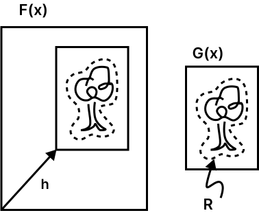
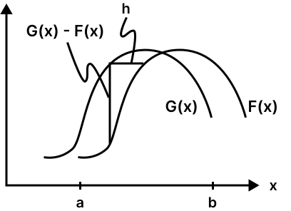
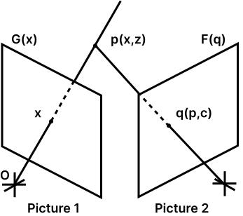
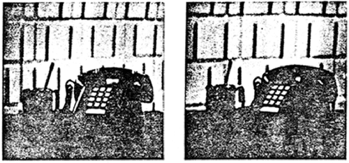
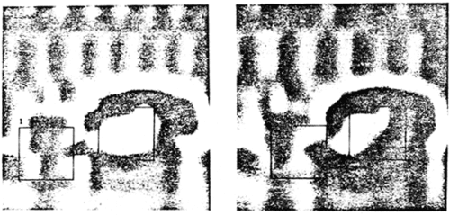
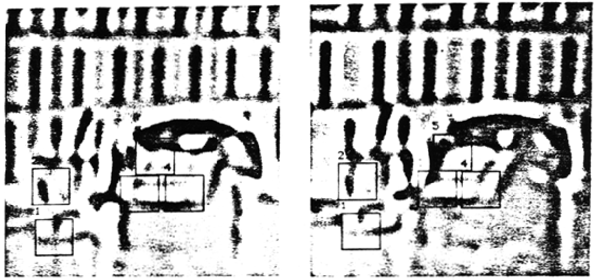
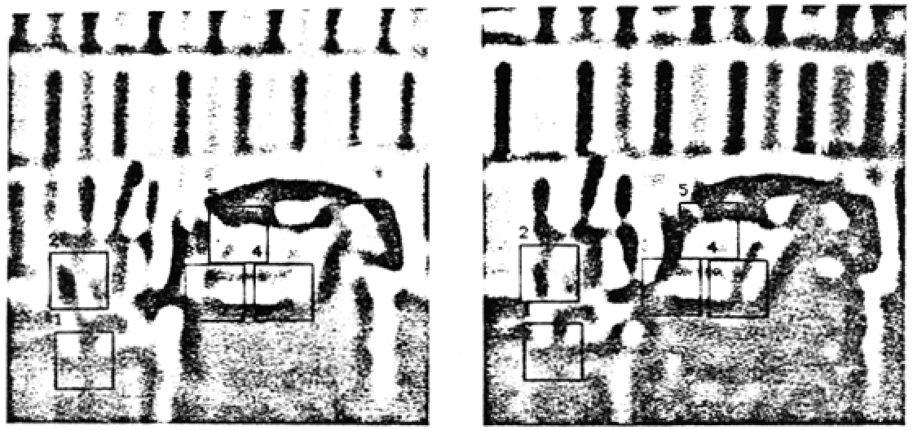
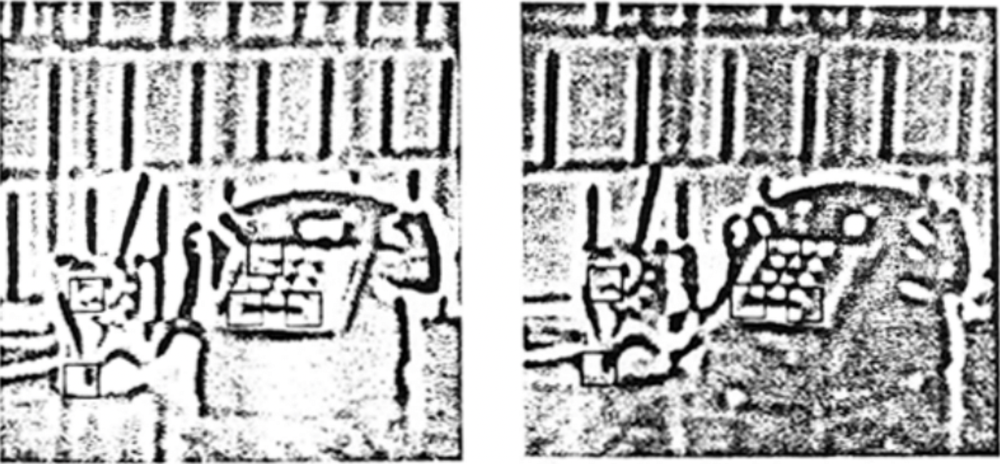

::: aside
Today, this 1981 paper is known for introducing the
[Lucas–Kanade method](https://en.wikipedia.org/wiki/Lucas%E2%80%93Kanade_method) for optical flow estimation.

[Original paper (PDF)](https://courses.cs.duke.edu/spring19/compsci527/papers/Lucas.pdf)
:::

~~~ definitions
@h :purple: disparity vector
@x :red: position vector in an image
~~~

::: abstract
Image registration finds a variety of applications in computer vision. Unfortunately, traditional image registration techniques tend to be costly. We present a new image registration technique that makes use of the spatial intensity gradient of the images to find a good match using a type of Newton-Raphson iteration. Our technique is faster because it examines far fewer potential matches between the images than existing techniques. Furthermore, this registration technique can be generalized to handle rotation, scaling and shearing. We show show our technique can be adapted for use in a stereo vision system.
:::

# Introduction {#sec1}

Image registration finds a variety of applications in computer vision, such as image matching for stereo vision, pattern recognition, and motion analysis. Untortunately, existing techniques for image registration tend to be costly. Moreover, they generally fail to deal with rotation or other distortions of the images.

In this paper we present a new image registration technique that uses spatial intensity gradient information to direct the search for the position that yields the best match. By taking more information about the images into account, this technique is able to find the best match between two images with far fewer comparisons of images than techniques which examine the possible positions of registration in some fixed order. Our technique takes advantage of the fact that in many applications the two images are already in approximate registration. This technique can be generalized to deal with arbitrary linear distortions of the image, including rotation. We then describe a stereo vision system that uses this registration technique, and suggest some further avenues for research toward making effective use of this method in stereo image understanding.

# The registration problem {#sec2}

::: figure {#fig1 .margin}

| The image registration problem.
:::

The translational image registration problem can be characterized as follows: We are given functions $@F(@x)$ and $@G(@x)$ which give the respective pixel values at each location $@x$ in two images, where $@x$ is a vector. We wish to find the disparity vector $@h$ which minimizes some measure of the difference between $@F(@x + @h)$ and $@G(@x)$, for $@x$ in some region of interest $@R$. (See @fig:fig1).

~~~ definitions
@F :blue: First stereo image
@F(x) :blue: First stereo image
@G :darkgreen: Second stereo image
@G(x) :darkgreen: Second stereo image
@F(@x + @h) :blue: Best translated $@F(x)$ to approximate $@G(x)$
@F(x + @h) :blue: Best translated $@F(x)$ to approximate $@G(x)$
~~~

~~~ definitions
@R :orange: Region of interest
~~~

Typical measures of the difference between $@F(x + @h)$ and $@G(x)$ are:

- $L_1 \, \text{norm} = \sum_{x \varepsilon @R} | @F(x + @h) - @G(x) |$

- $L_2 \, \text{norm} = (\sum_{x \varepsilon @R} [ @F(x + @h) - @G(x) ]^2)^{\frac{1}{2}}$

- negative of normalized correlation
~~~ math
= \frac{-\sum_{x \varepsilon @R} @F(x + @h) @G(x)}{(\sum_{x \varepsilon @R})^\frac{1}{2} (\sum_{x \varepsilon @R} @G(x) ^2)^ \frac{1}{2}}
~~~

We will propose a more general measure of image difference, of which both the $L_2$ norm and the correlation are special cases. The $L_1$ norm is chiefly of interest as an inexpensive approximation to the $L_2$ norm.

# Existing techniques {#sec3}

An obvious technique for registering two images is to calculate a measure of the difference between the images at all possible values of the disparity vector $@h$—that is, to exhaustively search the space of possible values of $@h$. This technique is very time consuming: if the size of the picture $@G(x)$ is $@N \times @N$, and the region of possible values of $@h$ is of size $@M \times @M$, then this method requires $O(@M^2 @N^2)$ time to compute.

~~~ definitions
@N :sienna: Size of picture $@G(x)$
@M :sienna: Size of the region of possible values of $@h$
~~~

Speedup at the risk of possible failure to find the best $@h$ can be achieved by using a hill-climbing technique. This technique begins with an initial estimate $@h_0$ of the disparity. To obtain the next guess from the current guess $@h_k$, one evaluates the difference function at all points in a small (say, $3 \times 3$) neighborhood of $h_k$ and takes as the next guess $@h_{k+1}$ that point which minimizes the difference function. As with all hill-climbing techniques, this method suffers from the  problem of false peaks: the local optimum that one attains may not be the global optimum. This technique operates in $O(@M^2 @N)$ time on the average, for $@M$ and $@N$ as above.

Another technique, known as the sequential similarity detection algorithm (SSDA) [@Barnea1972], only estimates the error for each disparity vector $@h$. In SSDA, the error function must be a cumulative one such as the $L_1$ or $L_2$ norm. One stops accumulating the error for the current $@h$ under investigation when it becomes apparent that the current $@h$ is not likely to give the best match. Criteria for stopping include a fixed threshold such that when the accumulated error exceeds this threshold one goes on to the next $@h$, and a variable threshold which increases with the number of pixels in $@R$ whose contribution to the total error have been added. SSDA leaves unspecified the order in which the $h$'s are examined.

Note that in SSDA if we adopt as our threshold the minimum error we have found among the $@h$ examined so far, we obtain an algorithm similar to alpha-beta pruning in minmax game trees [@Nilsson1971]. Here we take advantage of the fact that in evaluating $\min_{@h} \sum_x d(x, @h)$, where $d(x, @h)$ is the contribution of pixel $@x$ at disparity $@h$ to the total error, the $\sum_x$ can only increase as we look at more $x$'s (more pixels).

~~~ definitions
d(x, @h) :darkblue: contribution of pixel $@x$ at disparity $@h$ to the total error
~~~

Some registration algorithms employ a coarse-fine search strategy. See [@Moravec1979] for an example. One of the techniques discussed above is used to find the best registration for the images at low resolution, and the low resolution match is then used to constrain the region of possible matches examined at higher resolution. The coarse-fine strategy is adopted implicitly by some image understanding systems which work with a "pyramid" of images of the same scene at various resolutions.

It should be nated that some of the techniques mentioned so far can be combined because they concern orthogonal aspects of the image registration problem. Hill climbing and exhaustive search concern only the order in which the algorithm searches for the best match, and SSDA specifies only the method used to calculate (an estimate of) the difference function. Thus for example, one could use the SSDA technique with either hill climbing or exhaustive search, in addition a coarse-fine strategy may be adopted.

The algorithm we present specifies the order in which to search the space of possible $@h$'s. In particular, our technique starts with an initial estimate of $@h$, and it uses the spatial intensity gradient at each point of the image to modify the current estimate of $@h$ to obtain an $@h$ which yields a better match. This process is repeated in a kind of Newton-Raphson iteration. If the iteration converses, it will do so in $O(@M^2 \log @N)$ steps on the average. This registration technique can be combined with a coarse-fine strategy,since is requires an initial estimate of the approximate disparity $@h$.

# The registration algorithm {#sec4}

In this section we first derive an intuitive solution to the one dimensional registration problem, and then we derive an alternative solution which we generalize to multiple dimensions. We then show how our technique generalizes to other kinds of registration. We also discuss implementation and performance of the algorithm.

## One dimensional case {#sec4_1}

::: figure {#fig2 .margin sticky-until="#sec4_2"}

| Two curves to be matched.
:::

In the one-dimensional registration problem, we wish to find the horizontal disparity $@h$ between two curves $@F(x)$ and $@G(x) = @F(x + @h)$. This is illustrated in @fig:fig2.

Our solution to this problem depends on $@F'(x)$, a linear approximation to the behavior of $@F(x)$ in the neighborhood of $@x$, as do all subsequent solutions in this paper. In particular, for small $@h$,

~~~ definitions
@F' :darkblue: Linear approximation of $@F(x)$ in the neighborhood of $@x$
@F'(x) :darkblue: Linear approximation of $@F(x)$ in the neighborhood of $@x$
~~~

~~~ equation {#e1 type=equation}
\begin{split}
  @F'(x) &\approx \frac{@F(x + @h) - @F(x)}{@h} \\
  &= \frac{@G(x) - @F(x)}{@h}
\end{split}
~~~

so that

~~~ equation {#e2}
@h = \frac{@G(x) - @F(x)}{@F'(x)}
~~~

The success of our algorithm requires $@h$ to be small enough that this approximation is adequate. In section @sec:sec4_3 we will show how to extend the range of $@h$'s over which this approximation is adequate by smoothing the images.

The approximation to $@h$ given in @eqn:e2 depends on $@x$. A natural method for combining the various estimates of $@h$ at various values of $@x$ would be to simply average them:

~~~ equation {#e3}
@h \approx \sum_x \frac{@G(x) - @F(x)}{@F'(x)} / \sum_x 1
~~~

We can improve this average by realizing that the linear approximation in @eqn:e1 is good where $@F(x)$ is nearly linear, and conversely is worse where $|@F''(x)|$ is large. Thus we could weight the contribution of each term to the average in @eqn:e3 in inverse proportion to an estimate of $|@F''(x)|$. One such estimate is

~~~ definitions
@F'' :darkslateblue: Derivative of $@F'(x)$
@F''(x) :darkslateblue: Derivative of $@F'(x)$
@G' :darkolivegreen: Derivative of $@G(x)$
@G'(x) :darkolivegreen: Derivative of $@G(x)$
~~~

~~~ equation {#e4}
@F''(x) \approx \frac{@G'(x) - @F'(x)}{@h}
~~~

Since our estimate is to be used as a weight in an average, we can drop the constant factor of $\frac{1}{@h}$ in @eqn:e4, and use as our weighting function

~~~ equation {#e5}
@w(x) = \frac{1}{|@G'(x) - @F(x)|}
~~~

~~~ definitions
@w(x) :darkred: weighting function
~~~

This in fact appeals to our intuition: for example, in @fig:fig2, where the two curves cross, the estimate of $@h$ provided by @eqn:e2 is $0$, which is bad; fortunately, the weight given to this estimate in the average is small, since the difference between $@F'(x)$ and $@G'(x)$ at this point is large. The average with weighting is

~~~ equation {#e6}
@h \approx \sum_x \frac{@w(x)[@G(x) - @F(x)]}{@F'(x)} / \sum_{x} @w(x)
~~~

where $@w(x)$ is given by @eqn:e5.

Having obtained this estimate. we can then move $@F(x)$ by our estimate of $@h$, and repeat this procedure, yielding a type of Newton-Raphson iteration. Ideally, our sequence of estimates of $@h$ will converge to the best $@h$. This iteration is expressed by

~~~ math
@h_0 = 0,
~~~

~~~ equation {#e7}
@h_{k+1} = @h_k + \sum_{x} \frac{@w(x)[@G(x) - @F(x + @h_k)]}{@F'(x + @h_k)} / \sum_x @w(x)
~~~

## An alternative derivation {#sec4_2}

The derivation given above does not generalize well to two dimensions because the two-dimensional linear approximation occurs in a different form. Moreover, @eqn:e2 is undefined where $@F'(x) = 0$, i.e. where the curve is level. Both of these problems can be corrected by using the linear approximation of equation @eqn:e1 in the form

~~~ equation {#e8}
@F(x + @h) \approx @F(x) + @h @F'(x)
~~~

to find the $@h$ which minimizes the $L_2$ norm measure of the difference between the curves:

~~~ math
@E = \sum_x [@F(x + @h) - @G(x)]^2
~~~

To minimize the error with respect to $@h$, we set

~~~ equation
\begin{split}
  0 &= \frac{\partial @E}{\partial @h} \\
  &\approx \frac{\partial}{\partial @h} \sum_x [@F(x) + @h @F'(x) - @G(x)]^2 \\
  &= \sum_x 2 @F'(x)[@F(x) + @h@F'(x) - @G(x)]
\end{split}
~~~

from which

~~~ equation {#e9}
@h \approx \frac{\sum_x @F'(x)[@G(x) - @F(x)]}{\sum_x @F'(x)^2}
~~~

This is essentially the same solution that we derived in @eqn:e6, but with the weighting function $@w(x) = @F'(x)^2$. As we will see the form of the linear approximation we have used here generalizes to two or more dimensions. Moreover, we have avoided the problem of dividing by $0$, since in @eqn:e9 we will divide by $0$ only if $@F'(x) = 0$ everywhere (in which case $@h$ really is undefined), whereas in @eqn:e3 we will divide by $0$ if $@F'(x) = 0$ anywhere.

The iterative form with weighting corresponding to @eqn:e7 is

~~~ math
@h_0 = 0,
~~~

~~~ equation {#e10}
@h_{k+1} = @h_k + \frac{\sum_x @w(x) @F'(x + @h_k) [@G(x) - @F(x + @h_k)]}{\sum_x @w(x) @F'(x + @h_k)^2}
~~~

where $@w(x)$ is given by @eqn:e5.

## Performance {#sec4_3}

A natural question to ask is under what conditions and how fast the sequence of $@h_k$'s converges to the real $h$. Consider the case:

$@F(x) = \sin{x}$,

$@G(x) = @F(x + @h) = \sin{(x + @h)}$.

It can be shown that both versions of the registration algorithm given above will converge to the correct $@h$ for $|@h| < \pi$, that is, for initial misregistrations as large as one-half wavelength. This suggests that we can improve the range of convergence of the algorithm by suppressing high spatial frequencies in the image, which can be accomplished by smoothing the image, i.e. by replacing each pixel of the image by a weighted average of neighboring pixels. The tradeoff is that smoothing suppresses small details, and thus makes the match less accurate. If the smoothing window is much larger than the size of the object that we are trying to match, the object may be suppressed entirely, and so no match will be possible.

Since lowpass filtered images can be sampled at lower resolution with no loss of information, the above observation suggests that we adopt a coarse-fine strategy. We can use a low resolution smoothed version of the image to obtain an approximate match. Applying the algorithm to higher resolution images will refine the match obtained at lower resolution.

While the effect of smoothing is to extend the range of convergence, the weighting function serves to improve the accuracy of the approximation, and thus to speed up the convergence. Without weighting, i.e. with $@w(x) = 1$, the calculated disparity $@h_1$ of the first iteration of @eqn:e10 with $@F(x) = \sin{x}$ falls off to zero as the disparity approaches one-half wavelength. However, with $@w(x)$ as in @eqn:e5, the calculation of disparity is much more accurate, and only falls off to zero at a disparity very near one-half wavelength. Thus with $@w(x)$ as in @eqn:e5 convergence is faster for large disparities.

## Implementation {#sec4_4}

Implementing @eqn:e10 requires calculating the weighted sums of the quantities $@F' @G$, $@F' @F$, and $(@F')^2$ over the region of interest $@R$. We cannot calculate $@F'(x)$ exactly, but for the purposes of this algorithm, we can estimate it by

~~~ math
@F'(x) \approx \frac{@F(x + \Delta x) - @F(x)}{\Delta x}
~~~

and similarly for $@G'(x)$, where we choose $\Delta x$ appropriately small (e.g. one pixel). Some more sophisticated technique could be used for estimating the first derivatives, but in general such techniques are equivalent to first smoothing the function, which we have proposed doing for other reasons, and then taking the difference.

## Generalization to multiple dimensions {#sec4_5}

The one-dimensional registration algorithm given above can be generalized to two or more dimensions. We wish to minimize the $L_2$ norm measure of error:

~~~ math
@E = \sum_{x \varepsilon @R} [@F(x + @h) - @G(x)]^2
~~~

where $@x$ and $@h$ are $n$-dimensional row vectors. We make a linear approximation analogous to that in @eqn:e8,

~~~ math
@F(x + @h) \approx @F(x) + @h \frac{\partial}{\partial x} @F(x)
~~~

where $\partial / \partial x$ is the gradient operator with respect to $x$, as a column vector:

~~~ math
\frac{\partial}{\partial x} = \left[ \frac{\partial}{\partial x_1} \frac{\partial}{\partial x_2} \dots \frac{\partial}{\partial x_n} \right]^\top
~~~

Using this approximation, to minimize $@E$, we set

~~~ math
\begin{split}
  0 &= \frac{\partial}{\partial @h} @E \\
  &\approx \frac{\partial}{\partial @h} \sum_x \left[ @F(x) + @h \frac{\partial @F}{\partial x} - @G(x) \right]^2 \\
  &= \sum_x 2 \frac{\partial @F}{\partial x} \left[ @F(x) + @h \frac{\partial @F}{\partial x} - @G(x) \right]
\end{split}
~~~

from which

~~~ math
@h = \left[ \sum_x \left( \frac{\partial @F}{\partial x} \right)^\top [@G(x) - @F(x)] \right] \left[ \sum_x \left( \frac{\partial @F}{\partial x} \right)^\top \frac{\partial @F}{\partial x} \right]^{-1}
~~~

which has much the same form as the one-dimensional version in @eqn:e9.

The discussions above of iteration, weighting, smoothing, and the coarse-fine technique with respect to the onedimensional case apply to the n-dimensional case as well. Calculating our estimate of $@h$ in the two-dimensional case requires accumulating the weighted sum of five products $((@G - @F)@F_x, (@G - @F)@F_y, @F^2_x, @F^2_y, \text{and } @F_x @F_y)$ over the region $@R$, as opposed to accumulating one product for correlation or the $L_2$ norm. However, this is more than compensated for, especially in high-resolution images, by evaluating these sums at fewer values of $@h$.

## Further generalizations {#sec4.6}
Our technique can be extended to registration between two images related not by a simple translation, but by an arbitrary linear transformation, such as rotation, scaling, and shearing. Such a relationship is expressed by

~~~ math
@G(x) = @F(x @A + @h)
~~~

where $@A$ is a matrix expressing the linear spatial tranformation between $@F(x)$ and $@G(x)$. The quantity to be minimized in this case is

~~~ definitions
@A :darkred: matrix representing linear transformation between $@F(x)$ and $@G(x)$
~~~

~~~ math
@E = \sum_x [@F(x@A + @h) - @G(x)]^2
~~~

To determine the amount $\Delta @A$ to adjust $@A$ and the amount $\Delta @h$ to adjust $@h$, we use the linear approximation

~~~ equation {#e11}
\begin{split}
  & @F(x(@A + \Delta @A) + (@h + \Delta @h)) \\
  \approx& @F(x@A + @h) + (x \Delta @A + \Delta @h) \frac{\partial}{\partial x} @F(x)
\end{split}
~~~

When we use this approximation the error expression again becomes quadratic in the quantities to be minimized with respect to. Differentiating with respect to these quantities and setting the results equal to zero yields a set of linear equations to be solved simultaneously.

This generalization is useful in applications such as stereovision, where the two different views of the object will be different views, due to the difference of the viewpoints of the cameras or to differences in the processing of the two images. If we model this difference as a linear transformation, we have (ignoring the registration problem for the moment)

~~~ math
@F(x) = @\alpha @G(x) + @\beta
~~~

where $@\alpha$ may be thought of as a contrast adjustment and $@\beta$ as a brightness adjustment. Combining this with the general linear transformation registration problem, we obtain

~~~ definitions
@\alpha :violet: contrast adjustment
@\beta :rebeccapurple: brightness adjustment
~~~

~~~ math
@E = \sum_x [@F(x@A + @h) - (@\alpha @G(x) + @\beta)]^2
~~~

as the quantity to minimize with respect to $@\alpha$, $@\beta$, $@A$, and $@h$. The minimization of this quantity, using the linear approximation in equation @eqn:e11, is straightforward. This is the general form promised in section @sec:sec2. If we ignore $@A$, minimizing this quantity is equivalent to maximizing the correlation coefficient (see, for example, [@Dudewicz1976]); if we ignore $@\alpha$ and $@\beta$ as well, minimizing this form is equivalent to minimizing the $L_2$ norm.

# Application to stereo vision {#sec5}

In this section we show how the generalized registration algorithm described above can be applied to extracting depth information from stereo images.

## The stereo problem {#sec5_1}

The problem of extracting depth information from a stereo pair has in principle four components: finding objects in the pictures, matching the objects in the two views, determining the camera parameters, and determining the distances from the camera to the objects. Our approach is to combine object matching with solving for the camera parameters and the distances of the objects by using a form of the fast registration technique described above.

Techniques for locating objects include an interest operator [@Moravec1979], zero crossings in bandpass-filtered images [@Marr1979], and linear features [@Baker1980]. One might also use regions found by an image segmentation program as objects.

Stereo vision systems which work with features at the pixel level can use one of the registration techniques discussed above. Systems whose objects are higher-level features must use some difference measure and some search technique suited to the particular feature being used. Our registration algorithm provides a stereo vision system with a fast method of doing pixel-level matching.

Many stereo vision systems concern themselves only with calculating the distances to the matched objects. One must also be aware that in any real application of stereo vision the relative positions of the cameras will not be known with perfect accuracy. @Gennery1979 has shown how to simultaneously solve for the camera parameters and the distances of objects.

## A mathematical characterization {#sec5_2}

~~~ definitions
@z :violet: distance of object
@p :darkolivegreen: object's position on camera 1's film plane
@q :darkblue: object's position on camera 2's film plane
@c :rebeccapurple: vector of camera 2's parameters with respect to camera 1
@@x :red: position of image in camera 1 film plane
@@G :darkgreen: intensity value of pixel in picture 1
@@F :blue: intensity value of pixel in picture 2
@E :darkred: Error to minimize
~~~

The notation we use is illustrated in @fig:fig3. Let $c$ be the vector of camera parameters that describe the orientation and position of camera 2 with respect to camera 1's coordinate system. These parameters are azimuth, elevation, pan, tilt, and roll, as defined in @Gennery1979. Let $@@x$ denote the position of an image in the camera 1 film plane of an object. Suppose the object is at a distance $@z$ from camera 1. Given the position in picture 1 $@@x$ and distance $@z$ of the object, we could directly calculate the position $@p(@@x, @z)$ that it must have occupied in three-space. We express $@p$ with respect to camera 1's coordinate system so that $p$ does not depend on the orientation of camera 1. The object would appear on camera 2's film plane at a position $@q(@p, @c)$ that is dependent on the object's position in three-space $@p$ and on the camera parameters $@c$. Let $@@G(@@x)$ be the intensity value of pixel $@@x$ in picture 1, and let $@@F(@q)$ the intensity value of pixel $@q$ in picture 2. The goal of a stereo vision system is to invert the relationship described above and solve for $@c$ and $@z$, given $@x$, $@@F$ and $@@G$.

::: figure {#fig3 .center}
{width=50%}
| Stereo vision.
:::

## Applying the registration algorithm {#sec5_3}

First consider the case where we know the exact camera parameters $@c$, and we wish to discover the distance $@z$ of an object. Suppose we have an estimate of the distance $@z$. We wish to see what happens to the quality of our match between $@@F$ and $@@G$ as we vary $@z$ by an amount $\Delta @z$. The linear approximation that we use here is:

$@@F(@z + \Delta @z) \approx @@F(z) + \Delta \frac{\partial @@F}{\partial @z}$,

where

~~~ equation {#e12}
\frac{\partial @@F}{\partial z} = \frac{\partial @p}{\partial @z} \frac{\partial @q}{\partial @p} \frac{\partial @@F}{\partial @q}
~~~

This equation is due to the chain rule of the gradient operator; $\partial @q / \partial @p$ is a matrix of partial derivatives of the components of $@q$ with respect to the components of $@p$, and $\partial @F / \partial @q$ is the spatial intensity gradient of the image $@F(@q)$. To update our estimate of $@z$, we want to find the $\Delta @z$ which satisfies

~~~ math
0 = \frac{\partial}{\partial \Delta @z} @E \approx \frac{\partial}{\partial \Delta @z} \sum_x [@@F + \Delta @z \frac{\partial @@F}{\partial \Delta @z} - @@G]^2
~~~

Solving for $\delta @z$, we obtain

~~~ math
\delta @z = \sum_x \frac{\partial @@F}{\partial \Delta @z} [@@G - @@F] / \sum_x \left( \frac{\partial @@F}{\partial @z} \right)^2
~~~

where $\frac{\partial @@F}{\partial @z}$ is given by @eqn:e12.

On the other hand. suppose we know the distances $@z_i, i = 1, 2, \dots, n$, of each of $n$ objects from camera 1, but we don't know the exact camera parameters $@c$. We wish to determine the effect of changing our estimate of the camera parameters by an amount $\Delta @c$. Using the linear approximation

~~~ math
@@F(@c + \Delta @c) \approx @@F(c) + \Delta @c \frac{\partial @q}{\partial @c} \frac{\partial @@F}{\partial @q}
~~~

we solve the minimization of the error function with respect to $\Delta @c$ by setting

~~~ math
0 = \frac{\partial}{\partial \Delta @c} \sum_i \sum_{x \varepsilon R_i} [@@F(@c + \Delta @c) - @@G]^2 \approx \frac{\partial}{\partial \Delta @c} \sum_i \sum_{x} [@@F + \Delta @c \frac{\partial @q}{\partial @c} \frac{\partial @@F}{\partial @q} - @@G]^2
~~~

obtaining

~~~ math
\Delta @c \approx \left[\sum_x \left(\frac{\partial @q}{\partial @c} \frac{\partial @@F}{\partial @q} \right)^\top [@@G - @@F] \right] \left[ \left(\frac{\partial @q}{\partial @c} \frac{\partial @@F}{\partial @q} \right)^\top \left(\frac{\partial @q}{\partial @c} \frac{\partial @@F}{\partial @q} \right) \right]^{-1}
~~~

As with the other techniques derived in this paper, weighting and iteration improve the solutions for $\Delta @z$ and $\Delta @c$ derived above.

## An implementation {#sec5_4}

::: {.figures-aside .margin}

::: figure {#fig4}
{width=100%}
:::

::: figure {#fig5}
{width=100%}
:::

::: figure {#fig6}
{width=100%}
:::

::: figure {#fig7}
{width=100%}
:::

::: figure {#fig8}
{width=100%}
:::

::: figure {#fig9}
{width=100%}
:::

::: figure {#fig10}
{width=100%}
:::

:::

We have implemented the technique described above in a system which functions well under human supervision. Our program is capable of solving for the distances to the objects, the five camera parameters described above, and a brightness and contrast parameter for the entire scene, or any subset of these parameters. As one would expect from the discussion in section @sec:sec4_3, the algorithm will converge to the correct distances and camera parameters when the initial estimates of the $@z_i$'s and $@c$ are sufficiently accurate that we know the position in the camera 2 film plane of each object to within a distance on the order of the size of the object.

A session with this program is illustrated in figures 4 through 10. The original stereo pair is presented in @fig:fig4. (Readers who can view stereo pairs cross-eyed will want to hold the pictures upside down so that each eye receives the correct view). The camera parameters were determined independently by hand-selecting matching points and solving for the parameters using the program described in [@Gennery1979].

@fig:fig5 and @fig:fig6 are bandpass-flitered versions of the pictures in @fig:fig4. Bandpass-filtered images are preferred to lowpass-filtered images in finding matches because very low spatial frequencies tend to be a result of shading differences and carry no (or misleading) depth information. The two regions enclosed in rectangles in the left view of @fig:fig5 have been hand-selected and assigned an initial depth of $7.0$ in units of the distance between cameras. If these were the actual depths, the corresponding objects would be found in the right view at the positions indicated @fig:fig5. After seven depth-adjustment iterations, the program found the matches shown in @fig:fig6. The distances are $6.05$ for object 1 and $5.86$ for object 2.

@fig:fig7 and @fig:fig8 are bandpass-filtered with a band one octave higher than @fig:fig5 and @fig:fig6. Five new points have been hand-selected in the left view, reflecting the different features which have become visible in this spatial frequency range. Each has been assigned an initial depth equal to that found for the corresponding larger region in @fig:fig6. The predicted position corresponding to these depths is shown in the right view of @fig:fig7. After five depth-adjustment iterations, the matches shown in @fig:fig8 were found. The corresponding depths are $5.96$ for object 1, $5.98$ for object 2, $5.77$ for object 3, $5.78$ for object 4, and $6.09$ for object 5.

@fig:fig9 and @fig:fig10 are bandpass-filtered with a band yet another octave higher than @fig:fig7 and @fig:fig8. Again five new points have been hand-selected in the left view, reflecting the different features which have become visible in this spatial frequency range. Each has been assigned an initial depth equal to that found for the corresponding region in @fig:fig8. The predicted position corresponding to these depths is shown in the right view of @fig:fig9. After four depthadjustment iterations, the matches shown in @fig:fig10 were found. The corresponding depths are $5.97$ for object 1, $5.98$ for object 2, $5.80$ For object 3, $5.77$ for object 4, and $5.98$ for object 5.

## Future research {#sec5_5}

The system that we have implemented at present requires considerable hand-guidance. The following are the issues we intend to investigate toward the goal of automating the process.

- Providing initial depth estimates for objects: one should be able to use approximate depths obtained from low resolution images to provide initial depth estimates for nearby objects visible only at higher resolutions. This suggests a coarse-fine paradigm not just for the problem of finding individual matches but for the problem of extracting depth infortnation as a whole.

- Constructing a depth map: one could construct a depth map from depth measurements by some interpolation method, and refine the depth map with depth measurements obtained from successively higher resolution views.

- Selecting points of interest: the various techniques mentioned in section @sec:sec3 should be explored.

- Tracking sudden depth changes: the sudden depth changes found at the edges of objects require some set of higher-level heuristics to keep the matching algorithm on track at object boundaries.

- Compensating for the different appearances of objects in the two views: the general form of the matching algorithm that allows for arbitrary linear transformations should be useful here.

# Acknowledgements {#sec6}
We would like to thank Michael Horowitz, Richard Korf, and Pradeep Sindhu for their helpful comments on early drafts of this paper.

~~~ bibliography
@article{Barnea1972,
  title={A Class of Algorithms for Fast Digital Image Registration},
  author={Daniel I. Barnea and Harvey F. Silverman},
  journal={IEEE Transactions on Computers},
  year={1972},
  volume={C-21},
  pages={179-186},
  doi={10.1109/TC.1972.5008923}
}

@article{Marr1979,
  title={A computational theory of human stereo vision},
  author={D. Marr and Tomaso A. Poggio},
  journal={Proceedings of the Royal Society of London. Series B, Biological sciences},
  year={1979},
  volume={204 1156},
  pages={301-328},
  doi={10.1016/B978-1-4832-1446-7.50046-7}
}

@book{Dudewicz1976,
  place={New York},
  title={Introduction to statistics and probability},
  publisher={Holt, Rinehart and Winston},
  author={Dudewicz, Edward J.},
  year={1976}
}

@inproceedings{Baker1980,
  title={Edge Based Stereo Correlation},
  author={Baker, H. Harlyn},
  year={1980},
  booktitle={DARPA Image Understanding Workshop},
  pages={168-175}
}

@inproceedings{Gennery1979,
  title={Stereo-Camera Calibration},
  author={Gennery, Donald B},
  year={1979},
  booktitle={DARPA Image Understanding Workshop},
  pages={101-107}
}

@inproceedings{Moravec1979,
  title={Visual Mapping by a Robot Rover},
  author={Hans P. Moravec},
  booktitle={IJCAI},
  year={1979},
  doi={10.5555/1624861.1624997}
}

@inproceedings{Nilsson1971,
  title={Problem-solving methods in artificial intelligence},
  author={Nils J. Nilsson},
  booktitle={McGraw-Hill computer science series},
  year={1971},
  doi={10.1145/1056578.1056583}
}
~~~
