::: abstract
Live, interactive tools can support a diversity of domain-specific programming tasks, from visualization authoring to data wrangling. Real-world programming, however, requires performing multiple tasks in concert, calling for the use of multiple tools alongside conventional code. Programmers lack environments capable of composing live tools to support these situations. To enable live composability, we contribute Engraft, an API for the Web platform that allows live tools to be embedded within larger live-programming environments like computational notebooks. Engraft enables several new forms of composition: not only embedding live tools inside live environments, but also embedding live environments within each other and embedding live environments in the outside world, including conventional codebases. We demonstrate Engraft with examples from diverse domains, including web-application development and physics education. By providing composability, Engraft can help cultivate a cycle of use and innovation in live programming.
:::

# Introduction

People use a vast range of rich, specialized computer interfaces in daily life. We use spreadsheets to track accounts, graphics editors to create images, and timeline views for video editing. These interfaces are crafted around their domains, offering representations that afford direct manipulation and meaningful feedback.

Turning our gaze to programming, this richness disappears. Conventionally, programming takes place in a uniform world of textual code.
Parsing text, processing images, building a visualization, and chaining steps of a process are all distinct tasks, but a programmer's screen looks the same no matter which they are working on. "Domain-specific" languages can offer separate dialects for these separate situations, but even with DSLs, programming still takes on a textual form, deprived of the direct manipulation and live feedback that characterize everyday computer use.

Alternatives to textual code have been explored since the advent of interactive computing. Some of the earliest user interfaces developed were visual programming languages, using formalisms like flow charts to define programs [@doi:10.7249/RM6001; @Ellis1969THEGP]. In this paper, we build on work in *live programming* [@doi:10.1016/S1045-926X%2805%2980012-6]: "programming tools which provide immediate feedback on the dynamic behavior of a program even while programming" [@doi:10.22152/programming-journal.org/2019/3/1].
Live programming aims to provide the immediate feedback that we expect from rich computer applications. Live programming might be most helpful via a rich variety of domain-specific tools, with particular tools crafted to help programmers accomplish particular tasks. For example:

- Gneiss [@doi:10.1184/R1/6714389.V1] is a tool for making interactive, data-driven web applications through direct manipulation.
- Lyra [@doi:10.1111/cgf.12391], Data Illustrator [@doi:10.1145/3173574.3173697], and Charticulator [@doi:10.1109/TVCG.2018.2865158] are visualization authoring systems that let authors create expressive data visualizations without using traditional code.
- Wrangler [@doi:10.1145/1978942.1979444] is a programming-by-demonstration interface for data wrangling. With it, users can define complex scripts to clean up and reshape tabular data by directly manipulating a table, rather than writing lines of code.

These tools use novel techniques to make programming tasks concrete, visible, and approachable. However, while particular tools may find their niches, the role of interactive tools in programming _at large_ remains marginal. Programmers may go their entire careers without leaving the world of static text. Furthermore, the potential of live tools to extend programming power from trained software engineers to end-users in diverse disciplines remains unrealized. What fundamental limitations do live-programming systems have today which, if addressed, might bring them into broad use?

**We contend that a main factor limiting real use of live programming tools is their present lack of *composability*.** Conventional programming derives its power in large part from composability. This composability is so fundamental to programming that we take it for granted. We assume that *of course* we can combine multiple Python libraries when we write our scripts, and nest our `if` statements and `for` loops however we like. The ability to freely combine building blocks is what makes programming a medium with infinite expressive potential.

This composability does not exist in the world of rich user interfaces, including live-programming tools. As an example, suppose a digital artist wants to make a website that displays summaries of random Wikipedia articles.[^everest] This project involves multiple steps:

[^everest]: This use-case is inspired by @everest, a live-tweeted coding adventure.

1. Call the Wikipedia API to get raw data about articles.
2. Process a JSON response to extract out relevant information.
3. Format this information into an attractive web page.
4. Host the above process on a publicly available site.

This workflow is heterogeneous. We can imagine separate live-programming tools for each of these steps, like a tool which displays a JSON structure and lets a user pick the information they want (for step 2), and a tool which lets a user build a data-backed web page through direct manipulation (for step 3). Could the artist use such tools together to accomplish their larger goal?
Right now, they can not. Ad-hoc approaches are possible, including tools that generate code or hard-wired tool assemblies for specific workflows, but none of these can replicate the free-form composability of conventional code without losing liveness and immediacy.

We envision general-purpose programming systems combining three essential elements. Many systems combine two of these elements, but few research systems---and none in common use---include all three:

* **Liveness:** Feedback about the program's dynamic behavior deeply permeates the programming experience.
* **Domain-specific richness:** Programmers use interactive representations designed for the domains they work with.
* **Composability:** Tools can be freely combined to support diverse workflows and accomplish larger goals.

We present _Engraft_,[^name] a system for live composition of live, domain-specific tools and environments. Engraft takes the form of an API on the Web platform. An Engraft-compatible tool follows a standard interface for embedding, allowing it to be embedded together with other tools within live environments like notebooks. In this way, disparate task-specific tools can be joined together to solve real problems, while maintaining liveness among them.

[^name]: Grafting is "a horticultural technique whereby tissues of plants are joined so as to continue their growth together" [@wikipedia-grafting]. This provides an apt analogy for the way Engraft allows trees of heterogeneous live tools to work together.

A number of key design decisions shape the Engraft API.
Engraft tools are given *freedom of implementation*. A tool must implement a common interface, but its internal implementation is otherwise unconstrained.
Engraft tools *can be embedded anywhere in the Web platform*, including embeddings inside *other tools*, as well as in diverse applications and development contexts.
Engraft tools communicate with their hosts using *streams of pure values*. A tool is given values by its host and it provides values in return.
Engraft tools expose *computational and UI behaviors, with computational behavior primary*. An Engraft tool can run without rendering any UI, but not visa versa.
Finally, Engraft tools *are not required to generate or edit underlying textual code*. Engraft explores a vision of live programming untethered from a textual-code source of truth.

By following these decisions, Engraft enables **three forms of composition**, all of which are underexplored and two of which are novel:

::: {.table-three-forms}
:::: {.table-three-forms-wrapper}
|  |     |
|:--:|--|
| 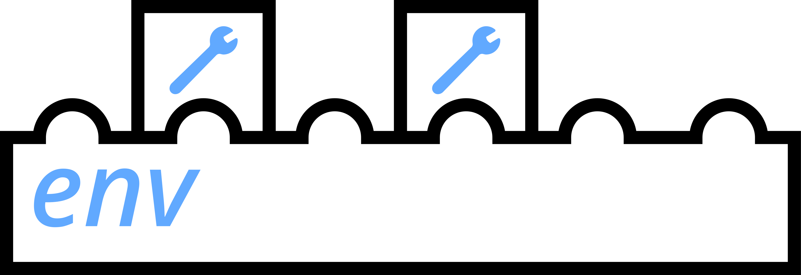{width=500} | **Live tools inside live environments:** The goal already described: joining task-specific tools together in a shared live environment. |
| 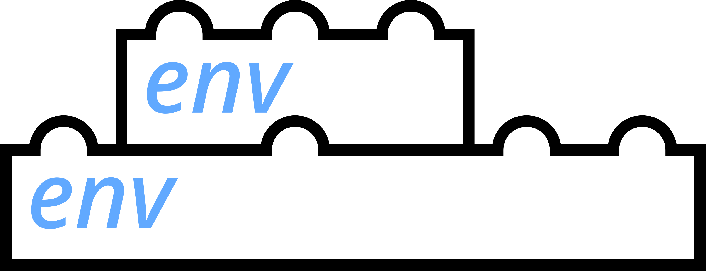{width=500} | **Live environments inside live environments:** Environments can embed in other live environments, with nested scopes at multiple levels in the programming process. |
| 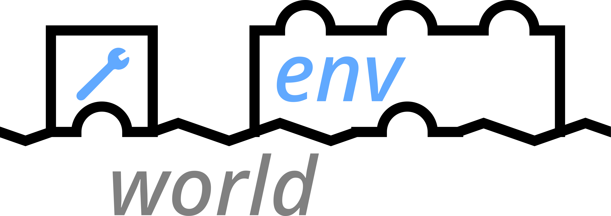{width=500} | **Live tools inside the outside world:** Engraft tools (including environments) can be embedded into applications or codebases. |
::::
:::

## Summary of Contributions

* We identify *composability* as an essential element missing from the current live-programming ecosystem.
* We articulate three forms of composition that are necessary for live programming to match conventional programming in expressiveness and practical utility.
* We present a model for an API with which heterogeneous live tools can be composed together via the three forms of composition we articulated.
* We present our prototype of this API, called Engraft, together with an assortment of example tools that showcase interaction styles that might be used in tools in the future.
* We show, through examples, how our prototype makes a variety of programming activities visible and interactive.

# Related Work

Engraft combines three essential elements: *liveness*, *domain-specific richness*, and *composability*. Each of these elements have long histories in the literature, though it is rare for all three to be combined at once (@fig:venn).
We first look at pairwise combinations of these elements, then discuss the special triple intersection consisting of projects most similar to Engraft.

::: figure {#venn}
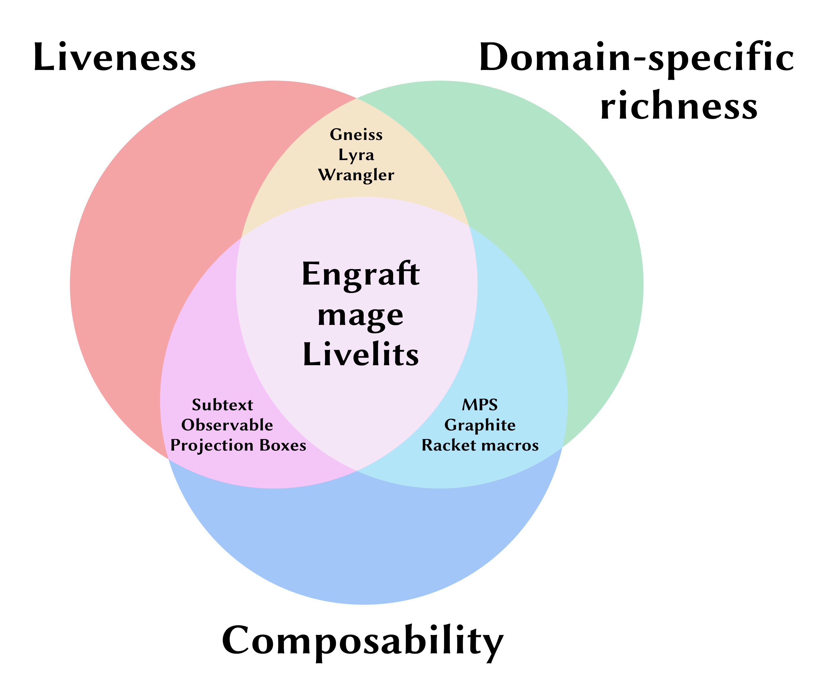{width=500 latex:width="0.7\columnwidth"}
| Pairwise and three-way intersections between liveness, domain-specific richness, and composability.
\Description{The three categories are presented as circles in a Venn diagram. The intersection between "Liveness" and "Domain-specific richness" contains Gneiss, Lyra, and Wrangler. The intersection between "Liveness" and "Composability" contains Subtext, Observable, and Projection Boxes. The Intersection between "Domain-specific richness" and "Composability" contains MPS, Graphite, and Racket macros. Finally, the central three-way intersection contains Engraft, mage, and livelits.}
:::

## Liveness + Domain-specific richness

Engraft is inspired by domain-specific programming tools like Gneiss [@doi:10.1184/R1/6714389.V1], Lyra [@doi:10.1111/cgf.12391], and Wrangler [@doi:10.1145/1978942.1979444]. These tools replace complex, opaque programming processes with direct interactions. To achieve this, they leverage novel programming paradigms (such as Gneiss's extensions of the spreadsheet model) and interaction techniques (such as Wrangler's use of "programming by demonstration"). We see enormous potential in tools like these.

However, these tools are fundamentally isolated. The challenge of combining them, or integrating them into conventional programming systems, undermines the benefits of their liveness, and arguably limits their use. Lacking such composability, developers of novel interactive programming tools have taken a variety of ad-hoc approaches to integrate them into larger workflows.

One approach is simply "copy-paste". For example, [regex101](https://regex101.com/), [Debuggex](https://www.debuggex.com/), and [RegExr](https://regexr.com/) offer live debuggers, visualizers, and documentation to help programmers write regular expressions. These tools are not integrated with developer tools like IDEs. One simply copies regular expressions in and out as needed.
Though quite a bit more complex than a regular-expression helper, Wrangler [@doi:10.1145/1978942.1979444] similarly "integrates" with larger programming tasks via "copy-paste" of generated code.
Although this works, consider what is lost.

There is a loss of *liveness*. In a copy-paste system, the user must provide sample input by hand. This tedious extra step is a place where mistakes can be propagated if the user's assumptions about what the input data looks like do not match reality.
There is also a loss of *persistence*. With one of these online tools, a programmer may curate a set of test inputs, but this ensemble is not persisted when the regular expression is copy-pasted back to code.
Finally, there is a loss of *collocation*. Using an online tool requires leaving the application code and entering a new space. With this comes a potential for disorientation and distraction.

Academic researchers developing novel interactive programming tools have generally not focused attention on how they might be integrated into larger programming workflows, preferring to focus on the tools themselves.
Furthermore, even if tool-makers go beyond the call of duty and build tight integrations into larger environments, these integrations will be *ad-hoc*. They must be built from scratch, as was done to integrate Voyager [@doi:10.1145/3025453.3025768] into JupyterLab. Generally, integrations must be built separately for each development environment.
In contrast, Engraft provides a single API that tools and hosts can use for live, fully persistent, collocated embedding.

## Composability + Liveness

Next, we consider systems combining composability and liveness,[^liveness] albeit without domain-specific richness. Most live programming editors fall into this space. We place these into three categories:

[^liveness]: Some systems are live only in that they display the output of a program, and try to update this display in response to changes in the program. Examples include "live reloading" and "hot reloading" systems popular for application development. These are at the coarser end of a scale measuring the *granularity* of liveness. At the other end of the scale are systems that exhibit fine-grained liveness: making visible the dynamic behavior of smaller programming constructs like intermediate values and control flow.

**Liveness within textual code.** One common recipe is to augment textual-code editors with in-context displays showing run-time behavior. Rauch et al.'s "Babylonian-style Programming" [@doi:10.22152/programming-journal.org/2019/3/9] surveys the state of the art in this category as of 2012. They evaluate eight existing editors [@doi:10.1145/1052883.1052894; @live-literals; @doi:10.1145/2814189.2817268; @inventing-on-principle; @learnable-programming; @seymour; @light-table], before adding their own to the list. Notable entrants to this category since 2012 include Swift Playgrounds in Xcode [@swift-playgrounds] and Projection Boxes [@doi:10.1145/3313831.3376494]. These editors imbue conventional textual code with powerful new forms of visibility. As they restrict their attention to this conventional textual code, they do not provide opportunities for rich task-specific representations and interactions.

**Liveness between textual code cells.** Rather than threading live feedback into traditional codebases, other editors provide special interfaces where code is broken up into "cells". These editors can then provide visibility into values flowing between cells. We call such editors "live environments", as they provide liveness to environments where pieces of code are composed. The paradigmatic live environment is the spreadsheet. More recent live environments include Observable [@observable] and Natto [@natto], which both augment JavaScript programming in-the-small with a live structure in-the-large: Observable via a computational notebook and Natto via nodes and wires on a canvas. While environments like these play an important role in building programs with Engraft, they do not, by themselves, enable natural domain-specific interactivity. Specifically: (1) Cells can render UI, but this UI cannot persistently modify program state.^[Observable and Natto have both implemented particular, ad-hoc tools that can persist state: Observable's Data Table Cell [@observable-data-table-cell] and Natto's Template Panes. These extensions are built into their respective platforms and can access capabilities that are not available to user-authored tools.] (2) They do not support hierarchical nesting of tools. (3) They are both monolithic web applications which cannot themselves be embedded into other live environments or outside applications.^[Observable notebooks and Natto canvases can be invoked via JavaScript module export, but someone using this export cannot see their own inputs flowing through the notebook/canvas, nor do they have the ability to modify the notebook/canvas's behavior in context.]

**Liveness with structured editors.** Finally, we have *structured*, or *projectional*, editors which are not based on textual code or cells thereof, but which instead allow interactions directly with structured representations of code. Many structured-editor projects involve live feedback, including Enso [@enso], Lamdu [@lamdu], PANE [@pane], and Subtext [@doi:10.1145/1094811.1094851]. To our knowledge, no live structured editor projects have added custom domain-specific components to their structures, though it would seem to be a natural direction.

## Composability + Domain-specific richness

The final pairing integrates domain-specific representations and interactions into general-purpose programming environments, albeit static ones. A number of projects have explored this possibility.
@doi:10.1145/3428290 describes a visual macro system for Racket which lets users define interactively editable visual syntaxes embedded inside of arbitrary Racket code.
Graphite [@doi:10.1109/VLHCC.2011.6070422] extends a Java IDE with pop-up "palettes" to bidirectionally edit literals in code.
MPS (Meta Programming System) [@mps] is a workbench for developing projectional domain-specific languages. MPS languages typically look mostly like conventional code, but they can embed custom interfaces like tables and state-machine diagrams.

These approaches differ from Engraft along many axes, but by far the most salient is their lack of liveness. In all the above cases, visual representations embedded in code represent static syntax, and do not show information about dynamic program behavior. All of the tools in Engraft benefit from liveness, and some, like [Extractor]{.toolname} and [Formatter]{.toolname}, derive their entire power from allowing the user to act directly on data in the system. These sort of tools are not possible in a system without liveness.

## Combining All Three {#all-three}

Engraft joins two recent projects that combine liveness, domain-specific richness, and composability: mage [@doi:10.1145/3379337.3415842] ("an API for allowing smooth transitions between GUI and code work in notebooks") and Hazel's livelits [@doi:10.1145/3453483.3454059] ("user-defined GUIs embedded persistently into code").
These projects share both motivations and common design elements with Engraft. However, Engraft goes beyond them by enabling new forms of composition.

While mage and livelits support joining tools together in a shared live environment, Engraft further supports embedding environments within environments, and embedding live tools within the outside world.
Because its API is tied to its Jupyter host, mage tools cannot be embedded within each other, but must follow the flat structure of a Jupyter Notebook.

Unlike mage tools, livelits are nestable within each other and other Hazel [@doi:10.1145/3290327] constructs, but a smaller variety of tools are possible than with mage or Engraft.
Live environments like notebooks can not serve as livelits, as livelits' typing discipline is not expressive enough to represent these dynamic environments.[^hazel-environments]
Livelits, as the name "live literals" suggests, have so far been restricted to widgets like sliders and color pickers.
Engraft supports a broader range of tools, from nestable environments like [Notebook]{.toolname} to programming-by-demonstration tools like [Extractor]{.toolname} and [Formatter]{.toolname}.

Engraft also differs from livelits in our implementation strategy. While livelits are built in Hazel, a self-contained research platform, Engraft is built in the Web platform, where it can grow through contact with actual use.

[^hazel-environments]: The Hazel environment itself can be embedded in livelits, but this still means that developers do not have the benefit of experimenting with alternative live environments.

# Live Composability with Engraft

As we previewed in the introduction, Engraft enables three forms of live composition: **live tools inside live environments**, **live environments inside live environments**, and **live tools inside the outside world**. Our initial work on Engraft was driven by the first of these. The architecture that we designed in response to this goal proved to be more versatile than we expected, enabling the last two as an emergent byproduct. In retrospect, we believe all three of these forms will be important to make programming with live tools a viable alternative to static code.

This section describes the end-user experience of building programs with Engraft, making use of these three forms of composition. Later, in @sec:design-decisions and @sec:implementation, we discuss the design and implementation of the underlying Engraft API.

## Live tools inside live environments

Earlier, we presented an example of a digital artist who wants to make a website that displays summaries of random Wikipedia articles. Let's examine how this artist might accomplish their goal by composing live tools together in a live environment with Engraft.

They start by loading the Graft Garden website. This is a web application which provides a convenient starting point for using Engraft tools. Graft Garden will also host the output of these tools as a separate web page, as we will see later.

Once the artist tells Graft Garden to make a new project, they are presented with a blank page ([@fig:new_patch]), containing a single small code-editor box, called a *slot*. This slot is the starting point for everything they will do.

::: figure {#new_patch}
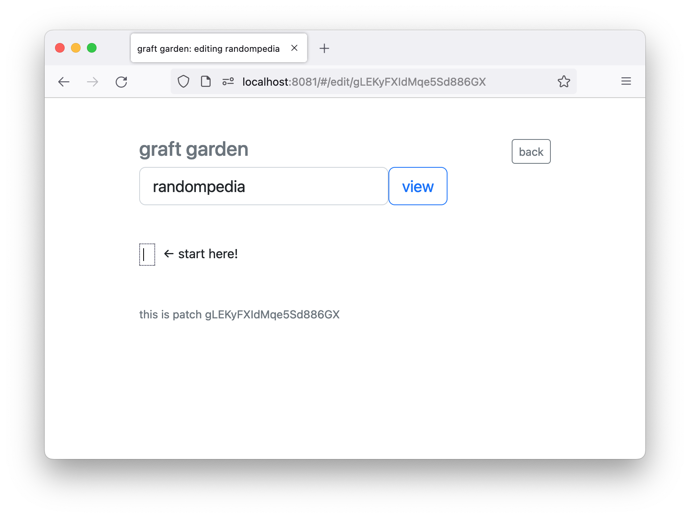
| A new "patch" (project) on Graft Garden.
\Description{A minimalist webpage in a browser. The webpage's header contains the heading "graft garden" and a text box with "randompedia" typed into it. The main body of the webpage contains a slot: a small box with a dashed border. Next to the slot is a note of guidance: "start here!".}
:::

The artist knows that their project will involve combining together multiple steps. So they would like to work in a *live environment* that allows multiple computational steps to be combined together in fluid and flexible ways. Example environments include computational notebooks (like Observable), free-form canvases of nodes and wires (like Natto), and spreadsheets (like Excel).
Engraft is not built around any one of these environments in particular. As versions of all of these have been implemented as Engraft tools, the artist can take their pick of whichever suits their needs.

In this case, the artist picks a computational notebook. They do this by beginning to type `/notebook` in the slot, and selecting ‘notebook' from the autocomplete menu that pops up. Once they do this, the slot is replaced with the notebook interface ([@fig:type_notebook]).

::: figure {#type_notebook}
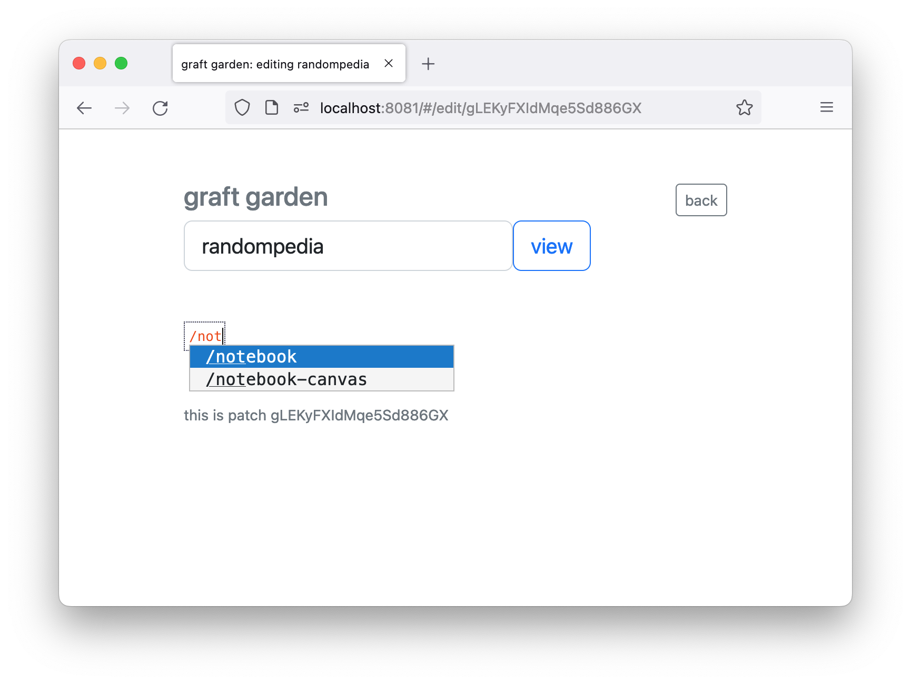{width=45%}
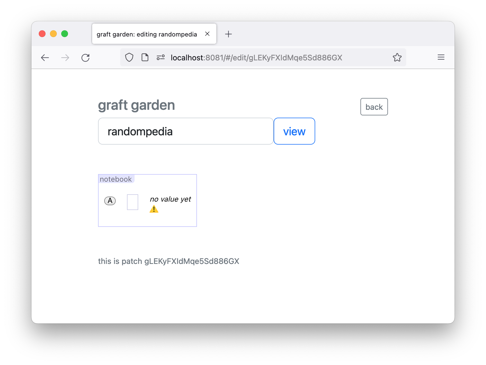{width=45%}
| The artist begins to type `/notebook` into the slot, and selects the autocomplete suggestion. A notebook is inserted into the slot.
\Description{Two subfigures. The first subfigure shows the "Graft Garden" webpage. The slot now contains typed text "/not". An autocomplete pop-up next to it shows a highlighted option "/notebook" and a second option "/notebook-canvas". In the second subfigure, the slot is replaced with a larger box, the "Notebook" tool. This tool has a lavender border, and a small heading at the top reading "notebook". Inside the tool is a single row, consisting of 1. a small token reading "A", 2. a small slot identical to the original one, and 3. the text "no output yet".}
:::

This is a reactive notebook in which a user can type code snippets into cells. The notebook will evaluate these snippets and show their resulting values alongside the cells ([@fig:example_notebook]). Cells receive default names (like in a spreadsheet), but can be renamed. Cells can refer to one another, and the notebook ensures that a cell is re-evaluated when one of its references changes.

::: figure {#example_notebook}
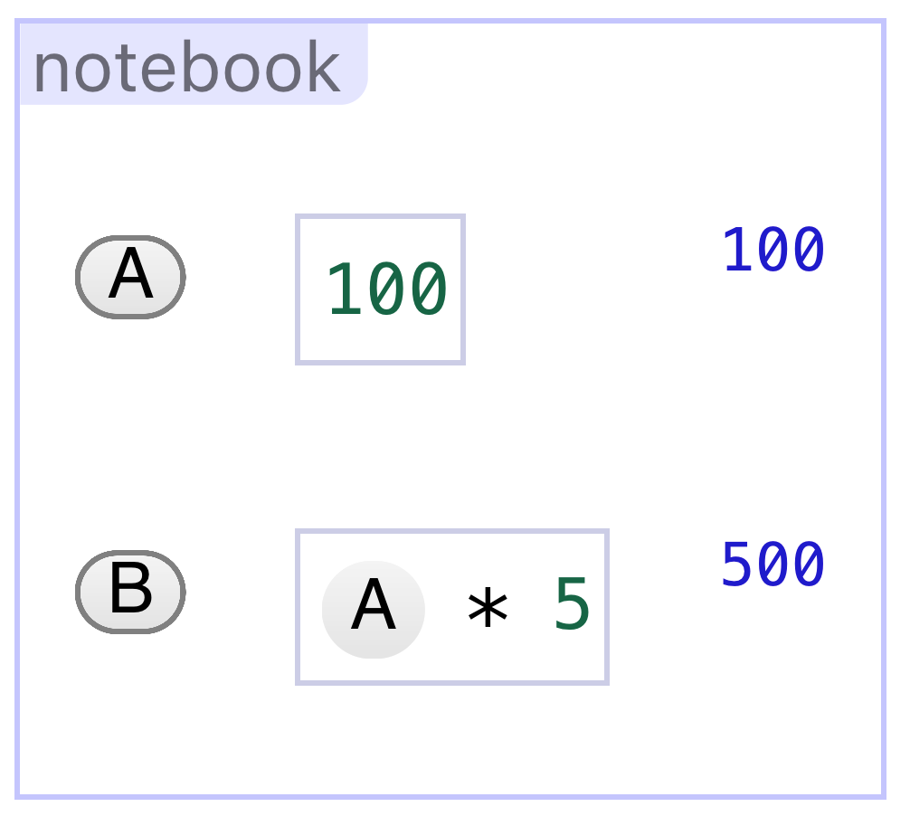{width=300 latex:width=6cm}
| Example usage of a notebook. The second cell (B) refers to the first (A).
\Description{The slot next to the "A" label reads "100", with blue output text 100 next to it. The slot next to the "B" label reads "A * 5" (where "A" is represented as a special token), with blue output text 500 next to it.}
:::

Let's return to the artist. The first thing they need to do is get hold of data from the Wikipedia API. Rather than write networking code directly, they type `/request` into the first cell, and select 'request' from the autocomplete menu that pops up. This inserts a [Request]{.toolname} tool into the cell. The notebook's cells are slots, just like the root slot the artist used to invoke the notebook.

The [Request]{.toolname} tool has two slots: one to provide a URL and one to provide an object of query parameters ([@fig:request_tool]). As the artist skims the Wikipedia API documentation, they experiment with different query parameters. The tool resends the query with every change, so the artist can see the effects of their changes live.

::: figure {#request_tool position="h"}
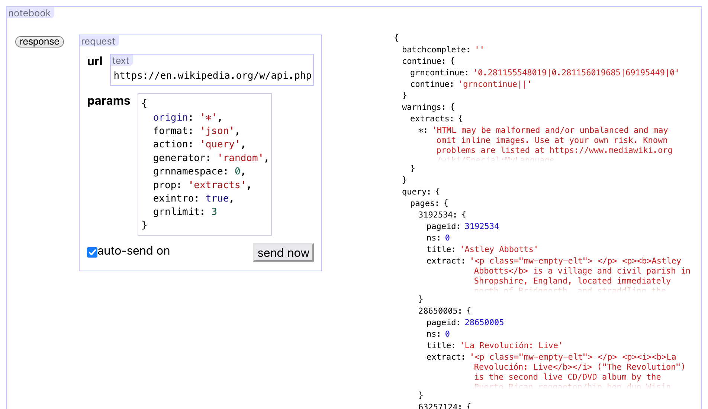{width=500 latex:width=10cm}
| A [Request]{.toolname} tool inserted into the notebook. The artist has provided contents for its "url" and "params" slots. The request's JSON response is shown to the right. Long string values are automatically placed in scrolling sub-windows.
\Description{A notebook is shown with one row visible. This row contains 1. a small token labelled "response", 2. an embedded "Request" tool, and 3. a large JSON output, with nested objects and arrays. The embedded "Request" tool has the same kind of frame as the original notebook, although it is labelled "request" at the top. Inside, there are two slots, one labelled "url" and the second labelled "params". A checked checkbox at the bottom is labelled "auto-send on", alongside a button labelled "send now".}
:::

Just like a snippet of code typed into a computational notebook, the [Request]{.toolname} tool produces *output*, which is returned to the notebook that hosts it. The notebook can then display this output live, and make it available to other cells by reference.

Examining the output, and playing with query parameters, the artist eventually finds a configuration they like. It delivers five random articles, complete with titles and HTML-summary "extracts".

While the artist can see the data they want in the API response, the task of extracting it out of the complicated JSON structure is a bit intimidating. Fortunately, they know a second tool, called the [Extractor]{.toolname} tool[^extractor] ([@fig:extractor_tool]). This tool accepts JSON data as input and presents an interface that allows the user to select data values by clicking on those values directly. The tool generalizes from these clicks, providing an output structure with the values the user wants. The result is equivalent to writing code that loops over arrays and objects with chains of property accesses.

[^extractor]: [Extractor]{.toolname} is similar to an interaction found in Gneiss [@doi:10.1184/R1/6714389.V1].

::: figure {#extractor_tool position="h"}
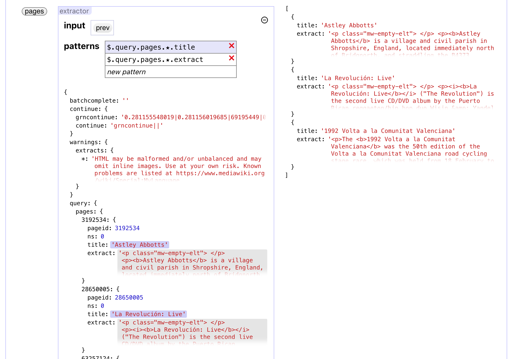{width=500 latex:width=10cm}
| An [Extractor]{.toolname} tool inserted into the notebook below the [Request]{.toolname} tool. It refers to the previous cell as input. The artist has selected various data fields by clicking on them. The tool's output is shown to the right.
\Description{A single row of a notebook is visible. This row contains 1. a small token labelled "pages", 2. an embedded "Extractor" tool, and 3. a smaller JSON output, consisting solely of an array of objects each of which have "title" and "extract" fields. The embedded "Extractor" tool has a slot at the top labelled "input", with a small "prev" token inside it. Below this, it has a table labelled "patterns", containing one "pattern" for "title" and a second for "extract". Finally, the tool shows a copy of the data output from the previous "Request" tool, but this time with certain fields deep in the data's hierarchy highlighted.}
:::

This tool is more interesting, in its liveness, than the [Request]{.toolname} tool. The [Request]{.toolname} tool offered a convenient form interface for specifying a request, but that interface was structurally similar to working with code. In contrast, the [Extractor]{.toolname} tool's interface relies on live input data to support programming-by-demonstration.

Now that the artist has extracted the data they care about, they want to reshape it into an attractive interface. For this they use a [Formatter]{.toolname} tool[^formatter] ([@fig:formatter_tool]). Given a JavaScript data structure, [Formatter]{.toolname} automatically suggests a way to format the data into HTML output. It also provides direct-manipulation handles the user can use to choose different options for this formatting. Like [Extractor]{.toolname}, [Formatter]{.toolname} uses live data to power a programming-by-demonstration interface. The artist hands [Formatter]{.toolname} the output of [Extractor]{.toolname}, and does a bit of clean-up.

[^formatter]: [Formatter]{.toolname} is similar to a (second) interaction found in Gneiss [@doi:10.1184/R1/6714389.V1], and is also inspired by Yoshiki Schmitz's work [@yoshiki].

::: figure {#formatter_tool position="h"}
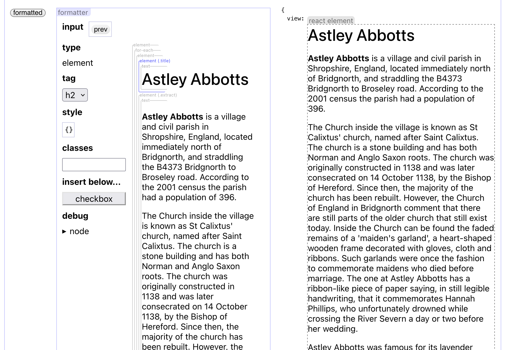{width=500 latex:width=10cm}
| A [Formatter]{.toolname} tool inserted into the notebook below the [Extractor]{.toolname} tool. It refers to the previous cell as input. The artist has used its interface (including an inspector on the left) to specify how the extracted data should be formatted. The tool output is shown to the right.
\Description{A single row of a notebook is visible. This row contains 1. a small token labelled "formatted", 2. an embedded "Formatter" tool, and 3. an output containing a formatted Wikipedia summary, with a heading "Astley Abbotts" and rich text beneath. The embedded "Formatter" tool has a slot at the top labelled "input", with a small "prev" token inside it. Below this, it has a custom interface. The interface shows roughly the same formatted display mentioned before, but with nested brackets around parts of it, showing a hierarchy. Most of these brackets are gray, but one is highlighted blue. On the left-hand side, a simple inspector allows properties of this bracket to be edited, such as selecting the tag type "h2".}
:::

The artist has now built a live computational notebook, consisting of three live tools:

1. a [Request]{.toolname} tool, to get data from the Wikipedia API,
2. an [Extractor]{.toolname} tool, to pluck out the data they need in a clean format, and
3. a [Formatter]{.toolname} tool, to shape the data into an HTML document with the appearance they desire.

The last step is to "deploy" this living program to a website, where a visitor will receive their own random set of articles. Conveniently, Graft Garden, the web application that has hosted their work so far, has already done this. The output of the last cell in the notebook (the [Formatter]{.toolname}, in this case) is returned back to Graft Garden. Graft Garden provides a shareable link that displays this final return value without visible tool UI ([@fig:randompedia]). Note that the Wikipedia articles shown here are different than above, as the artist's program runs anew every time this page is loaded.

::: figure {#randompedia position="h"}
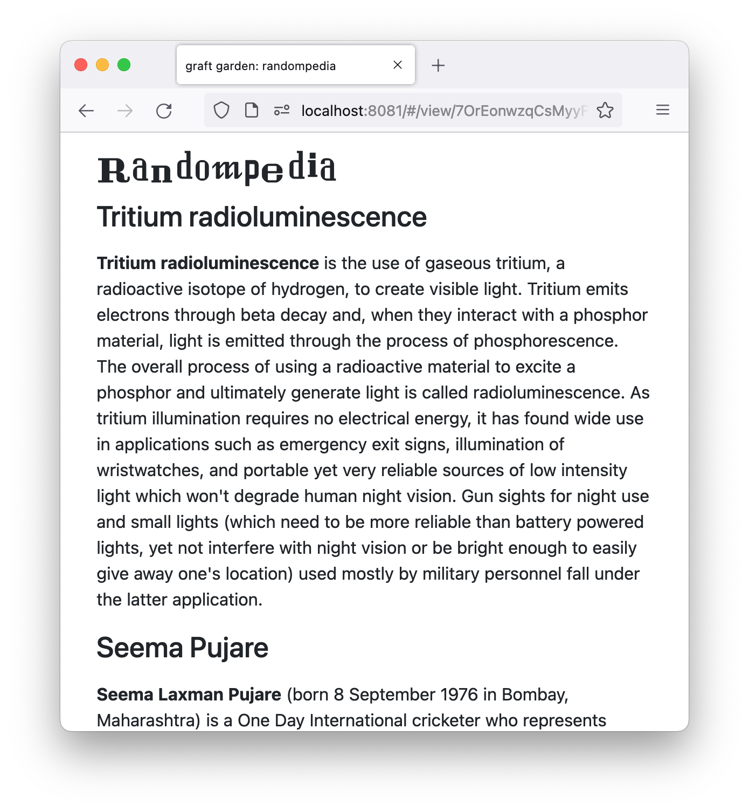{latex:width=8cm}
| The artist's final creation: a dynamic website invisibly powered by their Engraft program. It is available at a separate URL.
\Description{A webpage with a funky heading "Randompedia". Below this, two Wikipedia summaries are visible, one for "Tritium radioluminescence" and a second for "Seema Pujare". They appear like the output of the "Formatter" tool, but no tools are shown on this page.}
:::

Our artist has not had to type any code to create this dynamic web page, aside from experimenting with API query parameters. A "results not typical" disclaimer applies here: In most cases, more JavaScript coding will be required to accomplish real-world programming goals with Engraft. This fits with our vision, as Engraft is built to gradually extend conventional programming workflows. There should be nothing stopping a user from using traditional textual code whenever it is useful or necessary to do so. But when using Engraft, a new possibility opens up: replacing certain steps with interactive, direct-manipulation tools.

In the story above, the artist chose to compose their tools inside of a [Notebook]{.toolname}. As we mentioned earlier, this is not the only live environment an Engraft user may choose to use. For different tasks, different environments may be preferred.

Suppose a user wants to construct an arrow graphic to represent a vector of x- and y-values, perhaps as part of an interactive explanatory diagram. @fig:notebook_vs_canvas shows how they might do this in a [Notebook]{.toolname}. It then shows the same logical structure expressed in a new environment (loosely modeled on Natto [@natto-hn]^[A more ambitious adaptation of Natto, which could also be implemented with Engraft, would connect cells with wires rather than references.]), called a [NotebookCanvas]{.toolname}. Cells on a [NotebookCanvas]{.toolname} work the same way as on a [Notebook]{.toolname}, but they can be freely dragged around a canvas and resized however the user likes.

::: figure {#notebook_vs_canvas}
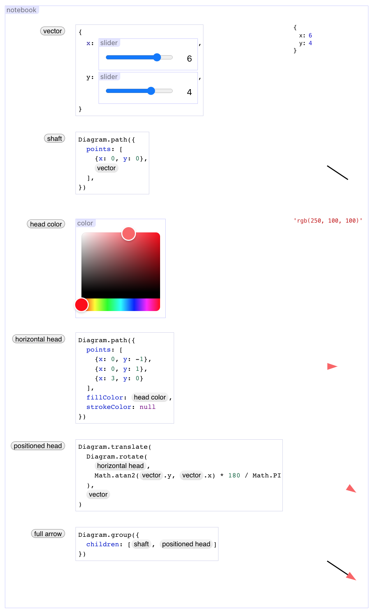{width=30%}
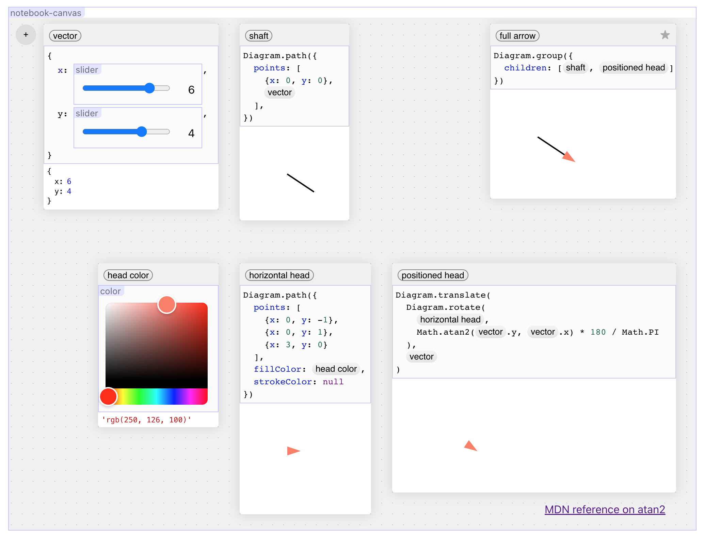{width=65%}
| (a) A [Notebook]{.toolname} in which a user builds an arrow graphic for a vector. (b) A [NotebookCanvas]{.toolname} consisting of the same cells, but arranged spatially.
\Description{Subfigure (a): A notebook with six cells. The notebook builds up a simple arrow shape in pieces, starting from xy data. The intermediate shapes are shown as cell output. The cells mostly contain JavaScript code, though one uses two sliders to specify x and y, and another uses a color picker. These interfaces are embedded in code with the same frames we have seen before, marking them as Engraft tools. Subfigure (b): The six cells from the notebook are now placed on a gray canvas background. Each is now a pane, consisting of a name token, a definition cell, and an output display in a column. They are different sizes, and spaced somewhat irregularly on the canvas.}
:::

The user might choose to use [NotebookCanvas]{.toolname} over [Notebook]{.toolname} for a number of reasons: higher visual density, space to organize nonlinear data-flows, and a looseness that avoids some "negative effects of prematurely or unnecessarily imposing a structure" [@doi:10.1023/A:1008716330212]. The user has this choice because Engraft decouples tools from environments, making it possible to choose the right environment for the job without losing access to the right tools.

## Live environments inside live environments

Live environments are powerful building blocks for live programming. The above example uses a [Notebook]{.toolname} to link together three live tools. However we have found that one environment, by itself, is often not enough, because a single environment is "flat".

To explain what we mean by *flat*, suppose an Observable user has an array of complex data elements. They would like to process each element of this array to obtain a new version of the array, a "map" operation. They are free, in Observable, to write a cell that performs this map operation:

```
newArray = oldArray.map((element) => {
	return step3(step2(step1(element)));
});
```

Here, the per-item processing function is complex, consisting of multiple steps (function calls). A selling point of a computational notebook is that it can split separate steps into separate cells, providing visibility into intermediate values. Here, Observable's interface is not available *inside* this map operation, because the entire map operation needs to be inside a single cell. The benefits of liveness and visibility that Observable offers are lost in this deep structure. Observable is *flat*, and programming, in general, is not.

In contrast, the Engraft architecture suggests that environments could themselves implement the API of an Engraft tool, becoming tools themselves. This means that live environments can be embedded inside of other live environments, allowing these environments to reflect a nested structure in the computation being performed.

For instance, we have built a tool called [Map]{.toolname}, designed to support a user mapping through an array. [Map]{.toolname} takes an input array and provides a slot for a "per-item tool". [Map]{.toolname} shows the per-item tool being run on a single element of the array, so that the user has concrete data to inform their experience of live-programming the per-item tool. The user can use [Map]{.toolname}'s interface to select which element of the array they would like to use as their example, so they can test that their per-item tool performs well across variations. To compute its final output, [Map]{.toolname} also runs a copy of the per-item tool on each element of the input array, though most of these executions are invisible. (This is a good example of why it is important that tools can run without their interfaces being rendered.)
[@fig:map_tool] shows a notebook embedded inside of [Map]{.toolname}, so that multiple stages in the per-item tool can be examined live as they are programmed.

::: figure {#map_tool}
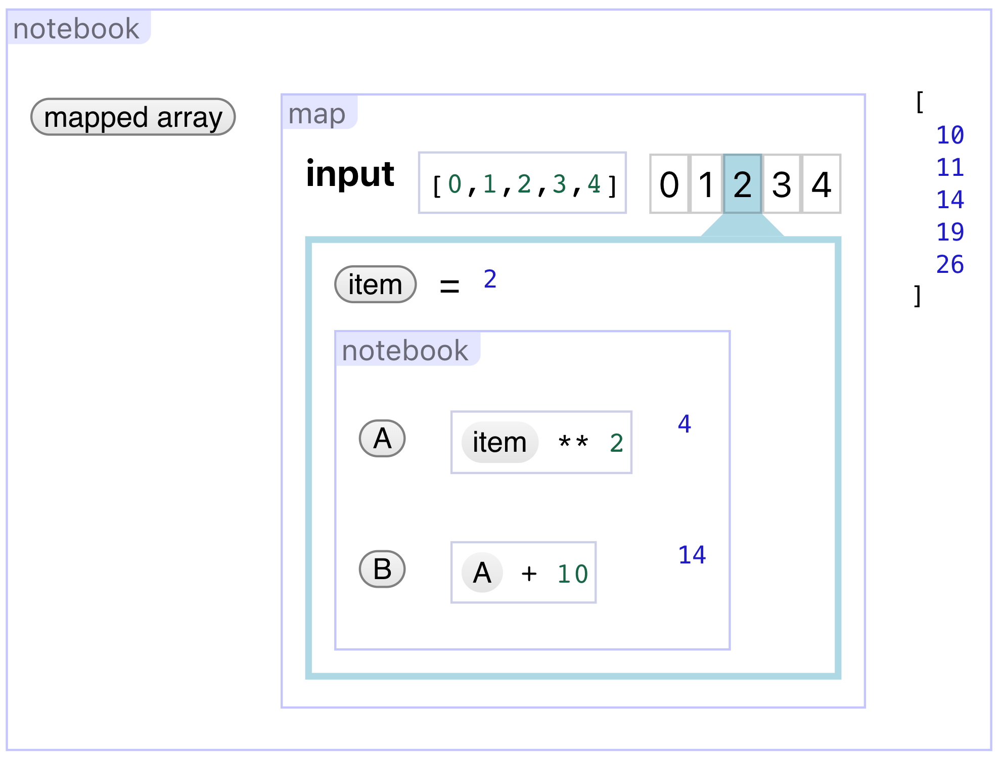{width=400 latex:width=8cm}
| A toy example, showing [Notebook]{.toolname} inside of [Map]{.toolname} inside of [Notebook]{.toolname}. [Map]{.toolname} has been given the array `[0,1,2,3,4]` as input. Its inner notebook squares an item of an array and then adds 10, in two separate cells. The user has selected index 2 in the [Map]{.toolname} tool as the example they would like to display in the inner notebook.
\Description{The new visual element here is the "Map" tool. It shows a slot labelled "input", containing the raw code "[0,1,2,3,4]". Next to this is a bar of five small boxes, labelled 0, 1, 2, 3, and 4. The box labelled 2 is highlighted in teal. A teal trapezoid below it connects this box to a much larger box with a white background and a teal border. At the top of this box is a line associating a token labelled "item" with a blue output "2" with an equation symbol. Below this is the notebook described in the caption. (The first row of the notebook uses a token labelled "item".)}
:::

To see [Map]{.toolname} used in a real-world context, let's look at an "image quilt" generator made with Engraft ([@fig:image_quilt]). Starting with a user-supplied query, like "abstract" or "cat", this web application displays a dense array of annotated artworks.

::: figure {#image_quilt}
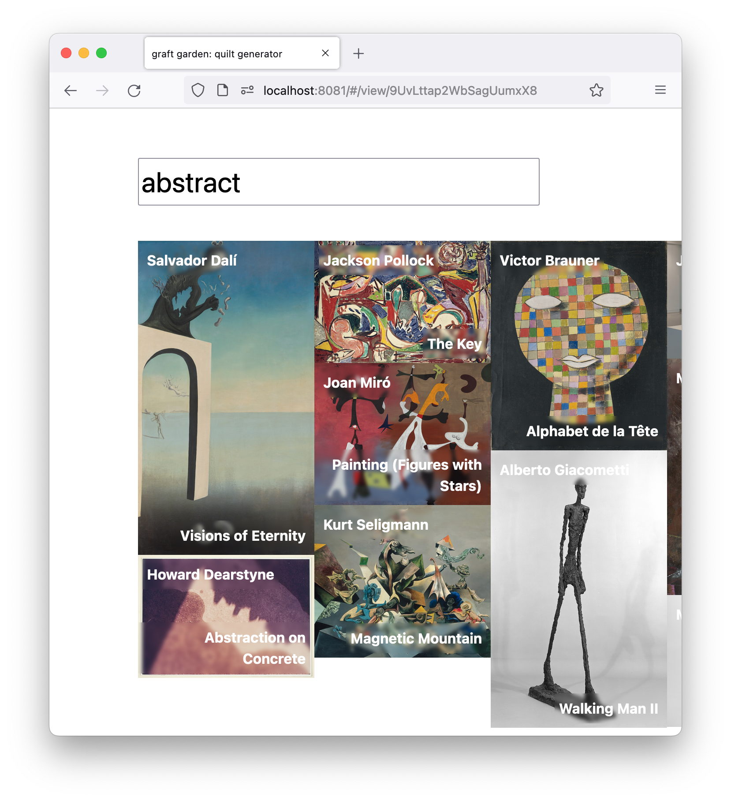{width=400 latex:width=8cm}
| The image quilt application, displayed in Graft Garden's "view" mode. The images shown are a result of the user typing "abstract" into the search box.
\Description{A minimalist webpage without any tool UI or headings. At the top, a large text box contains the text "abstract". Below this is a tightly-packed grid of modern-art images. Each one contains an artist's name in the top-left and an artwork name in the bottom-right.}
:::

The Engraft program behind this application starts by querying the Art Institute of Chicago API for matching works of art. This returns an array of objects representing works of art. To make the quilt, we need to turn each element of this array into a composite of image and text. We can do this with [Map]{.toolname} ([@fig:image_quilt_program]).

::: figure {#image_quilt_program}
{width=600 latex:width=0.9\columnwidth}
| An excerpt of the program used to generate the image quilt. A [Map]{.toolname} tool takes in an array of data returned by the Art Institute of Chicago API. A [Notebook]{.toolname} embedded inside the [Map]{.toolname} processes each element of this array. In three cells, it 1. constructs an image URL, 2. loads this URL into an image element, to check that it is constructed correctly, and 3. builds a composite, layering text on top of the image element with appropriate styling.
\Description{A screen-sized "map" tool, with the same overall structure as the one shown before. The top of the teal box shows that "item" is a particular JavaScript object, with fields like "artist_title" and "title". The notebook below shows results for a particular abstract artwork.}
:::

By splitting the per-item process into multiple steps in the [Notebook]{.toolname}, we receive immediate feedback about each step. Is the URL of the image being generated correctly? How does the composite look with its current styling? (One can certainly imagine this composition step being replaced someday with a direct-manipulation tool!) Once the array of HTML elements is returned by [Map]{.toolname}, it can finally be composed into the quilt.

Programming is full of nested abstractions, so mapping an array is only one example of where it can be valuable to nest environments. As a very different example, consider programming a physics simulation. We are inspired here by the Bootstrap curriculum, which uses programming to teach algebra, physics, and computation to students in grades 5-12 [@bootstrap]. We adopt a functional structure for our simulations similar to Bootstrap's "reactor" [@doi:10.22152/programming-journal.org/2019/3/11], where a simulation is defined by:

* a *state* value, initialized to a certain value,
* a way to *view* the state, and
* a way to *update* the state on each time step.

A tool called [Simulation]{.toolname} lets a user define each of these pieces in slots. It can be useful to insert a live environment into one of these slots -- say, to break down the "update" into steps. Here, a [Notebook]{.toolname} in the "update" slot of a [Simulation]{.toolname} describes a bouncing ball behavior ([@fig:simulation]).

::: figure {#simulation}
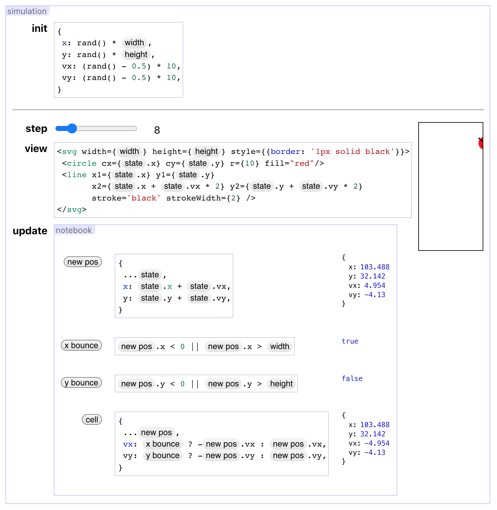{width=450 latex:width=9cm}
| A [Simulation]{.toolname} tool, loaded with code that describes how a ball bounces around a rectangular region. The user of the tool has provided 1. init: a slot to initialize the ball's state, 2. view: a slot describing how the state should be rendered, and 3. update: a slot ([Notebook]{.toolname}, here) describing how the state should be updated on each tick of time. The user has scrubbed the step slider to step 8, at which point the ball is bouncing off the rectangle's right-hand side.
\Description{The "init" slot contains code defining fields "x", "y", "vx", and "vy" and setting them to random values. The "view" slot contains code with XML tags defining a SVG element containing a circle and a line. Attributes of these elements sometimes extract fields of embedded tokens labelled "state". The "update" slot contains a notebook. It's four cells are labelled "new pos", "x bounce", "y bounce", and "cell". The "new pos" cell adds the state's velocity to its position. The "x bounce" and "y bounce" cells test if the ball has moved outside of the box, and return "true" or "false". In this case, "x bounce" returns "true". The "cell" cell inverts x or y velocity if a bounce occurs. In this case, it has inverted the x velocity. To the right of a step slider, a box shows the SVG output, in this case, a ball mostly off the right-hand side of a box, with a small line showing its velocity.}
:::

By dragging the "step" slider, the user can see the "view" and "update" in the context of that particular step. Here, for instance, we see that the "x bounce" cell in the notebook has evaluated to `true`, so its x velocity will be inverted in the next step, as it bounces off the right-hand side of the box. Scrubbing through the time steps with the slider, the user can check that the pieces of their computation do what they expect, even as conditions change.

[Simulation]{.toolname} could have been implemented as a top-level application, rather than a tool. But implementing it as a tool provides even more benefits. In the example above, [Simulation]{.toolname} is in fact embedded in a larger [Notebook]{.notebook} (not shown). This larger notebook provides the shared variables "width" and "height" that the [Simulation]{.toolname}'s different slots can refer to. The [Simulation]{.toolname} tool also provides output of its own back to the [Notebook]{.notebook}: a trace of all the states the simulation passes through. This trace can be used, live, in other cells to analyze the output of the simulation. Here, we feed it into a tool that embeds Voyager 2 [@doi:10.1145/3025453.3025768], a system for visual data exploration. Using Voyager 2's interface, the user plots the x position over time ([@fig:simulation_voyager]). The bounce after time-step 8 is visible in this plot in a new way.

::: figure {#simulation_voyager}
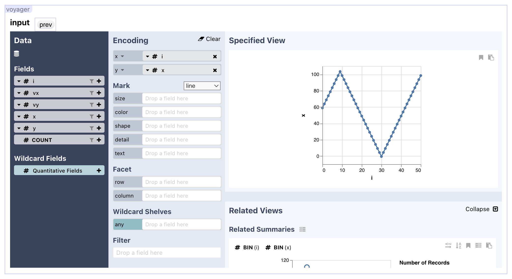{width=500 latex:width=10cm}
| A [Voyager]{.toolname} tool in the same [Notebook]{.toolname} as the [Simulation]{.toolname}. It has been provided with the [Simulation]{.toolname}'s output as its input, and the user has dragged fields onto the encoding shelves to plot "x" against "i".
\Description{A tool, with the standard lavender border, labelled "voyager". At its top, a slot labelled "input" contains a token labelled "prev". Below this is the Voyager 2 interface: a large, complex interface which appears stylistically dissimilar to the interfaces shown so far. It contains bars labelled with different fields, like "x", "vx", etc. Under the heading "Encoding", a bar labelled "i" has been placed next to the label "x" and a bar labelled "x" has been placed next to the label "y". To the right, a chart is shown. It shows a zig-zag line made of dots and lines, representing the ball's x position over time. At around where the x-axis is labelled 8, the line changes from moving up to moving down.}
:::

There is nothing special about the example situations described above. Nested structures are pervasive in programming. To provide the benefits of liveness & domain-specific richness across these nested structures, live environments must be similarly composable.

\FloatBarrier

## Live tools inside the outside world

Given an Engraft slot, a programmer has access to the entire ecosystem of interoperable Engraft tools. But the question remains of how they get to that slot, and how the program in the slot gets things done in the larger world. Here, we discuss how the Engraft architecture makes it possible to embed live tools and environments where work is done in the real world. We focus on two categories of embeddings: codebases and applications.

### Codebases

So far, we have presented Engraft in the context of Graft Garden, a simple web application that hosts Engraft tools and lets users create custom web applications. While Graft Garden is easy to access and use, it naturally has a limited range of usefulness. We do not expect developers of complex web applications to abandon their preferred frameworks, throw out their codebases, and switch to Graft Garden (or any other imagined Engraft host, for that matter). However, we still believe that programmers working in codebases could benefit from the judicious use of live tools and environments, if this didn't require switching entirely into a new, all-encompassing platform.

Fortunately, we have found that the structure of the Engraft ecosystem offers opportunities for integration with present programming practices. With these integrations, programmers can take advantage of what Engraft has to offer in an unobtrusive and gradual fashion.

As an example of this, we prototyped embedding of Engraft tools into conventional web-application programming workflows. Specifically, we implemented a React "hook" called `useLiveTool` which allows a live tool to be embedded into a React codebase. At development time, this hook presents the Engraft user interface running alongside a live version of the web application being developed ([@fig:synonymizer]). Data is fed, live, from the web application being developed into the Engraft user interface. The results are fed, live, back to the web application. When the developer is done working with the tool, they can disable it from being displayed. In production, the "computational behavior" of the tool is used without any visual presentation.

::: figure {#synonymizer}
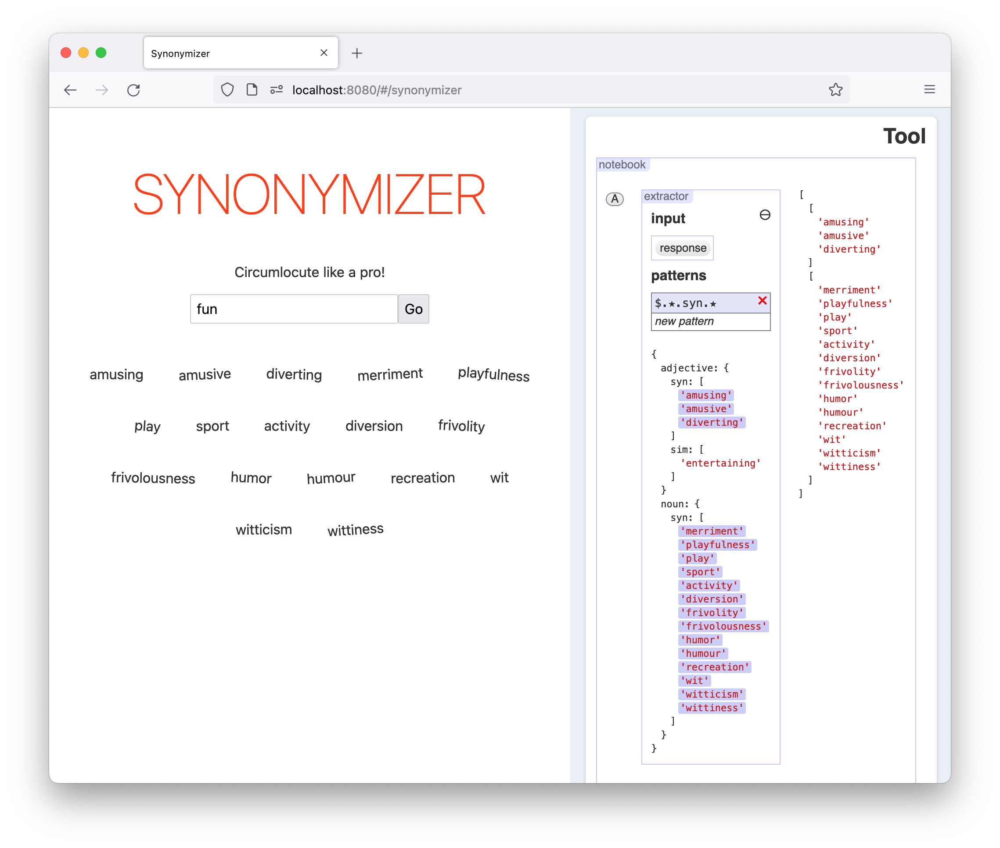
| A conventional web application, Synonymizer, developed with `useLiveTool`. Because `useLiveTool` is called with `hide:false`, the live tool is displayed in the browser, to the right of the running application. Several live tools, including [Notebook]{.toolname} and [Extractor]{.toolname}, are used in this side pane to transform an API response passed from the conventional code into the tool into a clean set of words that can be displayed on screen. The running app shows the live output from the tool.
\Description{A browser window is shown. On the left is a webpage, with heading "SYNONYMIZER", a text box underneath with "fun" typed into it, and a large number of synonyms of fun (like "amusing") displayed below at jaunty angles. On the right, a special pane contains a Notebook tool. Embedded in this Notebook is an Extractor tool. The Extractor shows its input, a Javascript structure containing arrays of words inside multiple levels of nested objects. Its output shows a simpler structure, with these objects stripped out. The words in the output match the words shown in the webpage on the left.}
:::

```
const synonyms = useLiveTool(
	{ response },
	{ defaultValue: [], hide: false}
);
```

This is only one example of how Engraft could be embedded into existing development contexts. Different situations will call for different embeddings. For instance, someone writing a command-line program may want to write a particular function with Engraft. Because the command-line program runs imperatively, with side effects, it can not use `useLiveTool`'s fully-reactive approach where the program re-runs as the user edits the function in Engraft. However, a "programming with examples" approach [@doi:10.1145/22627.22349] could be employed, where the user gathers a number of input values for their function before iterating on their function's implementation, testing it on examples as they go.

The design and implementation of these various embeddings will be nontrivial, as they must bridge gaps between a variety of programming paradigms and Engraft's own reactive infrastructure. We discuss some of these challenges briefly in @sec:technical-limitations. However, Engraft's loosely-coupled functional architecture puts it in a good position to take on these challenges.

### Applications

Codebases aside, we are also interested in ways interactive end-user applications can host Engraft tools. Graft Garden provides one example, but any application with access to the Web platform could provide an Engraft slot as an access point to the Engraft ecosystem.

For instance, Cuttle [@cuttle], a vector editor for digital fabrication, currently has the ability to implement components and modifiers with bits of JavaScript code. If Cuttle's code box were replaced with an Engraft slot, the world of Engraft programming tools would be available, in-place, to Cuttle users. ([@fig:cuttle])

::: figure {#cuttle}
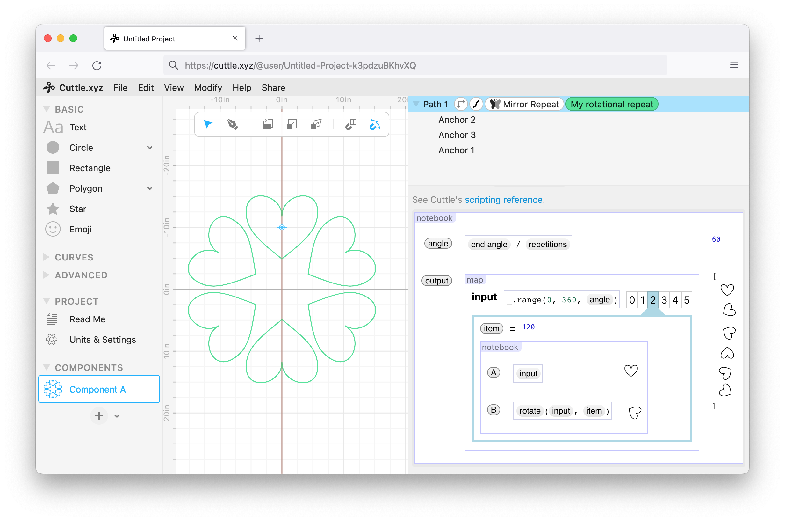
| A mockup of an imagined embedding of Engraft into Cuttle. The Engraft program defines a modifier in Cuttle which transforms an input heart shape into an array of rotated hearts.
\Description{A web browser showing a vector-graphics app called Cuttle. On Cuttle's canvas, a pinwheel pattern of six hearts is visible. On a sidebar, a Engraft Notebook tool is embedded. Its styling is different from the application it is embedded in. It shows a Map tool operating on an input heart to rotate it into six different positions, producing the shape ultimately shown on Cuttle's canvas.}
:::

One can imagine applications farther from the world of programming, using Engraft to provide open-ended extensions of their own interfaces. An animation application's easing-function editor and color picker could be implemented as Engraft slots prepared with default tools. Experienced users could then choose to remove these defaults and replace them with their own tools. In this way, Engraft could enable end-user customization, blurring the lines between application user and developer.

# Engraft Design Decisions {#design-decisions}

The Engraft prototype was developed in accordance with five high-level design decisions.

To support open-ended experimentation in tools, **Engraft is defined as an open API, not a toolkit.**
Engraft tools can be implemented in any way, within the bounds of the Engraft API and the Web platform, adopting their own styling, interaction techniques, and implementation frameworks. A toolkit approach would prematurely lock in constraints on tools' designs. An API approach also makes it possible to adapt existing tools to Engraft with minimal changes. As a test of this, we wrapped Voyager 2 [@doi:10.1145/3025453.3025768], a system for visual data exploration, as an Engraft tool. @sec:live-environments-inside-live-environments shows how this opens up new use-cases for Voyager.

To connect with existing programming activity, and to enable new forms of composition, **Engraft is built on the Web platform.**
A large part of the computing world now exists on the Web platform. Engraft can be composed together with this existing activity, as we described in @sec:live-tools-inside-the-outside-world. In this way, Engraft tools can perform their own specialized roles in a larger ecosystem. This supports gradual adoption of Engraft, creating a feedback loop of development and use. Engraft's use of the Web platform is also the basis for Engraft tools' recursive composability: Engraft tools can host one another because they are both implemented on the Web platform and hosted by the web platform. Systems like mage [@doi:10.1145/3379337.3415842], which do not support open-ended embedding of tools on the Web, lack this.

To support visibility and open-ended composability, **the Engraft API is based on streams of pure values.**
A tool's host provides it with a set of variables bound to JavaScript values. The tool can, at any point, provide output (a JavaScript value or error) through a host-provided callback. We chose to base communication on a functional, value-oriented paradigm due to the success this paradigm has had in diverse contexts ranging from React to spreadsheets.

To support both live editing and serious computational use, **Engraft makes tool-running primary and tool-rendering secondary.**
The Engraft API lets a tool run, taking in input from its host and returning output, without rendering any UI. As part of running, the tool offers its host an optional UI. In many situations, the host will use the option of *not* displaying a tool's UI, such as when a codebase embeds a live tool in production or when a tool like [Map]{.toolname} only renders an example instance of its body. By allowing tools to run invisibly, Engraft supports these serious computational uses. This relationship between running and displaying is not true the other way around: an Engraft tool's UI *cannot* be displayed without running it. Requiring that tool developers create versions of their tools which can run in static environments would be a distraction from Engraft's goal of supporting pervasively live programming.

To encourage innovative interactive tools, **Engraft tools are not required to generate or edit underlying textual code.**
In Engraft, a tool's underlying state is not code, but a serializable JavaScript object we call its *program*. This program can take any form, and can be interpreted in any way at runtime by the tool's implementation. This stands in contrast to a common approach taken by live-programming systems, in which a live tool ultimately generates source code which defines its computational behavior, and is often expected to re-parse this code after it has been manually edited. While it is true in a technical sense that any serializable JavaScript object could be represented as textual code and visa versa, the two formats have different grains. In platforms based on tools generating textual code, tool designers are encouraged to make tools based on pre-existing code patterns. With Engraft, we want tool designers to start with a task, and freely determine their design without regard to textual-code idioms.

# Engraft Implementation Details {#implementation}

We now present implementation details of the Engraft prototype. We begin with a slightly idealized description of the Engraft API, before explaining a few deviations from this ideal, then go on to discuss the Engraft tool ecosystem.

## The Engraft API

An Engraft tool is implemented as a JavaScript class that abides by an interface that Engraft specifies. A host uses this interface to create and manage an instance of this tool it wants to embed. Since all tools abide by the same interface, a host that uses this interface can embed any tool.

A tool class's interface is centered around a particular bundle of "properties" that contains all the information a host provides to an embedded tool. When a host creates a tool instance, it provides it with a set of properties (1, below). The host can later call an "update" method on a tool instance to provide a new set of properties (2, below). Finally, the host can call a "destroy" method when the tool is no longer needed (3, below).

```
const toolInstance = new MyTool(properties);  // 1
toolInstance.update(newProperties);           // 2
toolInstance.destroy();                       // 3
```

The real content of the Engraft API lies in the fields of the properties object. They are as follows:

- `program`: The tool's program, a serializable JavaScript object that defines its behavior.
- `updateProgram`: A callback the tool uses to request a change to its program.
- `reportOutput`: A callback the tool uses to report its output -- a value or error.
- `reportView`: A callback the tool uses to report its view (UI).
- `varBindings`: Bindings of variable ids & names to actual values, which the tool can immediately access.

A tool with access to the above five values has everything it needs to operate. It can read in its program specification, grab bindings from the environment (if needed), perform computations, and report back output and a view. A reported view can display any information gathered during the tool's execution, including intermediate values and final output. This view can also contain interactive controls which, when acted upon by the user, will trigger `updateProgram` to modify the tool's program.

This design was inspired by the component model of React [@react], a library for building user interfaces. React components offer a similar interface, in which a bundle of "props" is provided by an owner when a component is created, and then updated whenever the owner re-renders. React offers a set of tools for efficiently managing recomputation when a component's props change, including "hooks" and higher-order components for memoization.

React's model fit Engraft's needs well enough that we chose to implement our prototype system directly using React. This means that an Engraft tool is defined as a React component, rather than as the class we described above. Our use of React here is quite idiosyncratic. React components usually return trees of HTML elements, but in Engraft, it is essential that view behavior remain optional, and secondary to computational behavior. So Engraft tool components never directly return any HTML elements. When React "renders" a tool, it will construct an abstract tree that stores and maintains the state of the tool, together with the state of any subtools it may contain. These tools can then use callbacks provided as props to report output values and UI views back up the tree.

In our use of React, the first four "properties" above are provided directly to tools as React "props". The last property, `varBindings` is provided indirectly, using React's "context" feature. By wrapping a React component in context, the entire subtree under this context gets access to this information. Since most tools pass down the bindings they receive from their parent unchanged to their children, context provides a better developer experience here than props.

In addition to providing a React component (in lieu of the class we first described), a tool also provides a function called `programFactory` which is used to initialize a program for a new instance of the tool. To support the common pattern of a tool having a "main input" which an environment may want to pre-populate, `programFactory` optionally accepts a string `defaultInputCode`. This allows ergonomic interactions, such as new cells in a notebook automatically taking in the previous cell as input.

For more details, the supplemental material includes example code for several small tools. React has served as a helpful infrastructure for Engraft; nevertheless, it may be worth reconsidering in future work, as it is a heavyweight, unorthodox dependency.

## Slots and Subtools

Throughout this paper, we have shown Engraft programmers using "slots" to compose nested programs. The [Slot]{.toolname} tool is the glue that holds together Engraft programs. It is a built-in tool that appears at first as a code editor. Arbitrary JavaScript can be entered into this code editor, where it is compiled, evaluated, and returned as output. References to Engraft variables can be inserted into this editor using an an auto-complete window. If a tool's name is selected via auto-complete, the slot will be replaced with the tool, entering "subtool mode" ([@fig:adder_slots]).

::: figure {#adder_slots}
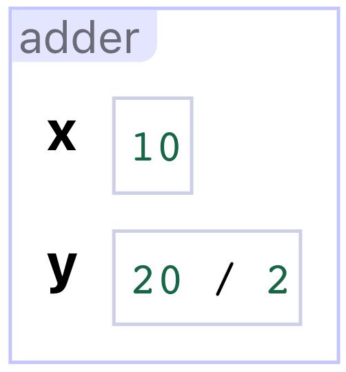{width=20.5%}
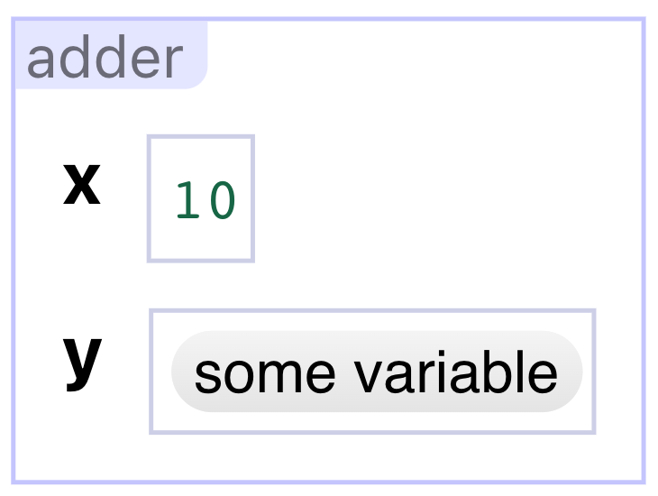{width=29.5%}
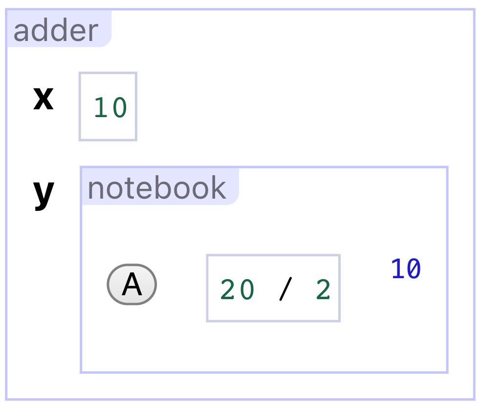{width=40%}
| A simple [Adder]{.toolname} tool. Its "y" slot is provided with (a) a code snippet, (b) a reference to a variable provided by the [Adder]{.toolname}'s host, (c) a nested [Notebook]{.toolname}.
\Description{The adder tool has two slots, labelled "x" and "y". In all three subfigures, the x slot contains the code "10". Subfigure (a): The y slot contains the code "20 / 2". Subfigure (b): The y slot contains a token labelled "some variable". Subfigure (c): The y slot contains an entire embedded subtool. It is a Notebook with one cell. The cell's slot contains the code "20 / 2", and the notebook shows that this evaluates to "10".}
:::

When [Slot]{.toolname} renders a subtool, it provides it with a "tool frame" to identify it. On hover, the title bar of this frame also reveals a few buttons ([@fig:tool_frame]):

* \textsf{cp}`cp`{=html}: Copy the tool's program to the clipboard, so it can be pasted into a different location.
* \textsf{i}`i`{=html}: Display a pop-up debugger window with information on the tool's program and environment.
* \textsf{x}`x`{=html}: Remove the subtool, bring the slot back into code mode.

::: figure {#tool_frame}
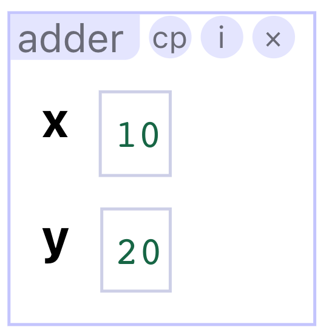{width=250 latex:width=5cm}
| The appearance of an [Adder]{.toolname} tool's "tool frame" when its title bar is hovered, revealing three circular buttons.
\Description{Next to the tool frame's label (reading "adder"), three small circles are visible. They are labelled "cp", "i", and "x".}
:::

We anticipate this frame will support additional general-purpose interactions in the future, such as "maximizing" a tool for focused work or "pinning" it to a sidebar.

Through the use of slots, a "tree of tools" is formed during the use of Engraft. [@fig:tree_of_tools] shows an example arrangement of tools together with a diagram of the resulting tree. Note, however, that there is no explicit reference to a tree of tools anywhere in the Engraft API or implementation. Rather, this tree emerges from the fact that a tool, like any other software system, is free to act as a host that embeds tools.


::: figure {#tree_of_tools}
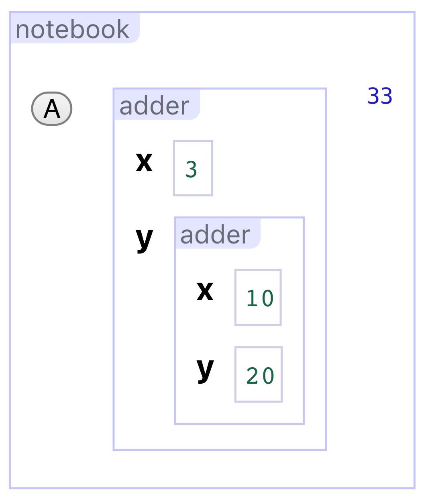{width=40%}
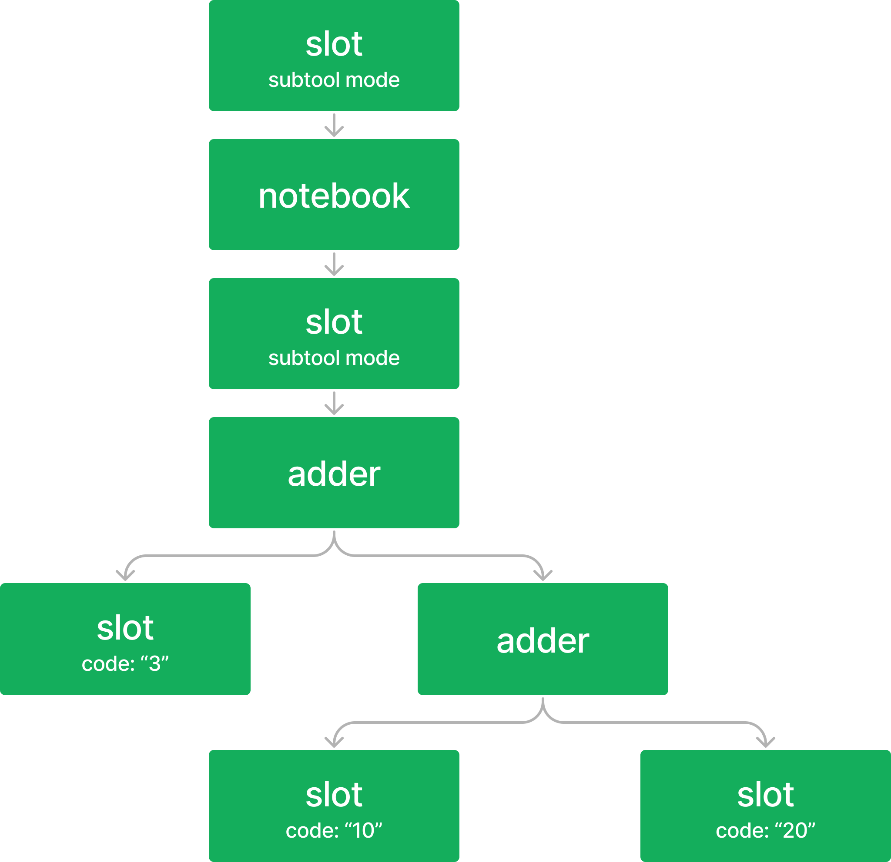{width=50%}
| (a) An arrangement of an [Adder]{.toolname} nested in an [Adder]{.toolname} nested in a [Notebook]{.toolname}. (b) The tree of tools resulting from this arrangement. Note the [Slot]{.toolname} tools, which provide the code-editors shown as leaves of the tree, as well as invisible intermediates between tools and their subtools.
\Description{Subfigure (a): A notebook contains a single cell, an Adder. This Adder has an x slot with "3", and a y slot with a nested Adder. This nested Adder has an x slot with "10", and a y slot with "20". Subfigure (b): A tree of abstract nodes, beginning with a chain of single-child nodes. A slot (in subtool mode) goes to a notebook, which goes to a slot (in subtool mode) which goes to an adder. This adder has two children: a slot with code "3" and a second adder. This second adder has two children: a slot with code "10" and a slot with code "20".}
:::

Although it is not built into the Engraft API (which could theoretically be used without it), [Slot]{.toolname} plays an essential role in the Engraft user experience. While the Engraft API provides the computational structures needed for open-ended composition, [Slot]{.toolname} provides users with an interface that makes that composition accessible in practice.

## Where do tools come from?

We showed earlier how a tool can be implemented as a JavaScript module. This technical description raises a few questions:

How does a prospective tool user access one of these modules? In our current prototype, we side-step this question -- all tools are bundled together with the Engraft system. For actual use, it will be important for tool creators to be able to post tools publicly and for tool users to be able to access them easily. One convenient approach would be to leverage existing package managers like NPM.

Does every tool need to be coded from scratch, by a developer intimately familiar with Engraft's low-level API? Right now, yes. But we see a range of possibilities that would support more accessible tool creation. For instance:

* A user could build a composite of Engraft tools (e.g., a color picker built in a computational notebook) and then select parts of this composite to expose in a custom tool interface.
* A user could take an existing web-based tool, and then describe how it could be embedded into an `iframe` and driven to make it participate in the Engraft API.

At the same time, our preferred design is to build these higher level meta-tools on top of the minimal Engraft API, which we expect is general enough to support them.

## Tools built so far

To date, we have implemented a few dozen primitive tools with Engraft. The examples in @sec:live-composability-with-engraft highlight some of these: [Notebook]{.toolname}, [Request]{.toolname}, [Extractor]{.toolname}, [Formatter]{.toolname}, [NotebookCanvas]{.toolname}, [Map]{.toolname}, [Simulation]{.toolname}, and [Voyager]{.toolname}. These examples also include [Slider]{.toolname}, [Color]{.toolname}, and [Text]{.toolname} tools. Appendix [-@sec:tool-menagerie] includes pictures and brief descriptions of eight more tools.
These tools are all "sketches", intended to test the Engraft API's design and to demonstrate its combinatorial possibilities. We expect that, with continued use, we will see both more polished and more radically divergent tools enter the Engraft ecosystem.

# Discussion

Our starting point in this paper is a simple observation: In spite of enormous efforts from industry and academia spanning decades, live-programming tools are not a mainstream part of programming practice. To our knowledge, this fact has not found much discussion in the literature.[^live-programming-gap] We believe that, given the enormous potential live programming might offer, this gap should be confronted head-on.

[^live-programming-gap]: Tanimoto’s 2013 reflections on live systems [@Tanimoto:2013:PEL] includes a section on “Criticisms of Liveness”, though he quickly dismisses them in favor of a generally optimistic view. Lau's short piece [@DBLP:journals/aim/Lau09] on why programming-by-demonstration systems (a related category) sometimes fail is insightful, but it focuses on AI-specific aspects and does not apply to live-programming systems in general.

This paper proposes *composability* as an essential element which must be combined with *liveness* and *domain-specific richness* to make alternatives to textual code effective in practice. We have presented Engraft: a prototype API which combines these three elements, enabling new forms of composition.

While we expect the lack of adoption of live tools is due to many factors, and there is no silver bullet that will make live tools truly usable, we believe that the approach Engraft makes concrete is compelling and worth further exploration.

## Risks

There are numerous ways Engraft may fail to work in practice.

**Engraft is heterogeneous.** We are excited by the prospect of Engraft fostering a vibrant, diverse, anarchic ecosystem of tools and environments. But our embrace of heterogeneous implementations carries liabilities. It might be challenging for users to learn new tools. It might be uncomfortable to work in a space that ties together discordant interfaces. Interoperability between tools might be a problem, since data exchange formats are not enforced.

**Engraft is untyped.** Engraft is built off the Web platform, and embraces JavaScript's highly dynamic, untyped style. This stands in contrast to the closely aligned livelits project [@doi:10.1145/3453483.3454059], discussed earlier, which specifically builds on Hazel's strong type discipline. Engraft may fail to scale to more complex work, if it turns out the benefits of static types are essential for managing this complexity. (We suspect that, in many cases, pervasive liveness forms an alternative to static types, but this is a speculative hypothesis.)

**Engraft is non-textual.** Engraft is, ultimately, a structured editor, as an Engraft program is not manipulated entirely as text. This is a fraught path. Plain-text interactions are familiar and well-polished by decades of computing. Structured editors can easily fail to match their fluidity and ergonomics, resulting in frustration from users. Textual code is also assumed by many important workflows, such as version control, and it is not immediately clear how these can be extended to non-textual programs. Recent work has sought to address some of these issues (such as @restructuring-structured-editing's work on token-level editing and @image-based's work on version control), but this is still an active area of research.

**Engraft tools are mostly isolated from one another.** An Engraft "tool" is analogous to a function or other bit of syntax in a functional programming language. It can access bindings provided by its host, return a value back to the host, and that's it. This design follows a traditional functional-programming discipline, which brings many advantages, but which also constrains the space of what a tool can be. An illustrative example comes from Gneiss [@doi:10.1184/R1/6714389.V1]. Gneiss combines three separate tools: an API query tool, a spreadsheet, and an interface builder. We wondered how Gneiss could be "unbundled" with Engraft, so that the tools that make it up could be used in new contexts and different tools could be brought into Gneiss's context. We found that, while it is possible to construct a workflow similar to Gneiss in Engraft today, the experience does not perfectly replicate Gneiss. Gneiss uses interactions that tightly tie its different tools together, like dragging a JSON field from the API query tool directly to the spreadsheet. It also uses flows of data which are, from a functional-programming perspective, quite messy, such as cyclic data flow between the spreadsheet and the interface builder. These are not presently possible with Engraft. It remains to be seen whether a programming environment like Engraft, based on isolated functional tools, is adequate to produce a holistically rich programming experience, or what would need to be added to the Engraft model to make it so.

## Technical Limitations

Aside from those large unknowns, we already anticipate some ways Engraft will need to be developed to support realistic use.

Engraft's **use of the Web platform** is a source of much of its potential, but it also brings along tricky issues. Security is naturally a concern. Web-based programming platforms (like Observable and Natto) have had to put much effort into sandboxing, and we can expect Engraft's flexibly-nested structures would make this all the more difficult. Another source of challenges is layout and styling. Engraft tools push the boundaries of UI frameworks, since tools act as heterogeneous composable application interfaces. CSS and the rest of the Web platform were not designed to support anything like this. They have worked well for prototyping so far, but careful work is required to find approaches that ensure the system stays robust, even as diverse tools are added.

Engraft's current **reactivity model** is limited. Currently, communication between tools and hosts is a free-for-all. A host can deliver new values to a tool whenever it likes, and the tool can reply with output whenever *it* likes. But there are situations where a greater degree of control is desirable. Certain hosts may want to run a tool synchronously, or run it asynchronously but in such a way that it can know for sure when the tool's output is "up to date" with its inputs. Neither of these is possible right now. Changes to the reactivity model could also aid performance, as right now "glitches" can cause unnecessary computations on out-of-date inputs.

Engraft's **embedding into conventional codebases** is incomplete, and there are details in the workflow that need working out. Many uses of live tools from conventional code will need forms of reactivity that are not currently supported, as described in the last paragraph. There are also questions around how the "program" of a live tool should be persisted. Currently, our prototype of `useLiveTool` simulates persistence by storing a tool's program in the user's web browser local storage. But for any real use, it will be important for this program to be stored as part of the web application's codebase, where it can be delivered with the application for production use, checked into source control, etc. This means live tools will need to write back to the codebase during development. Careful engineering and design work is required here, as live tools are competing against refined and entrenched textual workflows.

## Future Work

While Engraft has been prototyped well enough to allow experimental use, it has not reached a stage where research would benefit from broad promulgation and use in practice. This is especially true because Engraft takes the form of an API standard. If tools and hosts were built around one version of this API and then future discoveries suggested moving to a new version, effort would be wasted, incompatibilities would proliferate, and confidence would be undermined. Or, perhaps worse, dependencies on one version of Engraft's design might discourage iteration and exploration of Engraft itself, prematurely locking in an underdeveloped design.

Given this, there are several appealing ways to continue developing and testing Engraft.
One is to dive into a particular domain where end-user programming feels like a bottleneck, partnering closely with practitioners to test and iterate on the design of Engraft as it applies to their work. Once Engraft's design can be validated through successful application in multiple domains (say, both creative coding and data science), it may be ready to grow more openly.

Another is to establish Engraft as an enabling platform for researchers developing experimental live tools. Suppose a researcher has an idea for a novel live tool. Without Engraft, they are in a tough spot. As effective as their tool may be for its task, evaluating the tool requires building enough complementary infrastructure that their novel tool can be demonstrated in an end-to-end workflow. This may involve a significant amount of work which is unrelated to the novel interactions they are exploring. If the researcher implements their tool on top of Engraft, however, they can test it in the context of all the tools, environments, and real-world embeddings that already exist in the Engraft ecosystem. We hope that, in this way, Engraft can lower the barrier to entry for live-tool research and accelerate innovation in this field.

~~~ bibliography
@inproceedings{Ellis1969THEGP,
  title = {THE GRAIL PROJECT: AN EXPERIMENT IN MAN-MACHINE COMMUNICATIONS},
  author = {T. O. Ellis and John F. Heafner and William L. Sibley},
  year = {1969},
  url = {https://www.rand.org/pubs/research_memoranda/RM5999.html},
}


@unpublished{live-literals,
  title = {Live Literals},
  author = {Tijs van der Storm and Felienne Hermans},
  year = {2016},
  note = {Presented at the Workshop on Live Programming (LIVE) 2016},
  url = {https://homepages.cwi.nl/~storm/livelit/livelit.html},
}

@unpublished{inventing-on-principle,
  title = {Inventing on Principle},
  author = {Bret Victor},
  year = {2012},
  note = {Presented at the the Canadian University Software Engineering Conference (CUSEC)},
  url = {https://vimeo.com/36579366},
}

@online{learnable-programming,
  title = {Learnable Programming},
  author = {Bret Victor},
  year = {2012},
  url = {http://worrydream.com/LearnableProgramming/},
}

@unpublished{seymour,
  title = {Seymour: Live Programming for the Classroom},
  author = {Saketh Kasibatla and Alex Warth},
  year = {2017},
  note = {Presented at the Workshop on Live Programming (LIVE) 2017},
  url = {https://harc.github.io/seymour-live2017/},
}

@unpublished{pane,
  title = {PANE: Programming with Visible Data},
  author = {Joshua Horowitz},
  year = {2018},
  note = {Presented at the Workshop on Live Programming (LIVE) 2018},
  url = {http://joshuahhh.com/projects/pane/},
}

@online{light-table,
  title = {Light Table},
  author = {Chris Granger},
  year = {2022},
  url = {http://lighttable.com/},
}

@online{swift-playgrounds,
  title = {WWDC 2014},
  author = {{Apple Inc.}},
  year = {2014},
  url = {https://www.youtube.com/watch?v=w87fOAG8fjk},
}

@online{mps,
  title = {MPS: The Domain-Specific Language Creator by JetBrains},
  author = {{JetBrains s.r.o.}},
  year = {2022},
  url = {https://www.jetbrains.com/mps/},
}

@online{enso,
  title = {Enso},
  author = {Enso},
  year = {2022},
  url = {https://enso.org/},
}

@online{lamdu,
  title = {Lamdu},
  author = {Eyal Lotem and Yair Chuchem},
  year = {2022},
  url = {https://www.lamdu.org/},
}

@misc{wikipedia-grafting,
  author = "{Wikipedia contributors}",
  title = "Grafting --- {W}ikipedia{,} The Free Encyclopedia",
  year = "2022",
  url = "https://en.wikipedia.org/w/index.php?title=Grafting&oldid=1095365064",
  note = "[Online; accessed 01-September-2022]"
}

@unpublished{restructuring-structured-editing,
  title = {Restructuring Structure Editing},
  author = {David Moon and Cyrus Omar},
  year = {2021},
  note = {Presented at the Workshop on Live Programming (LIVE) 2021},
  url = {https://tylr.fun/essay/},
}


@online{segregate-by-mode,
  title = {Edward Tufte forum: Evidence presentations: At the leading edge of serious practice},
  author = {Edward Tufte},
  url = {https://www.edwardtufte.com/bboard/q-and-a-fetch-msg?msg_id=0002RP},
  year = {2006},
}


@online{bootstrap,
  title = {Bootstrap},
  author = {Bootstrap},
  url = {https://bootstrapworld.org/index.shtml},
  year = {2022},
}

@online{yoshiki,
  title = {I've been jamming on this concept for making data-driven designs...},
  author = {Yoshiki Schmitz},
  url = {https://twitter.com/yoshikischmitz/status/1176642448077967362},
  year = {2019},
}

@online{natto-hn,
  title = {Show HN: Natto – a canvas for writing and manipulating JavaScript},
  author = {Paul Shen},
  url = {https://news.ycombinator.com/item?id=26478548},
  year = {2021},
}

@online{natto,
  title = {welcome! -- natto},
  author = {Paul Shen},
  url = {https://natto.dev/},
  year = {2022},
}

@online{observable,
  title = {Observable - Explore, analyze, and explain data. As a team.},
  author = {{Observable Inc.}},
  url = {https://observablehq.com/},
  year = {2022},
}

@online{observable-data-table-cell,
  title = {Quickly Explore & Analyze Your Data With Data Table Cell / Observable / Observable},
  author = {{Observable Inc.}},
  url = {https://observablehq.com/@observablehq/introducing-data-table-cell},
  year = {2022},
}


@online{cuttle,
  title = {Cuttle - Design tool for digital cutting machines},
  author = {{Cuttle Labs Inc.}},
  url = {https://cuttle.xyz/},
  year = {2022},
}

@online{functional-core,
  title = {Functional Core, Imperative Shell - Destroy All Software},
  author = {Gary Bernhardt},
  url = {https://www.destroyallsoftware.com/screencasts/catalog/functional-core-imperative-shell},
  year = {2012}
}

@online{react,
  title = {React – A JavaScript library for building user interfaces},
  author = {{Meta Platforms, Inc.}},
  url = {https://reactjs.org/},
  year = {2022}
}

@misc{image-based,
  url = {https://arxiv.org/abs/2110.08993},

  author = {Edwards, Jonathan and Petricek, Tomas},

  keywords = {Programming Languages (cs.PL), Software Engineering (cs.SE), FOS: Computer and information sciences, FOS: Computer and information sciences},

  title = {Typed Image-based Programming with Structure Editing},

  publisher = {arXiv},

  year = {2021},

  copyright = {Creative Commons Attribution Non Commercial No Derivatives 4.0 International}
}

@inproceedings{Tanimoto:2013:PEL,
  abstract = {Liveness in programming environments generally refers to the ability to modify a running program. Liveness is one form of a more general class of behaviors by a programming environment that provide information to programmers about what they are constructing. This paper gives a brief historical perspective on liveness and proposes an extension of a hierarchy given in 1990, to now account for even more powerful execution-oriented tools for programmers. In addition, while liveness concerns the timeliness of execution feedback, considering a broader array of forms of feedback is helpful both in better understanding liveness and in designing ever more powerful development tools.},
  acmid = {2662735},
  added-at = {2018-01-30T18:23:00.000+0100},
  address = {Piscataway, NJ, USA},
  author = {Tanimoto, Steven L.},
  biburl = {https://www.bibsonomy.org/bibtex/2848046e30360ec0c07b821433f3199ac/gron},
  booktitle = {Proceedings of the 1st International Workshop on Live Programming},
  description = {A perspective on the evolution of live programming},
  doi = {10.1109/LIVE.2013.6617346},
  interhash = {76ecbb1c2f981acf702fd9f2dcbc2eb9},
  intrahash = {848046e30360ec0c07b821433f3199ac},
  isbn = {978-1-4673-6265-8},
  keywords = {Analysis Discussion LiveProgramming PositionPaper Requirements},
  location = {San Francisco, California},
  numpages = {4},
  pages = {31--34},
  publisher = {IEEE Press},
  series = {LIVE '13},
  timestamp = {2018-01-30T18:23:00.000+0100},
  title = {{A Perspective on the Evolution of Live Programming}},
  year = 2013
}

@article{DBLP:journals/aim/Lau09,
  author    = {Tessa Lau},
  title     = {Why Programming-By-Demonstration Systems Fail: Lessons Learned for
               Usable {AI}},
  journal   = {{AI} Mag.},
  volume    = {30},
  number    = {4},
  pages     = {65--67},
  year      = {2009},
  url       = {https://doi.org/10.1609/aimag.v30i4.2262},
  doi       = {10.1609/aimag.v30i4.2262},
  timestamp = {Tue, 25 Aug 2020 01:00:00 +0200},
  biburl    = {https://dblp.org/rec/journals/aim/Lau09.bib},
  bibsource = {dblp computer science bibliography, https://dblp.org}
}


@online{everest,
  title = {been having some ~motivation troubles~ recently (god who hasn't) so i'm gonna pick a tiny personal project off my ideas list and see if i can get it working by morning. tonight - a lil bash script that emails me the summaries of 5 random wikipedia articles each morning},
  author = {Everest Pipkin},
  url = {https://twitter.com/everestpipkin/status/1349274983651012609},
  year = {2021},
}

~~~

::: appendix

# Tool Menagerie
:::: figure {position="!htb"}
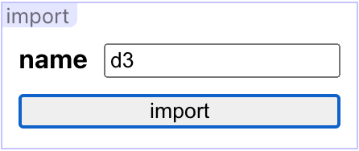{width=225 latex:width=4.5cm}
| "[Import]{.toolname}" allows modules to be dynamically imported from NPM.
\Description{The tool contains a text box labelled "name", with the text "d3" typed into it, and a button labelled "import".}
::::

:::: figure {position="!htb"}
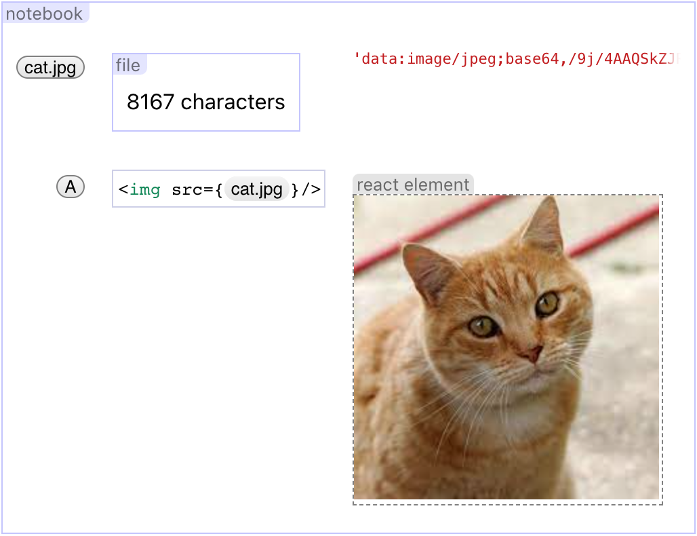{width=501 latex:width=10.3cm}
| "[File]{.toolname}" lets the user upload a file into the browser by dragging and dropping it onto the tool. The file is then persistently saved in the Engraft program as a `data` URI string.
\Description{This tool contains the label "8167 characters". The tool is embedded in a notebook, which shows that it outputs a long string starting "data:image/jpeg;base64" (a data URI). The next cell of the notebook applies this string as the `src` attribute of an HTML `img` tag. This cell's output is an image of a charming cat.}
::::

:::: figure {position="!htb"}
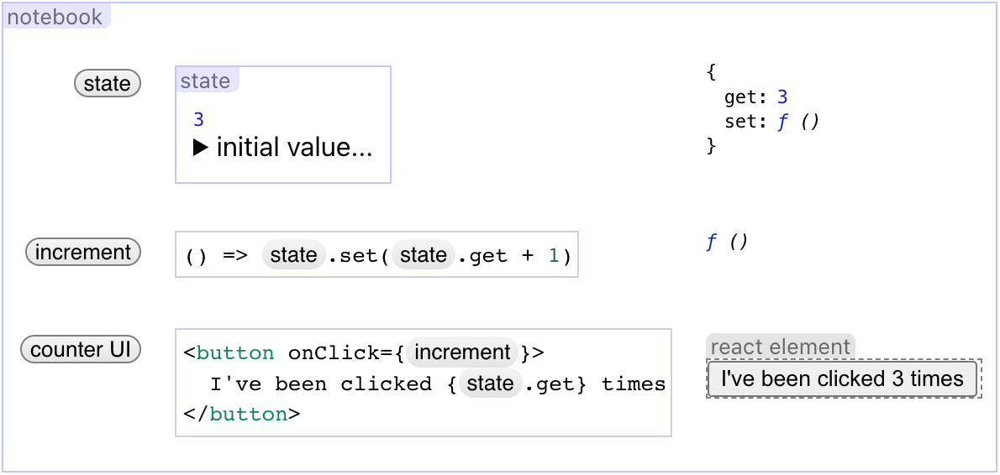{width=559 latex:width=11.9cm}
| "[State]{.toolname}" stores a piece of ephemeral state. It returns the current value of this state together with a setter. This can be used to implement stateful UIs.
\Description{This tool contains blue output text, reading "3". It also contains a collapsed control labelled "initial value...". The tool is embedded in a notebook, which shows that it outputs a JavaScript object with two fields: "get", with the value "3", and "set", with a function value. The next cell of the notebook constructs an "increment" function, using "get" and "set". The final cell of the notebook constructs a "counter" button, which displays the value of "get" and calls increment when it is clicked.}
::::

:::: figure {position="!htb"}
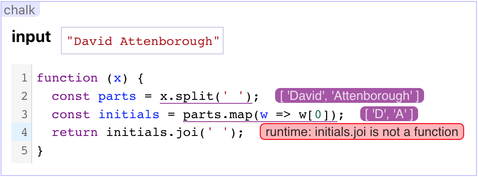{width=485 latex:width=9.7cm}
| "[Chalk]{.toolname}" is a code editor that displays live values and errors inline.
\Description{This tool contains a slot labelled "input", which contains a string literal "David Attenborough". Below this is a multi-line code editor, defining a function taking in an argument "x". The first line of the function reads "const parts = x.split(' ');". The expression "x.split(' ')" is underlined in purple, and a purple token after the end of the line is labelled "['David', 'Attenborough']". The next line similarly computes a variable, with its value shown in a purple token. The last line mistakenly calls ".joi" on an array, causing a red token to be displayed with an error message at the end of the line.}
::::

:::: figure {position="!htb"}
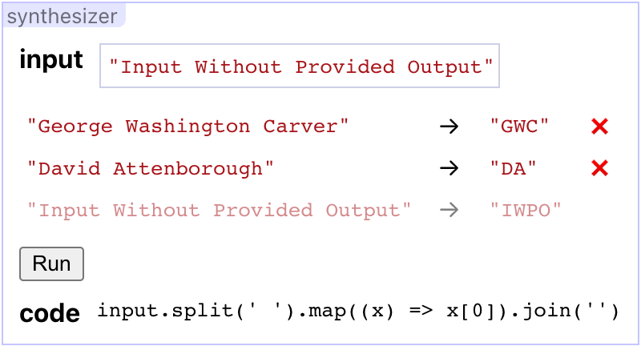{width=400 latex:width=8cm}
| "[Synthesizer]{.toolname}" is a simple example-based program synthesizer, following the example of [@doi:10.1145/3379337.3415869].
\Description{This tool contains a slot labelled "input", which contains a string literal "Input Without Provided Output". Below this is a table. The first column of the table contains input values. Arrows in each row map this first column to a second column, which contains output values. In the first two rows, the string "George Washington Carver" is mapped to "GWC", and "David Attenborough" is mapped to "DA". A third row, faded out, maps "Input Without Provided Output" to "IWPO". A button underneath the table is labelled "Run". Below this, the synthesized code \verb|input.split(' ').map((x) => x[0]).join('')| is displayed.}
::::

:::: figure {position="!htb"}
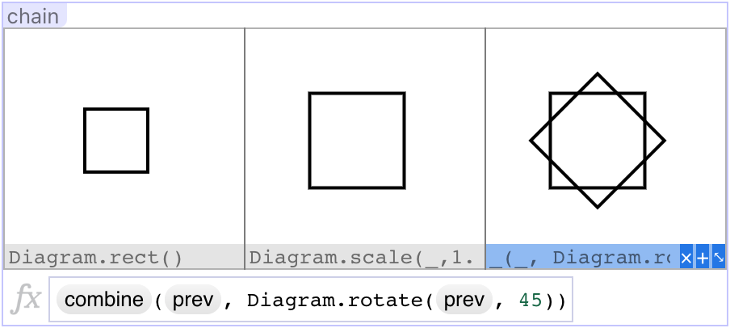{width=450 latex:width=9cm}
| "[Chain]{.toolname}" is a minimalist live environment inspired by the data-first design of spreadsheets.
\Description{This tool contains three square cells arranged in a tight row. The first square contains a small rendered square. The second contains a larger rendered square. The third contains the larger rendered square superimposed with a copy that has been rotated 45 degrees, forming an 8-pointed star. Beneath these cells are small bits of code in gray bars. The first reads \verb|Diagram.rect()|. The second reads \verb|Diagram.scale(_,1.| and is then cut off. The third is not very legible. The third bar is highlighted in light blue, and contains three buttons: "x", "+", and arrows. Underneath the row of cells, a formula editor is labelled "fx". The editor is a slot, and contains code roughly reading \verb|combine(prev, Diagram.rotate(prev, 45))|.}
::::

:::: figure {position="!htb"}
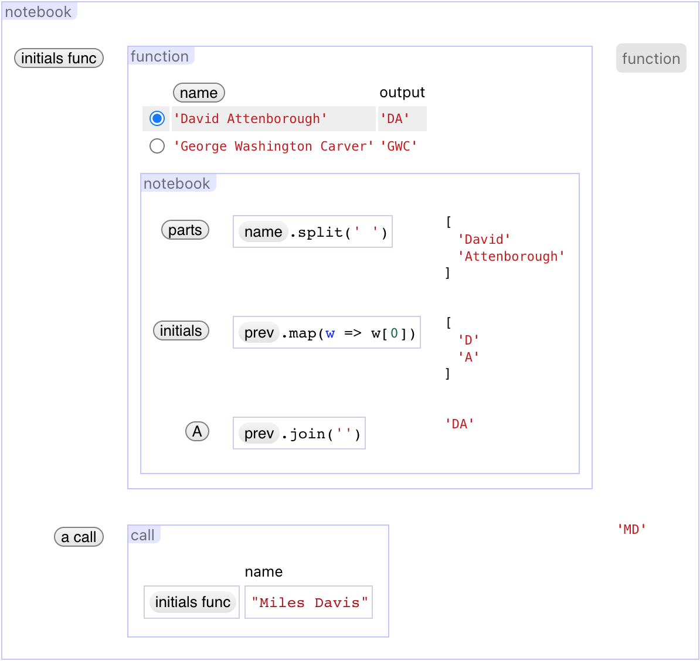{width=600 latex:width=12cm}
| "[Function]{.toolname}" can be used to define a function, using examples for live feedback. "[Call]{.toolname}" can then be used to call the function.
\Description{These two tools are demonstrated in two cells of a notebook. The first cell contains a Function tool. At the top of this tool is a table of example inputs. The first column is unlabelled, and contains radio buttons. The second column is labelled with a token labelled "name", and contains the string literals "David Attenborough" and "George Washington Carver". The last column is labelled "output", and contains the string literals "DA" and "GWC". Beneath this table is a slot. This slot contains a notebook which, over multiple cells, splits up its input into initials. The outermost notebook shows that the output of the Function tool is a special gray "function" token. The second cell of this outermost notebook contains a Call tool. This tool contains a slot referring to the first cell, as well as a slot labelled "name" containing the string literal "Miles Davis". The outermost notebook shows that the output of the Call tool is the string "MD".}
::::

:::
